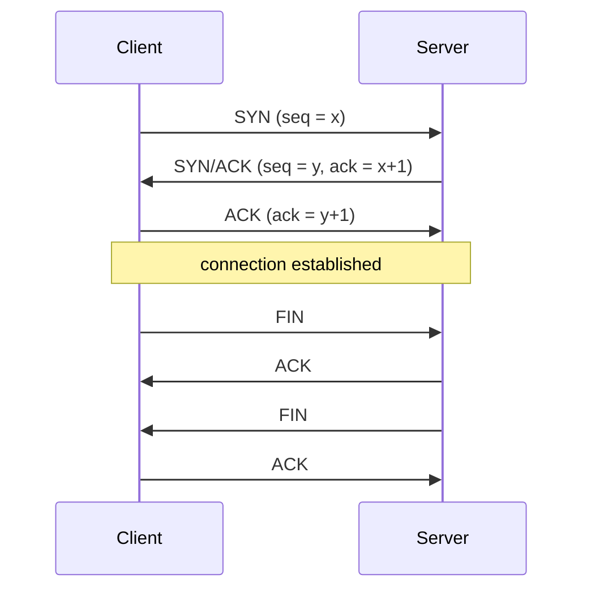
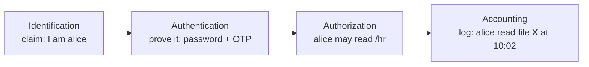
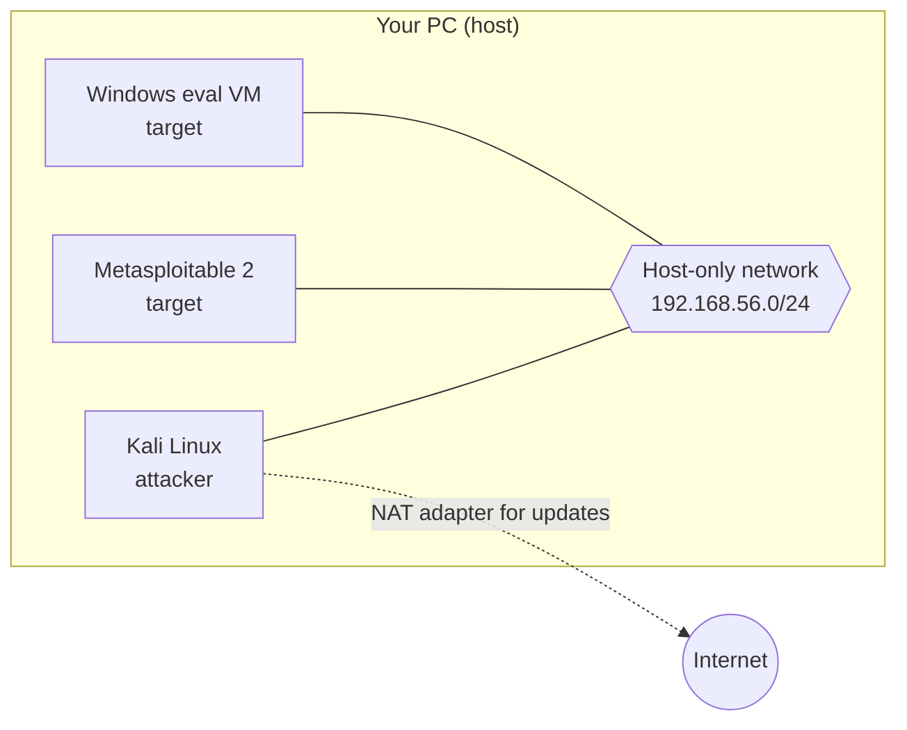

## Networking Essentials

**Plain English.** A network is a postal system for computers. Each machine has an address (IP). Each program on it has a door number (port). Protocols are the rules for writing and reading the letters. Almost every attack in this course abuses one of these rules, so you need to know the normal behavior first.

### Two models of the same stack

The **OSI model** has 7 layers and is used to *talk about* networks. The **TCP/IP model** has 4 layers and is what real systems *run*.

| OSI layer | Unit | Examples | TCP/IP layer |
|---|---|---|---|
| 7 Application | data | HTTP, DNS, SMTP, SSH | Application |
| 6 Presentation | data | encoding, TLS (often placed here) | Application |
| 5 Session | data | session setup, NetBIOS sessions, RPC | Application |
| 4 Transport | segment / datagram | TCP, UDP | Transport |
| 3 Network | packet | IP, ICMP, routing | Internet |
| 2 Data link | frame | Ethernet, MAC, ARP, switches, VLANs | Link |
| 1 Physical | bits | cables, radio, hubs | Link |

Memory aid for OSI from layer 1 up: **P**lease **D**o **N**ot **T**hrow **S**ausage **P**izza **A**way.

### TCP: the handshake and the flags

TCP is **connection-oriented**. It sets up a connection, numbers every byte, acknowledges what it receives and resends what gets lost. A connection starts with the **three-way handshake**:



The six classic flags are **SYN** (start), **ACK** (acknowledge), **FIN** (polite close), **RST** (abort now), **PSH** (deliver immediately) and **URG** (urgent pointer valid). ECE and CWR are used for congestion signalling. If a closed TCP port gets a SYN, it answers with **RST/ACK**. Scanners read these answers to work out port states; M3 builds on this.

**UDP** is **connectionless**: no handshake, no acknowledgement and no retransmission, just an 8-byte header and the data. It suits DNS queries, DHCP, SNMP, NTP, VoIP and streaming. A closed UDP port usually answers with **ICMP port unreachable** (type 3, code 3). An open one often says nothing at all, which is why UDP scanning is slow and ambiguous.

| | TCP | UDP |
|---|---|---|
| Connection | handshake | none |
| Reliability | acknowledgements, retransmission, ordering | best effort |
| Header | 20–60 bytes | 8 bytes |
| Typical use | web, mail, SSH, file transfer | DNS, DHCP, SNMP, NTP, streaming |

### Ports

A port is a 16-bit number (0–65535):

- 0–1023: **well-known** (system) ports.
- 1024–49151: **registered** ports.
- 49152–65535: **dynamic** ports, used for the client side of a connection.

The full list you must memorize is in the Quick reference, "Ports and protocols". The shortlist:

- FTP 21 (data 20), SSH 22, Telnet 23, SMTP 25, DNS 53, HTTP 80, POP3 110, IMAP 143, HTTPS 443.
- SMB 445, NetBIOS 137–139, SNMP 161, LDAP 389, RDP 3389, MySQL 3306, MSSQL 1433.

### IPv4 and subnetting

An IPv4 address is 32 bits written as four octets (`192.168.10.37`). A **prefix** like `/24` says how many bits belong to the network; the rest identify hosts.

- Addresses in a subnet: 2^(32 − prefix).
- Usable hosts: 2^(32 − prefix) − 2. The first address is the network address and the last is the broadcast.

| Prefix | Mask | Addresses | Usable hosts |
|---|---|---|---|
| /24 | 255.255.255.0 | 256 | 254 |
| /25 | 255.255.255.128 | 128 | 126 |
| /26 | 255.255.255.192 | 64 | 62 |
| /27 | 255.255.255.224 | 32 | 30 |
| /28 | 255.255.255.240 | 16 | 14 |
| /29 | 255.255.255.248 | 8 | 6 |
| /30 | 255.255.255.252 | 4 | 2 |

Worked example: `192.168.10.37/27`. A /27 moves in blocks of 32 (0, 32, 64…). 37 falls in the 32 block, so the network is `192.168.10.32`, the broadcast is `.63`, and the hosts are `.33`–`.62`.

Special ranges:

- **Private** (RFC 1918, not routed on the internet): `10.0.0.0/8`, `172.16.0.0/12`, `192.168.0.0/16`.
- **Loopback**: `127.0.0.0/8`.
- **Link-local / APIPA**: `169.254.0.0/16`. A Windows host that gets an APIPA address could not reach a DHCP server.

### DNS, DHCP, ARP, HTTP

**DNS** turns names into records. A resolver asks the root servers, then the TLD servers, then the domain's authoritative server, and caches the answers.

| Record | Holds |
|---|---|
| A / AAAA | IPv4 / IPv6 address |
| MX | mail server for the domain |
| NS | authoritative name servers |
| CNAME | alias to another name |
| PTR | reverse lookup (IP → name) |
| TXT | free text: SPF, DKIM, domain verification |
| SOA | zone authority, serial number, timers |

DNS uses **UDP 53** for normal queries and **TCP 53** for zone transfers (AXFR) and large responses. A zone transfer copies a whole zone to a secondary server. If one is allowed to *anyone*, it leaks the full host list; M2 and M4 exploit this.

**DHCP** hands out addresses in four steps, **DORA**: Discover, Offer, Request, Acknowledge. The server uses UDP 67 and the client UDP 68. Nothing authenticates the server, so a rogue DHCP server can hand out a malicious gateway or DNS server.

**ARP** answers "who has 192.168.1.1? Tell me your MAC address." Hosts cache the answers and believe any reply, even ones they never asked for. This is the root of ARP spoofing (M8).

**HTTP** is request/response. Methods include GET, POST, PUT, DELETE, HEAD and OPTIONS. Status codes by class:

- 2xx: success.
- 3xx: redirect.
- 4xx: client error (401 unauthenticated, 403 forbidden, 404 not found).
- 5xx: server error.

**HTTPS** is HTTP inside TLS: the server proves its identity with a certificate, and the traffic is encrypted and integrity-protected.

### Exam traps

- **DNS is UDP *and* TCP 53.** Zone transfers use TCP.
- **A /30 has 2 usable hosts**, not 4. Always subtract the network and broadcast addresses.
- **RST vs FIN.** RST aborts at once; FIN closes gracefully.
- **ARP is layer 2** in most exam questions. It carries IP addresses but never leaves the local link.
- **SMB is 445.** 139 is SMB over NetBIOS (the older transport).

## Operating System Essentials

**Plain English.** Every operating system answers the same questions: who are you, what are you allowed to touch, and what is running. Attackers ask these questions right after they get in. Defenders ask them all day. Learn the commands for both Linux and Windows.

### Linux

Everything is a file, and everything has an owner, a group and permission bits. `ls -l` shows them:

```
-rwsr-xr-x 1 root root 59K  /usr/bin/passwd
 └┬┘└┬┘└┬┘
 user group others
```

- `r`=4, `w`=2, `x`=1, so `chmod 640 file` gives `rw-r-----`.
- **SUID** (`s` in the user execute slot, 4000): the program runs with the *owner's* rights. SUID programs owned by root are a classic privilege-escalation path (M6). Find them with `find / -perm -4000 -type f 2>/dev/null`.
- **SGID** (2000): the program runs with the group's rights, or new files inherit the directory's group.
- **Sticky bit** (1000, `t`): in a shared directory like `/tmp`, only a file's owner can delete it.

Key files:

- `/etc/passwd`: accounts, readable by everyone.
- `/etc/shadow`: password hashes, readable by root only.
- `/etc/sudoers`: who may run what as root (read your own rights with `sudo -l`).
- `/var/log/`: logs, such as `auth.log` or `secure` for logins.

| Task | Linux command |
|---|---|
| Who am I, which groups | `id`, `whoami` |
| Network config | `ip a` (old: `ifconfig`) |
| Listening ports with the program | `ss -tulpn` (old: `netstat -tulpn`) |
| Processes | `ps aux`, `top` |
| Search text | `grep -ri password /etc` |
| Find files | `find / -name "*.conf"` |
| Fetch a URL | `curl -I https://example.org` |

### Windows

Windows controls access with **accounts**, **groups**, **privileges** and **ACLs** on objects. Local password hashes (NT hashes) live in the **SAM** registry hive. Domain hashes live in **NTDS.dit** on the domain controllers. The most powerful local account is **SYSTEM**, which ranks above Administrator.

| Task | cmd | PowerShell |
|---|---|---|
| Who am I, my privileges | `whoami /priv`, `whoami /groups` | — |
| Network config | `ipconfig /all` | `Get-NetIPConfiguration` |
| Connections with the PID | `netstat -ano` | `Get-NetTCPConnection` |
| Processes | `tasklist` | `Get-Process` |
| Users and admins | `net user`, `net localgroup administrators` | `Get-LocalUser` |
| File ACLs | `icacls C:\path` | `Get-Acl` |
| OS and patches | `systeminfo` | `Get-ComputerInfo` |

Logs are in the **Event Viewer**. The Security log records logons: 4624 is a successful logon and 4625 a failed one. M6 covers clearing logs.

A quick OS clue: default **TTL** values are 64 on Linux and 128 on Windows. A ping reply with TTL 125 most likely came from a Windows host 3 hops away. TTLs can be changed, so treat this as a hint, not proof.

### Exam traps

- **SUID runs as the file's owner**, not as the user who runs it.
- `netstat -ano` on Windows: **`-o` is the PID**. On Linux the program name comes from `-p`.
- **/etc/shadow**, not /etc/passwd, holds the hashes on a modern Linux.
- **SYSTEM > Administrator** on a Windows host.

## Security Basics

**Plain English.** Security means keeping the right people in, the wrong people out, and the data correct and available. The vocabulary below comes up in almost every exam question's wording, so learn it precisely.

### The CIA triad and friends

| Property | Means | Broken by | Protected by |
|---|---|---|---|
| **Confidentiality** | only authorized people can read | sniffing, data leaks | encryption, access control |
| **Integrity** | nobody changes data without authorization | tampering, MITM | hashes, digital signatures, MACs |
| **Availability** | systems work when needed | DoS, ransomware, outages | redundancy, backups, DDoS protection |

Two extra properties:

- **Authenticity**: the data or user really is who it claims to be.
- **Non-repudiation**: a sender cannot deny sending. Digital signatures provide it; symmetric keys cannot, because both sides hold the same key.

### AAA



The three authentication factors are something you **know** (a password), something you **have** (a token or phone) and something you **are** (biometrics). Real MFA combines *different* factor types; a password plus a PIN is still one factor type. RADIUS and TACACS+ are the classic AAA protocols.

### Risk vocabulary

- **Asset**: anything of value.
- **Vulnerability**: a weakness.
- **Threat**: something that could exploit it.
- **Exploit**: the code or technique that does.
- **Risk** = likelihood × impact.
- **Zero-day**: a vulnerability that has no patch yet.

The four ways to treat a risk:

- **Mitigate**: add controls.
- **Transfer (share)**: buy insurance, outsource.
- **Avoid**: stop the risky activity.
- **Accept**: document it and live with it.

### Controls and principles

Controls are classified two ways:

- **By type**: administrative (policies, training), technical (firewalls, encryption) and physical (locks, guards).
- **By function**: preventive (stop it), detective (notice it), corrective (fix it), deterrent (discourage it), recovery (restore) and compensating (a substitute when the normal control is not possible).

Three principles you will see again:

- **Least privilege**: give only the access a job needs.
- **Defense in depth**: several independent layers, so one failure is not fatal.
- **Separation of duties**: no single person can complete a sensitive task alone.

### Exam traps

- **Hashing gives integrity, not confidentiality.** Encryption gives confidentiality.
- **Non-repudiation needs asymmetric crypto** (digital signatures).
- **Buying cyber insurance is risk transfer**, not mitigation.
- **An IDS is detective, an IPS is preventive.** A backup is a recovery control.
- **Authentication ≠ authorization.** Logging in is authentication; the file permission check is authorization.

## Lab Setup

**Plain English.** You learn hacking by doing it, but only against machines you own. A home lab is a few virtual machines on your own computer, on a private virtual network that cannot touch anyone else. Build it once, snapshot it, and break it as often as you like.

### Virtualization

A **hypervisor** runs virtual machines:

- **Type 1** (bare metal) runs directly on the hardware: VMware ESXi, Microsoft Hyper-V, Proxmox VE (KVM).
- **Type 2** (hosted) runs as an application on your usual OS: VirtualBox, VMware Workstation.

For study, a type 2 hypervisor is enough. Aim for 16 GB of RAM on the host (8 GB works with one VM at a time), and turn on hardware virtualization (VT-x or AMD-V) in the BIOS/UEFI.

### Network modes (VirtualBox names)

| Mode | VM → internet | LAN → VM | VM ↔ VM | Use it for |
|---|---|---|---|---|
| NAT | yes | no | no | updating Kali |
| NAT Network | yes | no | yes | Kali + targets that need updates |
| Bridged | yes | **yes** | yes | never for vulnerable VMs |
| Host-only | no | no (host only) | yes | **attack lab** |
| Internal | no | no | yes | fully isolated lab |



### A safe starter lab

1. Install **VirtualBox** or **VMware Workstation**.
2. Import the official **Kali Linux** VM image from kali.org. The default login is `kali`/`kali`; change it.
3. Import **Metasploitable 2** (Rapid7). It is deliberately full of holes, so attach it to **host-only only**.
4. Take a **snapshot** of every VM before you start, and roll back when something breaks.
5. Optional: a Windows evaluation VM from Microsoft for the Windows modules.
6. Warm up your command line with OverTheWire **Bandit** and the TryHackMe **Pre Security** path.

### Rules of engagement

- Only test systems you own, or systems you have **written permission** to test. Unauthorized access is a crime: the CFAA in the US (18 U.S.C. § 1030) and the Computer Misuse Act 1990 in the UK.
- Never put a vulnerable VM on a bridged adapter, a public cloud IP or a shared network.
- Practice platforms such as TryHackMe and Hack The Box grant permission only for their own targets.

### Exam traps

- **Type 1 = bare metal**; VirtualBox is type 2.
- **Bridged puts the VM on your real LAN.** It is the wrong choice for vulnerable targets.
- **A snapshot is not a backup.** It lives on the same disk as the VM.
- **Scope and written authorization come first** in every ethical-hacking engagement.
