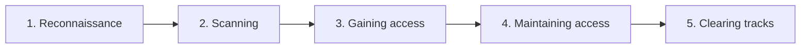
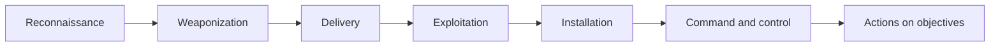
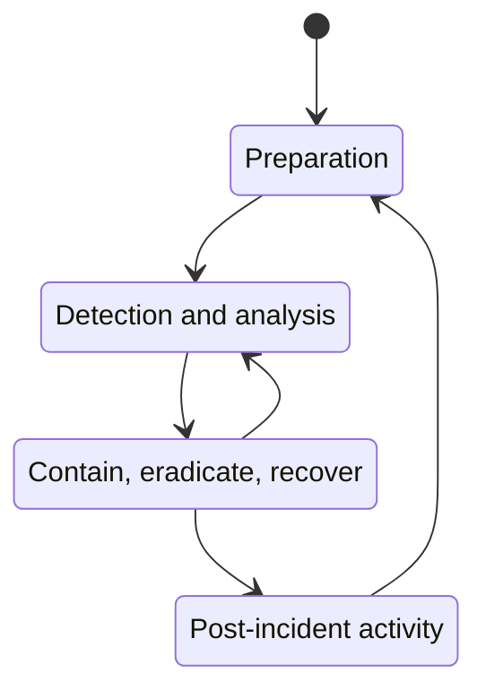

## Information Security Overview

**Plain English.** Information security is a set of promises about data: only the right people read it, nobody changes it in secret, it is there when needed, and you can prove who did what. An attack is anything that tries to break one of those promises. This module gives you the vocabulary the whole exam uses, so learn the words exactly.

### Elements of information security

| Element | Means | Broken by | Kept by |
|---|---|---|---|
| **Confidentiality** | only authorized people can read | sniffing, data leaks, shoulder surfing | encryption, access control |
| **Integrity** | no unauthorized change | tampering, man-in-the-middle edits | hashes, digital signatures |
| **Availability** | usable when needed | DoS/DDoS, ransomware | redundancy, backups |
| **Authenticity** | the data or user is genuine | spoofing, forged e-mail | authentication, certificates |
| **Non-repudiation** | the sender cannot deny the action | shared keys, missing logs | digital signatures, audit logs |

**Information assurance (IA)** is the wider goal of keeping all five properties true over time, including the ability to restore systems after an incident. Think "protect, detect, react".

### Classifying attacks

EC-Council sorts attacks into five classes (the list comes from an old NSA framework):

| Class | What the attacker does | Example |
|---|---|---|
| **Passive** | watches without changing anything | sniffing unencrypted traffic, traffic analysis |
| **Active** | changes data or disrupts service | DoS, session hijacking, modifying packets |
| **Close-in** | is physically near the target | shoulder surfing, dumpster diving |
| **Insider** | abuses trusted access | an admin copying the customer database |
| **Distribution** | tampers with hardware or software before delivery | a backdoored update, altered routers in transit |

"Distribution attack" is the EC-Council label; most other sources say **supply-chain attack**. Passive attacks are hard to *detect* (nothing changes), so the defense is to *prevent* them, mainly with encryption.

EC-Council also describes an attack as **motive (goal) + method + vulnerability**: the attacker needs a reason, a technique, and a weakness to use it on. Remove the weakness and the method fails.

A **zero-day** attack exploits a weakness that defenders do not yet know about, so no patch exists.

### Exam traps

- **Passive = no change.** If the scenario says the attacker *altered*, *injected* or *flooded* anything, it is active.
- **Hashing proves integrity, not confidentiality.** Signatures add authenticity and non-repudiation.
- **Ransomware hits availability first** (and confidentiality too if data is also stolen).

## Hacking Concepts and Hacker Classes

**Plain English.** "Hacking" means using a system in a way its owner did not intend, usually by exploiting a weakness. What makes it legal or criminal is **permission**, not skill. The exam asks you to recognize who the attacker is from their motive and behavior.

### Hacker classes

| Class | Motive or trait | Permission? |
|---|---|---|
| **White hat** | defenders, authorized testers | yes |
| **Black hat** | personal gain, damage | no |
| **Gray hat** | mixes both, may test without asking and then report | no |
| **Script kiddie** | runs other people's tools with little understanding | no |
| **Hacktivist** | a political or social cause: defacement, DDoS, leaks | no |
| **State-sponsored** | works for a government: espionage, sabotage | no (from the victim's view) |
| **Cyber terrorist** | ideology; wants fear or large-scale disruption | no |
| **Insider** | employee, contractor or partner misusing access | no (beyond their role) |
| **Suicide hacker** | does not care about being caught or punished | no |
| **Organized crime** | money: ransomware, fraud, stolen data markets | no |

An **advanced persistent threat (APT)** is a well-funded, skilled adversary (often state-linked) that gets in quietly and **stays** for a long time to steal data. "Persistent" is the key word: an APT is a campaign, not a one-off.

Mnemonic for the three hats: **white works with a contract, black breaks for profit, gray goes without asking.**

### Exam traps

- **Gray hat is still unauthorized**, even if the intent is to help.
- **Hacktivist vs cyber terrorist**: the hacktivist wants attention for a cause; the cyber terrorist wants fear and serious disruption.
- **Insider** includes careless employees, not only malicious ones.

## Ethical Hacking Concepts

**Plain English.** An ethical hacker uses the same tools and steps as a criminal, but with written permission, inside an agreed scope, and reports everything to the owner so the holes get fixed.

### What makes it ethical

1. **Written authorization** from someone who can grant it (the system owner), signed before any test.
2. **Scope and rules of engagement (ROE)**: which systems, which techniques, what time windows, who to call if something breaks, and what is forbidden (for example, no DoS, no social engineering).
3. **Confidentiality**: an NDA covers what the tester sees; findings go only to the client.
4. **Report**: every finding with evidence, risk and a fix. No report, no value.

Testing without permission is a crime (US CFAA, UK Computer Misuse Act), however good the intent. In 2022 the US Department of Justice said good-faith security research should not be charged under the CFAA, but that is prosecution policy, not a license.

### Kinds of assessment

| Assessment | Goal | Exploits? |
|---|---|---|
| **Vulnerability assessment** | list and rank weaknesses | no |
| **Penetration test** | prove which weaknesses can be exploited and what they lead to | yes, inside scope |
| **Red team** | emulate a real adversary against the defenders (blue team) over time | yes, stealthily |
| **Bug bounty** | reward outside researchers for reported bugs | per the program's rules |

Knowledge given to the tester:

- **Black box**: none; simulates an outside attacker.
- **White box**: full (diagrams, source code, credentials); most thorough per hour.
- **Gray box**: partial, such as a normal user account.

**Announced** (overt) tests are known to IT staff. **Unannounced** (covert) tests also measure whether the staff detect and respond.

NIST SP 800-115 splits a penetration test into four phases: **planning → discovery → attack → reporting**, with discovery and attack repeating as new access opens up.

### AI in ethical hacking (new in v13)

> **v13 adds AI across the course.** Expect questions on how AI helps an ethical hacker and what it changes.

AI assistants can summarize recon data, explain code or logs, draft scripts and write report sections. Tools named in the course include chat-based helpers such as **ShellGPT** (commands from plain English) and **PentestGPT** (guides a test step by step). Three rules:

- **Verify everything**: models invent commands, flags and CVEs.
- **Protect client data**: pasting findings into a public AI service can break the NDA and the scope.
- **AI systems are targets too**: LLM applications have their own weaknesses, such as prompt injection (OWASP Top 10 for LLM Applications).

### Exam traps

- **The first thing a tester needs is signed permission**, not a tool or a scan.
- **Vulnerability assessment ≠ penetration test**: only the pen test exploits.
- **Black box is the least efficient**, not the most thorough.

## Hacking Methodologies and Frameworks

**Plain English.** Attacks follow a predictable order. Frameworks give that order names, so attackers can plan and defenders can spot where to break the chain.

### The five phases of hacking (EC-Council)

| Phase | What happens | Example |
|---|---|---|
| **Reconnaissance** | gather information; **passive** (no contact: search engines, public records) or **active** (touching the target: calls, pings) | reading the company's job posts |
| **Scanning** | find live hosts, open ports, services, vulnerabilities | a port scan |
| **Gaining access** | exploit a weakness; escalate privileges | a phishing payload runs |
| **Maintaining access** | persistence: backdoors, new accounts, scheduled tasks | a hidden admin account |
| **Clearing tracks** | hide activity, delete or edit logs | clearing the Windows Security log (event 1102 is written when that happens) |

Mnemonic: **R**eal **S**pies **G**ather **M**ore **C**lues.

The **CEH ethical hacking framework** breaks the same path into steps you will meet as modules: footprinting and reconnaissance → scanning → enumeration → vulnerability analysis → system hacking (gaining access, escalating privileges, maintaining access, clearing logs).

### Cyber Kill Chain (Lockheed Martin)

| Stage | Attacker | Defender's chance |
|---|---|---|
| Weaponization | pairs an exploit with a payload (a malicious document) | threat intelligence on tooling |
| Delivery | sends it (e-mail, web, USB) | mail filtering, web proxy |
| Exploitation | the code runs by abusing a flaw | patching, exploit protection |
| Installation | drops persistent malware | application allow-listing, EDR |
| Command and control | the implant calls home | egress filtering, DNS monitoring |
| Actions on objectives | steal, encrypt, destroy | DLP, segmentation |

Defenders answer each stage with one of six actions: **detect, deny, disrupt, degrade, deceive, destroy**. Breaking any one link stops the intrusion.

### MITRE ATT&CK

A knowledge base of real adversary behavior. **Tactic** = the goal (*why*: Persistence, Credential Access). **Technique** = how (*Create Account*, *Phishing*). **Procedure** = a specific group's implementation. The Enterprise matrix has **14 tactics**, from Reconnaissance and Resource Development to Exfiltration and Impact. Together these are **TTPs**. TTPs are harder for attackers to change than **indicators of compromise (IoCs)** such as hashes and IP addresses.

### Diamond Model

Every intrusion event links four features: **adversary, capability, infrastructure, victim**. Analysts pivot: from one C2 IP address (infrastructure) to other victims, or to the adversary.

### Threat intelligence

Threat intelligence is threat information that has been analyzed and given context so someone can act on it. It is produced in a cycle: **planning and direction → collection → processing → analysis and production → dissemination**, with feedback into the next round. Four types by audience: **strategic** (executives, trends), **operational** (specific campaigns), **tactical** (TTPs for defenders), **technical** (IoCs for tools).

### Exam traps

- **Kill chain: Delivery → Exploitation → Installation.** Weaponization happens on the attacker's side, before anything touches the victim.
- **Clearing tracks is phase 5**, not part of maintaining access.
- **ATT&CK tactic = why, technique = how.**
- **Diamond Model has no "motive" or "target" feature**; the four are adversary, capability, infrastructure, victim.

## Information Security Controls

**Plain English.** Controls are the safeguards that stop, spot or clean up attacks. Managing security means choosing controls based on risk, then being ready when something still goes wrong.

### Controls

| By type | Examples |
|---|---|
| Administrative | policies, training, background checks |
| Technical | firewalls, encryption, MFA, ACLs |
| Physical | locks, guards, fences, CCTV |

| By function | Job | Examples |
|---|---|---|
| Preventive | stop it | firewall, IPS, locks |
| Detective | notice it | IDS, log review, CCTV recording |
| Corrective | fix it | patching, reimaging |
| Deterrent | discourage it | warning banners, visible cameras |
| Recovery | restore | backups, DR site |
| Compensating | substitute | extra monitoring when a legacy system cannot be patched |

**Defense in depth** layers independent controls so one failure is not fatal. **Zero trust** removes trust based on network location: every request is authenticated and authorized. **Least privilege** gives each account only what its job needs.

### Risk management

Risk grows with the **likelihood** that a threat exploits a vulnerability and with the **impact** if it does (EC-Council also writes risk = threats × vulnerabilities × impact). NIST's process: **frame → assess → respond → monitor**. The four responses:

| Response | Example |
|---|---|
| Mitigate (reduce) | add MFA |
| Transfer (share) | cyber insurance, outsourcing |
| Avoid | stop offering the risky service |
| Accept | document and sign off |

**Threat modeling** asks early in design: what are we building, what can go wrong, what do we do about it, did it work? **Frameworks** that organize controls: NIST CSF 2.0 (**Govern, Identify, Protect, Detect, Respond, Recover**; Govern is new in 2.0), ISO/IEC 27001, CIS Controls v8.

### Incident management

This is the NIST SP 800-61 Rev. 2 lifecycle. The 2025 revision (Rev. 3) maps incident response onto the CSF 2.0 functions instead, but the stages above are what most questions describe. EC-Council's incident handling process splits the same work into more steps (triage, notification, evidence gathering and forensic analysis, and so on). **Contain before you eradicate**, and preserve evidence before you wipe anything.

### Exam traps

- **Insurance = transfer**, not mitigation.
- **A warning banner is a deterrent**; a camera is detective if someone watches the recording, deterrent if it is only visible.
- **Lessons learned** belong to post-incident activity, the last stage.
- **Compensating ≠ corrective**: compensating replaces a control you cannot use; corrective fixes damage.

## Information Security Laws and Standards

**Plain English.** Laws and standards tell organizations what they must protect and how. Exam questions describe an organization and its data; you name the rule. Match the **data type** and the **country**.

| If the scenario mentions… | Answer | Kind |
|---|---|---|
| card numbers | **PCI DSS** | industry standard (contracts with card brands) |
| US patient records | **HIPAA** | US law (HHS enforces) |
| US listed company's financial reports | **SOX** | US law (investor protection) |
| personal data of people in the EU | **GDPR** | EU regulation |
| UK personal data | **UK GDPR + Data Protection Act 2018** | UK law (ICO enforces) |
| US federal agency systems | **FISMA** | US law (NIST standards) |
| US banks' customer data | **GLBA** | US law (FTC Safeguards Rule) |
| breaking copy protection, takedown notices | **DMCA** | US law |
| certifiable security management system | **ISO/IEC 27001** | international standard |

Details worth knowing:

- **PCI DSS**: applies to anyone who stores, processes or transmits cardholder data; 12 requirements; set by the PCI Security Standards Council.
- **HIPAA**: Privacy Rule (use of PHI), Security Rule (administrative, physical and technical safeguards for ePHI), Breach Notification Rule (individuals within 60 days; large breaches also to the media).
- **SOX**: §302 executives certify reports; §404 internal controls over financial reporting are assessed and audited.
- **GDPR**: applies to any organization handling personal data of people in the EU, wherever it is based; breach notice to the authority within **72 hours**; fines up to **€20 million or 4% of global turnover**.
- **ISO/IEC 27001:2022**: certifiable ISMS requirements, Annex A lists 93 controls in 4 themes. **27002** is implementation guidance, not certifiable.
- **FISMA**: agencies follow NIST (FIPS 199 categorization, SP 800-53 controls, SP 800-37 RMF).
- **DMCA §1201**: bans bypassing copy protection, with limited security-research exemptions.

### Exam traps

- **PCI DSS is not a law.**
- **SOX protects investors**, not customers' privacy.
- **GDPR follows the data subject**, not the company's location.
- **ISO 27001 certifies, 27002 guides.**
