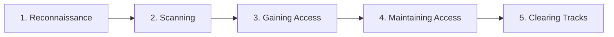

> **Sample notes.** This short version exists to test the app. The full module (all six sections, 1,500–3,000 words) is generated with `/build-module 1`.

## Information Security Overview

**Plain English.** Security is about keeping three promises about data: only the right people can read it, nobody can secretly change it, and it is there when you need it.

The **CIA triad**:

| Property | Question it answers | Typical attack against it |
|---|---|---|
| Confidentiality | Who can *read* it? | Sniffing, data leaks |
| Integrity | Has it been *changed*? | Record tampering, MITM modification |
| Availability | Can I *use* it now? | DoS/DDoS, ransomware |

Two related properties: **authenticity** (the identity is genuine) and **non-repudiation** (the sender cannot deny the action; provided by digital signatures).

## Hacking Methodologies and Frameworks

**Plain English.** Attackers follow a predictable sequence. Defenders learn it so they can break the chain early.

The **Cyber Kill Chain** (Lockheed Martin) has 7 stages: Reconnaissance → Weaponization → Delivery → Exploitation → Installation → Command & Control → Actions on Objectives.

## Exam traps

- **Tactic vs. technique.** A tactic is the *goal*; a technique is *how* it is reached.
- **Detective vs. preventive.** An IDS that only alerts is detective; an IPS that blocks is preventive.
- **Kill chain order.** Exploitation comes *before* Installation.
