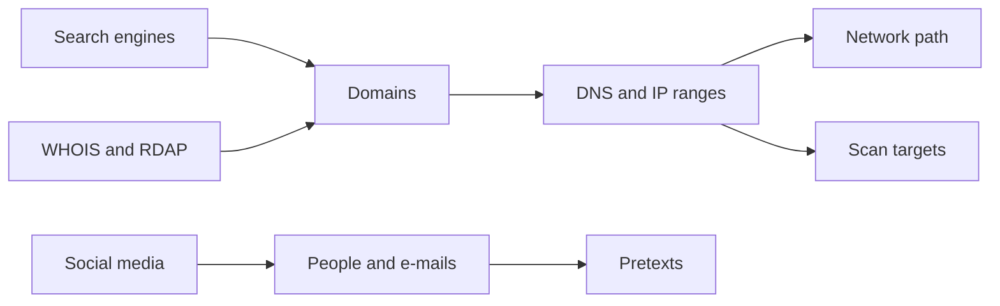
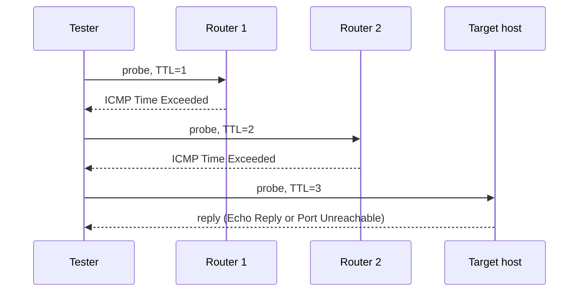

## Footprinting Concepts

**Plain English.** Footprinting is homework before the attack: learning as much as possible about the target from the outside. A good footprint tells the attacker (or the tester) which doors exist, who holds the keys, and which ones look weak. For defenders, it shows what the world can already see.

### Passive vs active

| | Passive footprinting | Active footprinting |
|---|---|---|
| Contact with the target | none | direct |
| Examples | search engines, WHOIS/RDAP, CT logs, archives, social media, job ads | querying the target's DNS servers, traceroute to its hosts, calling staff, e-mail tracking |
| Detection risk | very low | the target may log it |

Some sources draw the line differently for DNS: a lookup through a public resolver is usually called passive, a query sent straight to the target's name server (or a zone transfer attempt) is active. Exam questions usually hinge on one word: **does the activity touch the target's systems or people?**

### What you are looking for

- **Organization**: staff names and roles, e-mail format, locations, partners, subsidiaries, news.
- **Network**: domains and subdomains, IP ranges, ASN, DNS servers, mail servers, VPN and remote-access portals.
- **Systems**: operating systems, web servers, frameworks, cloud providers, exposed services.

**OSINT** (open-source intelligence) is the name for intelligence built from public sources. Most footprinting is OSINT. In ATT&CK it sits under the **Reconnaissance** tactic (TA0043).

### Exam traps

- **Footprinting comes first**, before scanning. If nothing has been sent to the target's network yet, it is still footprinting.
- **Passive ≠ legal by default.** A penetration test still needs scope for OSINT on staff.

## Footprinting through Search Engines

**Plain English.** Search engines have already crawled the target's website, and sometimes files that should never have been public. Advanced operators turn a search box into a precise filter.

| Operator | Does | Example |
|---|---|---|
| `site:` | only results from a domain or path | `site:example.com` |
| `filetype:` (or `ext:`) | only a file type | `site:example.com filetype:pdf` |
| `intitle:` | word in the page title | `intitle:"index of"` |
| `inurl:` | word in the URL | `site:example.com inurl:login` |
| `intext:` | word in the page body | `intext:"internal use only"` |
| `"…"` / `-` | exact phrase / exclude | `site:example.com -www` |

**Google hacking** ("dorking") combines operators to find exposed documents, directory listings, login portals, error messages and configuration files. The **Google Hacking Database (GHDB)**, kept by Exploit-DB, catalogs such queries by category. Google's `cache:` operator was retired in 2024; for old versions of pages use the **Wayback Machine**.

Other engines matter too: Bing and DuckDuckGo index different pages, and specialized engines search code repositories, FTP servers or IoT devices (next section).

### Exam traps

- `site:example.com -www` is a classic way to find **subdomains**.
- Searching is passive: the target sees nothing. Downloading every file found is still passive, but opening a login portal is contact.

## Footprinting through Internet Research Services

**Plain English.** Beyond search engines, many services collect data about organizations and their systems. Attackers query them instead of touching the target.

| Service type | What it reveals | Examples |
|---|---|---|
| Device search engines | internet-facing services, banners, versions | **Shodan** (`port:`, `org:`, `country:`, `hostname:`, `net:`), **Censys** |
| Certificate Transparency | every issued TLS certificate, so subdomains | crt.sh |
| Website profilers | hosting, IP history, technologies | Netcraft site report |
| Archives | old pages, former staff lists, removed files | Wayback Machine (archive.org) |
| People search | names, addresses, phone numbers, relatives | people search sites |
| Job sites | technologies in use ("experience with Cisco ASA and SAP") | company job ads |
| Financial and business | subsidiaries, executives, acquisitions | SEC EDGAR, business registers |
| Alerts | new mentions of the target | news and web alerts |
| Dark web | leaked credentials, breach dumps, access sales | Tor hidden services; defenders check breach services such as Have I Been Pwned |

**Competitive intelligence** is the business name for the same work: what the company does, where, with whom, and which technologies it uses, all from public sources.

### Exam traps

- **Shodan finds devices**, not web pages. A question about exposed webcams, ICS or RDP servers → Shodan (or Censys).
- **CT logs reveal subdomains** even when DNS zone transfers are blocked.
- Job postings leak the **technology stack**.

## Footprinting through Social Networking Sites

**Plain English.** Employees tell the world who they are, what they do and which tools they use. Put together, that is a phishing kit.

What attackers collect:

- names, titles and reporting lines (who can approve payments, who runs IT);
- the **e-mail format** (first.last@…), guessed from a few public addresses;
- technologies and projects from profiles and posts;
- locations, badges and office photos, events, travel;
- personal interests for convincing pretexts.

Tools: **theHarvester** gathers e-mails, names, subdomains, IPs and URLs from public sources; **Sherlock** checks one username across hundreds of sites. Searching profiles by hand on professional networks remains the most common method.

Countermeasures: a social media policy, training on what not to post (badges, screens, org charts), and privacy settings.

### Exam traps

- A pretext built from a LinkedIn profile is still **footprinting**; sending the phishing e-mail is the attack.
- **theHarvester = e-mails and subdomains**; **Sherlock = usernames**.

## Whois Footprinting

**Plain English.** Every domain and IP block is registered somewhere. The registration record says who manages it, since when, and which name servers it uses.

- **WHOIS** is the classic protocol: plain text over **TCP port 43**.
- **RDAP** is its successor: queries over HTTPS, structured JSON answers, access control. Since **28 January 2025**, gTLD registries and registrars no longer have to run WHOIS (a few exceptions remain).
- Since the **GDPR** (2018), personal contact details are usually **redacted**; you still get the registrar, dates and name servers.
- **Thick** registries keep full records; **thin** registries keep only domain and registrar data and point to the registrar.

| Lookup | Where | Gives |
|---|---|---|
| Domain | registrar or registry (ICANN Lookup, `whois example.com`) | registrar, creation/expiry dates, name servers, status, maybe contacts |
| IP address or ASN | one of the five **RIRs**: **ARIN** (North America), **RIPE NCC** (Europe, Middle East, Central Asia), **APNIC** (Asia-Pacific), **LACNIC** (Latin America), **AFRINIC** (Africa) | owner, address block (network range), abuse contact |

A short creation date or an expiry date close at hand can flag a phishing domain. Name servers reveal the DNS provider.

### Exam traps

- **WHOIS = TCP 43**; RDAP = HTTPS.
- **Which RIR for a European IP?** RIPE NCC.
- Registrar privacy (proxy registration) is a **countermeasure** against WHOIS footprinting.

## DNS Footprinting

**Plain English.** DNS is the phone book of the internet. Its records list the mail servers, name servers, hosts and sometimes the services a company runs.

| Record | Holds | Why an attacker cares |
|---|---|---|
| A / AAAA | IPv4 / IPv6 address | hosts to target |
| MX | mail servers | phishing, mail provider |
| NS | authoritative name servers | where to try a zone transfer |
| CNAME | alias | cloud services, takeover candidates |
| SOA | zone authority, admin e-mail, serial | primary name server, admin contact |
| PTR | reverse lookup (IP → name) | naming conventions |
| TXT | free text (SPF, DMARC, site verification) | mail providers, SaaS in use |
| SRV | service location (`_ldap._tcp`, `_sip._tcp`) | internal services such as LDAP or SIP |
| HINFO | host CPU and OS | system info (rarely published) |

**Zone transfer (AXFR).** Secondary name servers copy the whole zone from the primary over **TCP 53**. If the server answers anyone, one request lists every host: `dig axfr @ns1.example.com example.com`. Fix: allow transfers only to known secondaries, authenticated with **TSIG**.

Tools:

- `nslookup` (Windows and Linux; `set type=mx`, `ls -d` for a transfer on Windows);
- `dig` (`dig example.com mx`, `dig -x 203.0.113.5`, `dig axfr …`) and `host`;
- **DNSRecon** and **dnsenum**: standard lookups, subdomain brute force, transfer attempts, reverse sweeps.

Other sources of names: reverse DNS on the whole IP range, CT logs, and DNSSEC **NSEC** zone walking (**NSEC3** hashes names to make this harder). Many servers now answer `ANY` queries minimally (RFC 8482), so ask for record types one by one.

### Exam traps

- **AXFR uses TCP**, normal lookups mostly UDP 53.
- **The SOA record** names the primary name server and the zone's admin mailbox.
- Split-horizon DNS keeps internal names off the public server.

## Network and Email Footprinting

**Plain English.** Traceroute shows the road to the target; e-mail headers show the road a message took. Both reveal infrastructure.

### Traceroute

Each router decrements the TTL; the one that drops it to zero sends back **ICMP Time Exceeded**, revealing itself. The final host answers with an Echo Reply (ICMP probes) or Port Unreachable (UDP probes).

| Tool | Default probe |
|---|---|
| Windows `tracert` | ICMP Echo |
| Linux `traceroute` | UDP to high ports (from 33434); `-I` ICMP, `-T` TCP SYN |

If a firewall blocks ICMP or UDP, TCP traceroute to port 80 or 443 often gets through. Rows of `* * *` mean no reply for that hop. Combine the path with RIR data to find the **network range** and where firewalls sit.

### E-mail headers

- **Received:** lines are added by each server, newest on top: read them **bottom-up** to follow the path from the sender.
- **Return-Path**, **Message-ID**, **Date**, **X-Originating-IP** (when present) help identify the origin.
- **Authentication-Results** shows SPF, DKIM and DMARC verdicts.
- The domain's SPF, DKIM and DMARC TXT records reveal which providers send its mail.

**E-mail tracking** tools hide a unique image or link in a message and record when, where (IP, rough location) and with which client it was opened. Blocking remote images defeats most of them.

### Exam traps

- **Windows tracert = ICMP, Linux traceroute = UDP** by default.
- The **first** Received line in the header is the **last** hop.

## Footprinting through Social Engineering

**Plain English.** Sometimes the fastest way to learn about a company is to ask its people, or watch them. Social engineering uses trust, helpfulness, urgency and authority.

| Technique | How it gathers information |
|---|---|
| Eavesdropping | listening to conversations or reading messages not meant for you |
| Shoulder surfing | watching a screen or keyboard (passwords, PINs, data) |
| Dumpster diving | searching trash for documents, org charts, notes, old media |
| Impersonation / pretexting | posing as IT support, a vendor or a new employee |
| Vishing | phone calls using a pretext ("this is the helpdesk…") |
| Phishing for information | e-mails that ask for details rather than deliver malware |

Countermeasures: security awareness training, verification procedures (call back on a known number), a clean-desk policy, shredding, and proper media sanitization before disposal.

### Exam traps

- **Dumpster diving and shoulder surfing are close-in techniques** (M1 attack classes): the attacker must be physically near.
- **Pretexting** = inventing a scenario; **impersonation** = pretending to be a specific role or person. They usually go together.

## Footprinting Tasks using Advanced Tools and AI

**Plain English.** Doing footprinting by hand is slow. Tools query dozens of sources at once and link the results; AI helps sort and summarize them.

| Tool | What it does |
|---|---|
| **Maltego** | link analysis: "transforms" expand one entity (domain, e-mail, person) into related ones, drawn as a graph |
| **Recon-ng** | modular web-reconnaissance framework, Metasploit-like console, workspaces, module marketplace; recon only |
| **theHarvester** | e-mails, names, subdomains, IPs, URLs from public sources |
| **SpiderFoot** | automated OSINT with hundreds of modules, passive or active use cases |
| **FOCA**, **ExifTool** | metadata from documents and images: authors, usernames, software versions, paths, GPS |
| **HTTrack**, `wget -m` | mirror a website for offline review |
| **Photon** | fast crawler that extracts URLs, e-mails, files and keys from a site |
| **OSINT Framework** | categorized directory of free OSINT tools and sites |

### AI-powered footprinting (new in v13)

> **v13 adds AI to footprinting.** Expect questions on what AI speeds up and where it needs a human.

AI assistants can generate search operator combinations, summarize hundreds of results, extract names and e-mail formats, write small scripts that chain OSINT tools, and draft the recon section of a report. The rules from M1 still apply: check every fact (models invent subdomains and people), keep collected personal data inside the engagement, and stay within scope.

### Exam traps

- **Maltego = graph and transforms. Recon-ng = modules and workspaces.**
- **Metadata** in public documents is a common source of usernames and software versions.

## Footprinting Countermeasures

**Plain English.** You cannot hide everything a business must publish, but you can stop giving away the details an attacker needs.

| Exposure | Countermeasure |
|---|---|
| Sensitive files found by search engines | remove them; request removal from search results; protect with authentication, not robots.txt |
| robots.txt listing secret paths | robots.txt is public and is not access control: protect the paths instead |
| Document metadata | strip metadata before publishing |
| WHOIS contact data | registrar privacy/proxy service; role accounts instead of names |
| DNS | restrict zone transfers (TSIG), split-horizon DNS, no HINFO or revealing names |
| Error pages, banners, directory listings | generic errors, minimal banners, listing disabled |
| Staff posts and job ads | social media policy, generic job ads |
| Social engineering | training, verification procedures, clean desk, shredding |
| Unknown exposure | footprint yourself regularly: search engines, Shodan/Censys, CT logs, breach services |

### Exam traps

- **robots.txt is not a security control.**
- **Footprinting cannot be stopped entirely.** The goal is to limit what is useful and to know what is out there.
