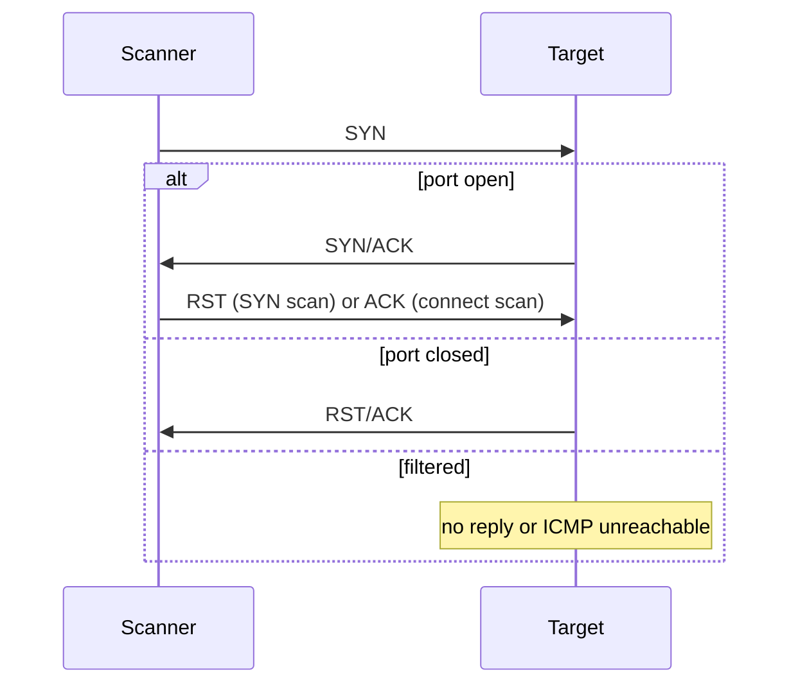

> **Sample notes.** This short version exists to test the app. The full module is generated with `/build-module 3`.

## Network Scanning Concepts

**Plain English.** Scanning is knocking on every door of a building to see which ones open, which ones answer "go away", and which ones stay silent.

TCP opens a connection with a three-way handshake:

## Port and Service Discovery

| Scan | Nmap | Flags sent | Open | Closed | Filtered |
|---|---|---|---|---|---|
| SYN (half-open) | `-sS` | SYN | SYN/ACK | RST | none / ICMP |
| Connect | `-sT` | full handshake | handshake done | RST | none / ICMP |
| NULL / FIN / Xmas | `-sN` `-sF` `-sX` | none / FIN / FIN+PSH+URG | *open\|filtered* (none) | RST | ICMP unreachable |
| ACK | `-sA` | ACK | — (*unfiltered* = RST) | — | none / ICMP |
| UDP | `-sU` | UDP | UDP reply | ICMP 3/3 | other ICMP unreachable |

## Scanning Beyond IDS and Firewall

- `-f` / `--mtu`: fragment the packets
- `-D RND:10`: add decoy source addresses
- `-g 53`: set the source port
- `-sI zombie`: idle scan (the scanner's IP is never sent)
- `-T0`/`-T1`: slow timing

## Exam traps

- **ACK scan never finds open ports.** It maps firewall rules.
- **NULL/FIN/Xmas do not work against Windows.** Windows sends RST for every port.
- **Idle vs. decoy.** An idle scan sends *nothing* from your IP; a decoy scan still sends your real probes.
