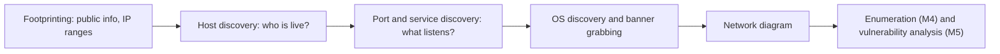
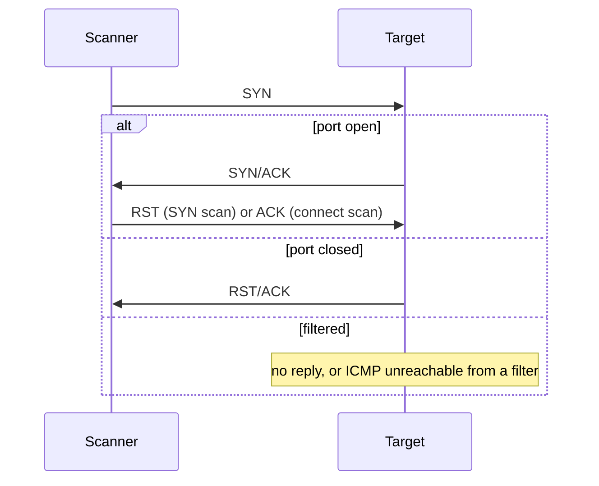
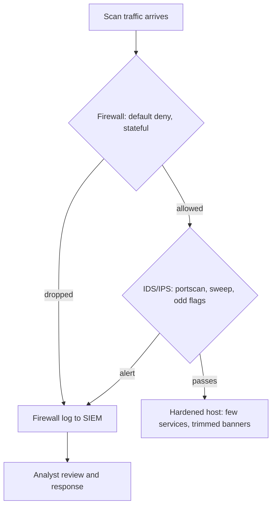

## Network Scanning Concepts

**Plain English.** Footprinting told you *where* the organisation lives on the network: its domains and IP ranges. Scanning knocks on those addresses to learn *what answers*: which hosts are up, which ports are open, which services and operating systems sit behind them. Think of walking down a street trying every door: some open, some answer "go away", some stay silent. Unlike footprinting, scanning sends packets to the target, so it can be seen and logged.

### Where scanning fits

```mermaid
flowchart LR
  F["Footprinting: public info, IP ranges"] --> H["Host discovery: who is live?"]
  H --> P["Port and service discovery: what listens?"]
  P --> O["OS discovery and banner grabbing"]
  O --> D["Network diagram"]
  D --> E["Enumeration (M4) and vulnerability analysis (M5)"]
```

EC-Council lists the scanning steps as: check for live systems, discover open ports, discover services and versions, discover the OS (banner grabbing), scan beyond IDS/firewalls, and draw network diagrams. NIST SP 800-115 groups the same work as *network discovery* and *network port and service identification*. MITRE ATT&CK calls scanning from outside **T1595 Active Scanning** (Reconnaissance) and scanning from inside a compromised network **T1046 Network Service Discovery** (Discovery).

### TCP basics the exam leans on

The **three-way handshake** opens every TCP connection: client **SYN** → server **SYN/ACK** → client **ACK**. A port with no listener answers a SYN with **RST** (usually RST/ACK).

```mermaid
sequenceDiagram
  participant C as Scanner
  participant T as Target
  C->>T: SYN
  alt port open
    T->>C: SYN/ACK
    C->>T: RST (SYN scan) or ACK (connect scan)
  else port closed
    T->>C: RST/ACK
  else filtered
    Note over T: no reply, or ICMP unreachable from a filter
  end
```

| Flag | Meaning |
|---|---|
| **SYN** | synchronise sequence numbers: "let's open a connection" |
| **ACK** | the acknowledgment number is valid |
| **FIN** | the sender has no more data: graceful close |
| **RST** | reset: abort the connection, or "nothing listens here" |
| **PSH** | push the data to the application now |
| **URG** | the urgent pointer is valid |

RFC 9293 lists two more bits, **CWR** and **ECE**, used for congestion notification (RFC 3168). Two RFC rules explain half of the scan table: a **closed** port answers any non-RST segment with RST, and an **open** port silently drops a segment that carries none of SYN, RST or ACK.

**UDP** has no handshake and no flags. A closed UDP port normally triggers **ICMP port unreachable** (type 3, code 3); an open one may answer or stay silent.

### ICMP types to know

| Type | Name | Where you meet it |
|---|---|---|
| 0 / 8 | echo reply / echo request | ping sweeps |
| 3 | destination unreachable (code 3 port, 13 administratively prohibited, 4 fragmentation needed) | port states, filters |
| 5 | redirect | routing (and M11 hijacking) |
| 11 | time exceeded | traceroute |
| 13 / 14 | timestamp request / reply | alternative ping |
| 17 / 18 | address mask request / reply | alternative ping (deprecated) |

### Ports

IANA ranges: **0–1023** well-known (system), **1024–49151** registered (user), **49152–65535** dynamic/private. Know the classics: 21 FTP, 22 SSH, 23 Telnet, 25 SMTP, 53 DNS, 69 TFTP, 80 HTTP, 110 POP3, 123 NTP, 135 MS RPC, 137–139 NetBIOS, 143 IMAP, 161/162 SNMP, 389 LDAP, 443 HTTPS, 445 SMB, 1433 MS SQL, 3306 MySQL, 3389 RDP.

### Tools by name

| Tool | What it is |
|---|---|
| **Nmap** (Zenmap GUI) | the reference scanner: host, port, service and OS discovery, scripts (NSE) |
| **hping3** | command-line packet assembler: builds TCP, UDP, ICMP or raw IP packets with chosen flags; firewall testing, traceroute, IP ID observation |
| **Masscan**, **ZMap** | very fast asynchronous scanners for huge ranges, up to the whole Internet |
| **RustScan**, **Unicornscan** | fast port finders; RustScan hands open ports to Nmap |
| **Angry IP Scanner**, **fping** | ping sweepers (GUI / command line) |
| **Scapy**, **Colasoft Packet Builder** | packet crafting |

### Network diagrams

Scan results end up as a **network diagram**: live hosts, subnets, gateways and firewalls, with the hops traceroute revealed. Attackers use it to plan; defenders compare it with their own documented topology to spot unknown hosts. Zenmap draws a topology view; EC-Council also names commercial network-mapping tools.

## Host Discovery

**Plain English.** Before trying every door, find out which houses are occupied. Host discovery (a *ping sweep*) sends a cheap probe to every address in a range and notes who answers.

| Probe | Nmap option | "Host up" reply | Notes |
|---|---|---|---|
| ARP request | `-PR` | ARP reply | local segment only; default there; can't be hidden by host firewalls |
| ICMP echo | `-PE` | echo reply (type 0) | often blocked at the perimeter |
| ICMP timestamp / address mask | `-PP` / `-PM` | type 14 / type 18 | try when only echo is blocked |
| TCP SYN | `-PS` (port 80 by default) | SYN/ACK **or** RST | any answer proves the host exists |
| TCP ACK | `-PA` | RST | passes stateless filters that only block SYNs |
| UDP | `-PU` (port 40125 by default) | ICMP port unreachable | an unusual port so the port is likely closed |
| SCTP INIT / IP protocol | `-PY` / `-PO` | INIT-ACK or ABORT / any reply | rarer options |

Controls: **`-sn`** = discovery only, no port scan (the classic ping sweep). **`-Pn`** = skip discovery and scan every address as if it were up (for hosts that block pings). **`-sL`** = list targets and resolve names, sending nothing to them. Without options, a privileged Nmap sends ICMP echo, SYN to 443, ACK to 80 and ICMP timestamp; on a local Ethernet it uses ARP instead.

Other tools: **fping** and **Angry IP Scanner** (sweeps), **arp-scan** and **netdiscover** (ARP on the LAN), **hping3** in ICMP mode.

**IPv6.** A /64 subnet holds 2^64 addresses, so sweeping is impractical. Discovery relies on DNS, predictable address patterns and, on the local link, Neighbor Discovery and the all-nodes multicast group.

**Defender's view.** One source sending ARP requests or echo requests to a whole range within seconds is the sweep signature. IDS portsweep rules and flow logs (Zeek conn.log) show one source touching many destinations.

### Exam traps

- **No reply ≠ host down.** A firewall may drop every probe; that is what `-Pn` is for.
- **ARP beats ICMP on a LAN**, but ARP never crosses a router.
- **`-sn` vs `-Pn`.** `-sn` = "no port scan"; `-Pn` = "no ping".

## Port and Service Discovery

**Plain English.** Now try each door of an occupied house. The way the door reacts (opens, is slammed, or nothing happens) tells you whether anyone is home behind it. Each scan type is a different way of knocking, and the exam asks you to read the reaction.

### The six Nmap port states

| State | Meaning |
|---|---|
| **open** | an application accepts connections or datagrams |
| **closed** | the host answered, but nothing listens there |
| **filtered** | a filter blocks the probe; Nmap can't tell |
| **unfiltered** | reachable, open or closed unknown (ACK scan only) |
| **open\|filtered** | open or filtered, no way to tell (UDP, FIN, NULL, Xmas, IP protocol) |
| **closed\|filtered** | closed or filtered (idle scan only) |

States describe what Nmap sees *from where it stands*: the same port can be open from inside and filtered from the Internet.

### Scan types and replies

| Scan | Nmap | Sends | Open | Closed | Filtered |
|---|---|---|---|---|---|
| SYN (half-open, stealth) | `-sS` | SYN | SYN/ACK (scanner then sends RST) | RST | no reply / ICMP unreachable |
| Connect (full open) | `-sT` | full handshake via `connect()` | handshake completes | RST | no reply / ICMP unreachable |
| NULL / FIN / Xmas | `-sN` `-sF` `-sX` | no flags / FIN / FIN+PSH+URG | no reply → *open\|filtered* | RST | ICMP unreachable |
| Maimon | `-sM` | FIN/ACK | no reply → *open\|filtered* (BSD) | RST | ICMP unreachable |
| ACK | `-sA` | ACK | — (RST → *unfiltered*) | — | no reply / ICMP |
| Window | `-sW` | ACK | RST with window > 0 (some systems) | RST with window 0 | no reply / ICMP |
| UDP | `-sU` | UDP datagram | UDP reply (silence → *open\|filtered*) | ICMP 3/3 | other ICMP 3 codes |
| Idle (zombie) | `-sI` | spoofed SYN via a zombie | zombie IP ID +2 | IP ID +1 → *closed\|filtered* | — |
| SCTP INIT | `-sY` | INIT | INIT-ACK | ABORT | no reply / ICMP |

- **SYN scan** is Nmap's default when it can send raw packets (root/admin). It never completes the handshake, so applications don't log a connection; firewalls and IDS still see it.
- **Connect scan** is the fallback without privileges. It completes the handshake, so the service may log it.
- **NULL/FIN/Xmas** (EC-Council: *inverse TCP flag* scans) rely on the RFC rule above. Windows and many network devices send RST from every port, so every port looks closed.
- **ACK scan** maps firewall rules: RST means the probe got through (unfiltered), silence means a filter dropped it. A stateful firewall drops unsolicited ACKs.
- **UDP scan** is slow: silence is ambiguous, and hosts rate-limit ICMP errors. Version detection (`-sV`) helps separate open from filtered.
- Other names to recognise: **IP protocol scan** (`-sO`), **FTP bounce** (`-b`, abuses an FTP server's PORT command, mostly patched), **list scan** (`-sL`).

### Reading Nmap output

`PORT STATE SERVICE` (plus `VERSION` with `-sV`). For example `22/tcp open ssh` then `80/tcp closed http`. A line such as `Not shown: 997 closed tcp ports (reset)` collapses the common state; `--reason` prints the reply behind each state (`syn-ack`, `reset`, `no-response`). The SERVICE column without `-sV` is only a guess from the port number. Default scope: the 1,000 most common ports; `-p-` = all 65,535, `-F` = 100 most common. Output formats: `-oN` normal, `-oX` XML, `-oG` grepable, `-oA` all three.

### Service and version discovery, banner grabbing

- **`-sV`** probes each open port with requests from `nmap-service-probes` and matches the replies: protocol, product, version, sometimes the OS.
- **`-A`** = OS detection + version detection + default scripts (`-sC`) + traceroute.
- **NSE** runs scripts by category (default, safe, discovery, vuln, …).
- **Banner grabbing** reads the greeting a service sends: SSH version string, SMTP `220` line, HTTP `Server:` header. *Active*: connect and read (Netcat, Telnet, Nmap `-sV`). *Passive*: read banners from traffic or error pages without sending new probes.

### hping3 in one table

| Option | Meaning |
|---|---|
| (default) | TCP mode |
| `-1` / `-2` / `-0` | ICMP / UDP / raw IP mode |
| `-S` `-A` `-F` `-R` `-P` `-U` | set SYN, ACK, FIN, RST, PSH, URG |
| `-p` | destination port |
| `-8` (`--scan`) | scan mode over a port range |

A SYN probe answered with SYN/ACK marks an open port; RST/ACK marks a closed one.

### Exam traps

- **ACK scan never reports open.** It answers "filtered or not".
- **Silence means different things.** SYN scan: filtered. UDP/FIN/NULL/Xmas: open\|filtered.
- **ICMP 3/3 = closed** for UDP; other type 3 codes = filtered.
- **Half-open ≠ invisible.** The SYN scan avoids application logs, not firewall or IDS logs.

## OS Discovery

**Plain English.** Every operating system's network stack has habits: the TTL it starts packets with, the window size it offers, the TCP options it sets and their order. Watching those habits tells you the OS, the way an accent tells you where someone grew up.

| Approach | How | Tool | Trade-off |
|---|---|---|---|
| **Active fingerprinting** | send crafted TCP, UDP and ICMP probes, compare the replies with a database | Nmap `-O` (database `nmap-os-db`) | precise, but the probes are unusual and detectable |
| **Passive fingerprinting** | read packets the host sends anyway (SYN, TTL, window, options, DF bit) | p0f, Wireshark by hand | no probes, stealthy, less precise, needs traffic |
| **Banner grabbing** | read what services announce | Netcat, Telnet, Nmap `-sV` | fast; banners can be changed |
| **Service scripts** | ask a service for OS details | NSE `smb-os-discovery` | only where the service answers |

**Nmap `-O`** works best with at least **one open and one closed TCP port**. Its output shows *Device type*, *Running*, *OS CPE*, *OS details* and *Network Distance*; with no exact match it prints *Aggressive OS guesses* with percentages. `-A` includes `-O`. Nmap also has IPv6 OS detection.

### TTL and window clues

| Initial TTL | Usual family |
|---|---|
| 64 | Linux, most Unix-like systems, macOS |
| 128 | Windows |
| 255 | many network devices (Cisco IOS), Solaris |

The TTL you observe is the initial value **minus the hops** on the way, so round **up** to the nearest default: a TTL of 116 means 128 minus 12 hops, so Windows. Window sizes also differ by OS and version; EC-Council's table (for example Linux 5840, Windows 65,535 or 8,192) is a clue, not a rule.

**Defender's view.** Active OS probes use odd flag and option combinations and hit closed ports; IDS signatures flag them as fingerprinting. Traffic normalisation at the perimeter and trimmed banners make the answer less reliable.

### Exam traps

- **Passive = no packets sent.** If the question says "without sending traffic", the answer is p0f or sniffing, not Nmap `-O`.
- **Round TTL up**, never down.

## Scanning Beyond IDS and Firewall

**Plain English.** Filters and intrusion detection systems look for scan patterns, so scanners try to blend in: split packets, hide among fake sources, go very slowly. A defender does not need the recipes; they need to recognise each class and know what it looks like in the logs.

| Concept class | What it tries to hide | What the defender sees / does |
|---|---|---|
| **Packet fragmentation** | the TCP flags, split across tiny IP fragments | IDS reassembles before inspecting; drop tiny or overlapping fragments (RFC 1858) |
| **Decoys** | which source is real, among many forged ones | correlate by timing and TTL; the real scanner is the one that also receives replies |
| **Source address spoofing** | the scanner's address | ingress/egress filtering (BCP 38) drops impossible sources |
| **Idle (zombie) scan** | the scanner entirely: probes appear to come from a third host | hosts with random or per-destination IP IDs make poor zombies; spoofed-source filtering |
| **Source port manipulation** | probes from "trusted" ports such as 53 or 20 | stateful filtering; never allow by source port alone |
| **Slow timing** (Nmap T0 paranoid, T1 sneaky) | the rate, to stay under IDS thresholds | longer correlation windows, flow logs, SIEM aggregation |
| **Randomised order, padding, crafted packets** | the pattern and packet signature | anomaly rules, normalisation |
| **Proxies and anonymisers** | the true origin | reputation feeds, blocklists, logs at the proxy |

Packet crafters (**hping3**, **Scapy**, **Colasoft Packet Builder**) let anyone build these unusual packets; the same tools help defenders **test their own firewall rules**. An ACK scan tells stateless filters from stateful ones, and an ICMP *administratively prohibited* reply (type 3 code 13) reveals a filtering device.

### Exam traps

- **Idle vs decoy.** Idle: no probe carries your address. Decoy: your probes are sent too, hidden among fakes.
- **Spoofed probes can't see replies**, unless the scanner can sniff the reply path; that is why decoys include the real source.
- **Slow scans beat per-minute thresholds**, not logging.

## Network Scanning Countermeasures

**Plain English.** You can't stop people from knocking, but you can have fewer doors, lock the ones you keep, stop announcing what is behind them, and notice who is walking the street trying handles.

| Scanning technique | Countermeasure | Detection |
|---|---|---|
| Ping sweep | block inbound ICMP echo, timestamp and address mask at the perimeter; rate-limit ICMP | IDS portsweep / ICMP sweep rules; flow logs |
| Port scan (SYN, connect) | close unused ports, disable unneeded services, default-deny firewall | IDS portscan rules: one source, many ports, many half-open connections |
| NULL / FIN / Xmas / ACK probes | stateful firewall drops packets that belong to no connection | signatures for impossible flag combinations |
| Banner grabbing | trim or change banners (Apache `ServerTokens Prod`, `ServerSignature Off`; nginx `server_tokens off`), patch | web and service logs |
| OS fingerprinting | traffic normalisation, fewer exposed services | fingerprint-probe signatures |
| Spoofing, decoys, idle scan | ingress/egress filtering (BCP 38), IP ID randomisation | spoofed-source and anomaly rules |
| Fragmentation | reassemble before inspection; drop tiny or overlapping fragments | fragment anomaly alerts |
| Slow scans | — | long-window correlation in the SIEM |

### Detecting scans

- **IDS/IPS.** Snort 3's `port_scan` inspector counts, per time window, one source hitting many ports on one host (*portscan*) or one port on many hosts (*portsweep*), plus unusual flag combinations. Suricata can rate-limit and aggregate alerts per source (`threshold`, `detection_filter`). Zeek's conn.log marks failed attempts (for example `S0` = SYN with no answer, `REJ` = rejected).
- **Firewall logs** turned into alerts (psad does this for Linux firewalls), sent to a SIEM and reviewed.
- **Deception**: honeypots, tarpits and fake open ports waste the scanner's time and raise a clear alert.

### Hardening

- **Attack surface first**: disable what you don't need (ATT&CK M1042). Each open port is an avenue for attack.
- **Default deny** in and out; **stateful inspection**; **segmentation** so an internal scan (T1046) reaches little (M1030); **network IPS** at the boundary (M1031).
- **ICMP with care**: filter what you don't need, but keep *fragmentation needed* (Path MTU Discovery) and the ICMPv6 messages IPv6 cannot work without (RFC 4890).
- **Scan yourself** regularly (authorised) and compare against the approved list of open ports.
- For internet-wide **T1595** scanning, prevention is mostly out of your hands (M1056 Pre-compromise): expose as little as possible and watch the traffic.

```mermaid
flowchart TD
  S["Scan traffic arrives"] --> F{"Firewall: default deny, stateful"}
  F -- dropped --> L["Firewall log to SIEM"]
  F -- allowed --> I{"IDS/IPS: portscan, sweep, odd flags"}
  I -- alert --> L
  I -- passes --> H["Hardened host: few services, trimmed banners"]
  L --> R["Analyst review and response"]
```

### Exam traps

- **Banner changes are obscurity.** They slow attackers; patching is the fix.
- **Blocking all ICMP breaks things** (Path MTU Discovery, IPv6 Neighbor Discovery).
- **A firewall that drops scans still logs them**: detection and prevention are separate controls.
