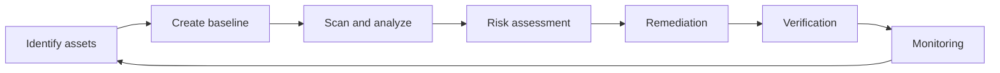
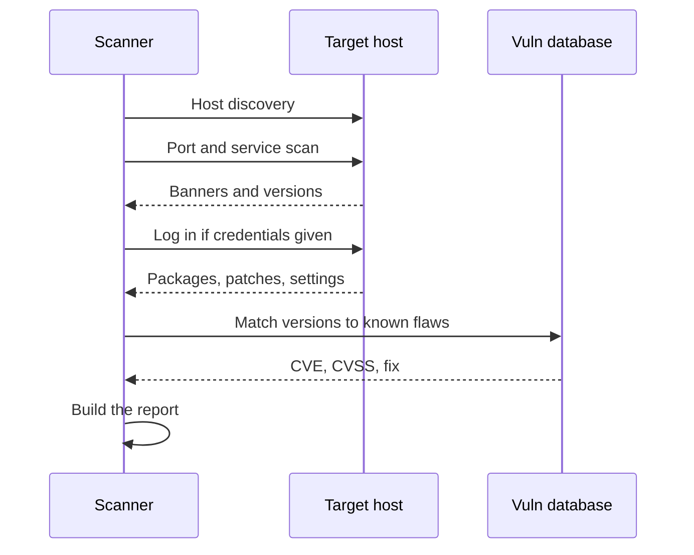
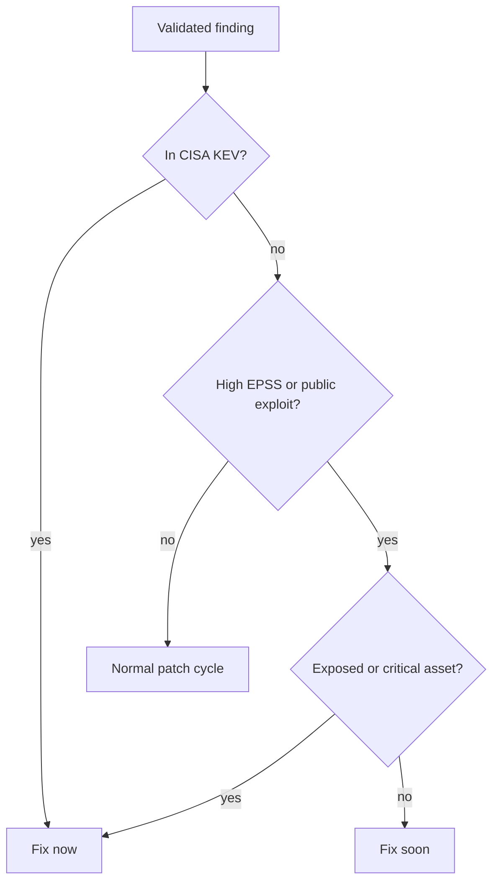

## Vulnerability Assessment Concepts

**Plain English.** A vulnerability is a weak spot an attacker could use: a missing patch, a default password, a service nobody switched off. A vulnerability assessment finds those weak spots, names them with standard IDs, rates how bad each one is and hands the owner a ranked to-do list. It does **not** exploit anything; proving impact by exploiting is a penetration test.

**Risk = likelihood × impact.** A severe flaw on an isolated test box can be low risk; a medium flaw on an internet-facing server that attackers are already using is high risk. Keep that in mind for every scoring question.

### Classifying vulnerabilities

| Class | Example | Public reference |
|---|---|---|
| **Misconfiguration** | directory listing on, verbose errors, unused services open | OWASP A05:2021 |
| **Default or hard-coded credentials** | admin/admin on a switch console | CWE-1392, CWE-798 |
| **Missing patches / outdated components** | web server release out of support | OWASP A06:2021, CWE-1395 |
| **Buffer overflow** | copying input without checking its size | CWE-120, CWE-787 |
| **Design flaw** | protocol with no authentication by design | CWE-306 |
| **Zero-day** | exploited before the vendor has a fix | NIST "zero day attack" |
| **Legacy and third-party** | end-of-life OS, a vulnerable library inside your app | CWE-1104 |

EC-Council's own list also names OS flaws, application flaws, default installations, open services and patch-management issues. Same ideas, different labels.

### The naming and scoring toolkit

| Name | Who runs it | What it tells you |
|---|---|---|
| **CVE** | CVE Program (sponsored by CISA, operated by MITRE); IDs assigned by **CNAs** | one specific vulnerability: `CVE-YYYY-NNNN` (4+ digits) |
| **NVD** | NIST | CVE + **CVSS base score** + **CWE** + **CPE** (affected products) |
| **CWE** | MITRE | the weakness **type** (root cause), e.g. CWE-89 SQL injection |
| **CAPEC** | MITRE | the attack **pattern** used against a weakness |
| **CPE** | NIST (NVD dictionary) | the standard **name** of a product and version |
| **CVSS** | FIRST | **severity** 0.0–10.0 plus a vector string |
| **EPSS** | FIRST | **probability** of exploitation in the next 30 days |
| **KEV** | CISA | CVEs **known to be exploited** in the wild |

A CVE Record is **Reserved** (ID held by a CNA, no details yet), then **Published**, or **Rejected** (do not use).

### CVSS in one page

Severity bands (v3.x and v4.0): **None 0.0 · Low 0.1–3.9 · Medium 4.0–6.9 · High 7.0–8.9 · Critical 9.0–10.0**. CVSS v2 had no Critical band (High went up to 10.0). The NVD states it plainly: CVSS is **not a measure of risk**.

**v3.1 base metrics**: Attack Vector (Network, Adjacent, Local, Physical) · Attack Complexity (Low, High) · Privileges Required (None, Low, High) · User Interaction (None, Required) · Scope (Unchanged, Changed) · Confidentiality, Integrity, Availability (High, Low, None). The **temporal** group (Exploit Code Maturity, Remediation Level, Report Confidence) changes over time; the **environmental** group adapts the score to your systems. The NVD publishes **base scores only**.

| Vector | Score | Typical flaw |
|---|---|---|
| `AV:N/AC:L/PR:N/UI:N/S:U/C:H/I:H/A:H` | 9.8 Critical | unauthenticated remote code execution |
| same with `S:C` | 10.0 Critical | RCE that escapes into other components |
| `AV:L/AC:L/PR:L/UI:N/S:U/C:H/I:H/A:H` | 7.8 High | local privilege escalation |
| `AV:N/AC:L/PR:N/UI:N/S:U/C:N/I:N/A:H` | 7.5 High | remote denial of service |
| `AV:N/AC:L/PR:N/UI:R/S:C/C:L/I:L/A:N` | 6.1 Medium | reflected XSS |

**CVSS v4.0** (released November 2023) changes:

- new base metric **Attack Requirements** (AT: None, Present);
- User Interaction becomes **None / Passive / Active**;
- **Scope is gone**: impact is scored for the **vulnerable system** (VC/VI/VA) and **subsequent systems** (SC/SI/SA);
- the temporal group becomes **Threat**, with one metric, **Exploit Maturity** (Attacked, POC, Unreported);
- scores are labeled **CVSS-B, CVSS-BT, CVSS-BE, CVSS-BTE** after the groups used;
- **Supplemental** metrics (Safety, Automatable, Recovery, Value Density, Vulnerability Response Effort, Provider Urgency) add context but **never change the score**.

Mnemonic for the v3.1 base order: **A**ll **A**ttackers **P**refer **U**nlocked **S**ystems, **C**learly **I**nsecure **A**ssets (AV, AC, PR, UI, S, C, I, A).

### The vulnerability-management life cycle

EC-Council groups these steps into three phases: **pre-assessment** (identify assets, create a baseline), **vulnerability assessment** (scan and analyze) and **post-assessment** (risk assessment, remediation, verification, monitoring). NIST SP 800-40 Rev. 4 describes the same loop in its own words: **know** when new vulnerabilities affect your assets → **plan** the risk response → **execute** it (prepare, implement, verify, keep monitoring).

Hook: *know what you have, find what's wrong, fix it, prove it, keep watching.*

### Types of assessment

| Pair | Difference |
|---|---|
| **Active / passive** | sends probes vs listens to traffic |
| **External / internal** | from the internet vs inside the network (internal usually finds more) |
| **Host-based / network-based** | checks one system locally vs probes many over the network |
| **Credentialed / non-credentialed** | logs in and reads versions vs guesses from banners |
| **Manual / automated** | expert checks vs scanners |

Also: **application**, **database** and **wireless** assessments. EC-Council also sorts *solutions*: **product-based** (you run it in-house) vs **service-based** (a third party runs it), and **tree-based** (auditor picks a strategy per machine type) vs **inference-based** (the tool discovers protocols and services, then chooses matching tests).

**Vulnerability research** means following new flaws before attackers use them: CVE/NVD, vendor advisories, Exploit-DB, KEV. EC-Council classifies what you find by **severity** (low, medium, high) and **exploit range** (local or remote). If you find a new flaw yourself, use **coordinated disclosure**: report it privately to the vendor or a coordinator such as CISA, agree on a timeline, then publish.

### Exam traps

- **CVE ≠ CWE.** CVE = this flaw in this product; CWE = the kind of mistake.
- **NVD does not assign CVE IDs**; CNAs do. NVD adds CVSS, CWE and CPE.
- **CVSS measures severity, not risk.** Exploitation (KEV, EPSS) and your environment change the priority.
- **Adjacent ≠ Local.** Adjacent = same subnet, Wi-Fi or Bluetooth; Local = a session on the box or a user opening a file.
- **v4.0 has no Scope and no Temporal group.** Look for subsequent-system impact and Threat/Exploit Maturity instead.

## Vulnerability Assessment Tools

**Plain English.** A vulnerability scanner is an automated checklist. It finds live hosts, works out what software they run, compares each version and setting with a database of known flaws, and reports matches with CVE IDs and CVSS scores. It is fast and broad, but it guesses when it cannot log in, so it produces false positives and misses things too.

### Scanning approaches

| Approach | Strength | Weakness |
|---|---|---|
| **Credentialed** | reads real patch levels and settings; fewer false positives | needs accounts, which must be protected |
| **Non-credentialed** | the attacker's view | relies on banners; misses local flaws |
| **Agent-based** | covers laptops that are rarely on the office network; low network load | software to install on every host |
| **Passive** (SPAN port or tap) | no probes, safe for fragile OT/ICS devices | sees only what crosses the wire |
| **External / internal** | shows what the internet sees / what an insider sees | the perimeter hides a lot from external scans |

Vulnerability scans send far more traffic than a port scan and can crash old printers or control devices. Agree time windows, throttle, and stop and call the client contact if something breaks.

### Tools you must recognize

| Tool | What it is | Remember |
|---|---|---|
| **Nessus** (Tenable) | commercial network scanner; free, limited Essentials edition | web UI **TCP 8834**; checks = **plugins** (NASL); templates (Host Discovery, Basic Network Scan, Advanced Scan, Credentialed Patch Audit); **VPR** threat rating |
| **OpenVAS / Greenbone** | open-source scanner | **gvmd** manager, OpenVAS scanner, **GSA** web UI (Kali `https://127.0.0.1:9392`); checks = **NVTs** (NASL) from the Community Feed; `gvm-setup`, `gvm-check-setup`; **QoD** filter hides results below 70 % by default |
| **Qualys VMDR** | cloud vulnerability management platform | agents plus cloud scanners |
| **Nikto** | web **server** scanner | `nikto -h host -port 443 -ssl -Tuning 2b -o r.html -Format htm`; `-evasion` for URI tricks; noisy |
| **Nmap NSE** | scripts for known flaws | `nmap -sV --script vuln` or `--script vulners` (maps CPE → CVE, needs `-sV`) |
| **OWASP ZAP** | web **application** scanner (DAST) | passive scan only watches traffic; active scan **attacks** |
| **Nuclei** | template scanner | community **YAML** templates for web, API, DNS, cloud |
| **Trivy / OWASP Dependency-Check** | component (SCA) scanners | container images, repos, libraries |
| **Lynis** | host audit for Linux, macOS, Unix | runs locally; hardening and compliance |
| **searchsploit** | offline Exploit-DB search | public exploit for a version = higher priority |

EC-Council also sorts tools by type: **host-based**, **depth assessment** (fuzzers that look for unknown flaws), **application-layer**, **scope assessment** (breadth), **active/passive**, and by location: network-based, agent-based, proxy and cluster scanners. When choosing a tool, look at the accuracy of its checks, how often its feed is updated, credentialed support, safe scanning options and report quality.

| Attack step | Tool that finds the weakness first | Countermeasure |
|---|---|---|
| Attacker uses a public exploit for an old service | Nessus / OpenVAS version checks, `searchsploit` | patch or upgrade; remove unneeded services |
| Attacker logs in with factory passwords | credentialed scan, default-credential checks | change defaults at deployment |
| Attacker probes web server files and CGIs | Nikto | remove sample files, harden the server config |
| Attacker injects into web forms | ZAP active scan | input validation, WAF as a stopgap |

> **AI in vulnerability assessment (new in v13).** Machine learning already ranks flaws: **EPSS** is a gradient-boosted model, and vendors add their own ratings (Tenable VPR). LLM assistants such as ShellGPT can draft scan commands, explain plugin output and write report text. Three rules: **verify** every CVE, flag and fix the AI suggests (models invent them); **never paste client scan data** into a public AI service; remember that LLM apps are targets you may have to assess too (OWASP Top 10 for LLM Applications).

### Exam traps

- **Nikto ≠ ZAP.** Nikto checks the web *server*; ZAP tests the web *application*.
- **Port 8834 = Nessus; 9392 = Greenbone GSA on Kali.**
- **Plugins** (Nessus) vs **NVTs** (Greenbone): both are NASL scripts.
- **Passive scanning** is the answer for fragile OT networks; **agents** are the answer for roaming laptops.
- **`vulners` only matches versions**: it does not prove the flaw is there.

## Vulnerability Assessment Reports

**Plain English.** The report is the product. Scan output is raw data; the report turns it into validated findings, ranked by real risk, with a clear fix and an owner for each. Different readers need different parts: managers read the summary, admins read the findings.

### What goes in

1. **Executive summary**: overall risk in business terms, top issues, trend since the last assessment.
2. **Assessment overview**: scope, dates, method, tools, credentialed or not, anything excluded.
3. **Findings**: for each one, affected host, vulnerability and CVE, CVSS/severity, evidence, how it was validated.
4. **Risk assessment**: priority using exploitation data and asset value, not the base score alone.
5. **Recommendations**: the fix, the root cause, the owner, the deadline (tracked in a **POA&M**).

NIST SP 800-115 asks for **root-cause analysis**: if 300 servers miss the same update, the finding is a broken patch process, not 300 separate problems. Recommend technical fixes (apply the patch) and process fixes (repair patch management).

### Validating results

| Result | Meaning | Action |
|---|---|---|
| **True positive** | real flaw, reported | fix and track |
| **False positive** | reported, not real (backported fix, altered banner) | document the evidence, close it |
| **False negative** | real, not reported | reduce with credentials, current feeds, manual checks |
| **True negative** | not there, not reported | nothing |

Check whether authentication actually worked (a Nessus scan information section showing `Credentialed checks : no` means remote checks only). A clean report from a failed login is not a clean host.

### Prioritizing

CISA's **SSVC** gives a similar decision tree with outcomes **Track, Track\*, Attend, Act**. Tenable's **VPR** (0.1–10) mixes CVSS with threat activity; in Nessus it only updates when you rescan.

### Responding and closing the loop

| Response (SP 800-40r4) | Example |
|---|---|
| **Mitigate** | patch, disable the feature, or add a **compensating control** such as segmentation |
| **Accept** | documented, signed-off decision, reviewed later |
| **Transfer** | cyber insurance, moving the service to SaaS |
| **Avoid** | uninstall the software, retire the asset |

Only patching or upgrading (or removing the software) actually eliminates the flaw. Then: test the fix on a comparable system → change management → deploy → **rescan to verify** → keep monitoring so nobody reverts it.

Reports are a map of your weaknesses: store them encrypted, share them on a need-to-know basis, destroy them per the agreed data-handling rules.

### Exam traps

- **The executive summary is for managers**; findings with evidence are for the fixers.
- **Validate before you report**; record false positives instead of silently deleting them.
- **KEV beats a higher CVSS**: known exploitation plus internet exposure goes first.
- **Verification = rescan.** An admin's "done" is not evidence.
- **Accepting a risk is a documented decision**, not dropping the finding from the report.
