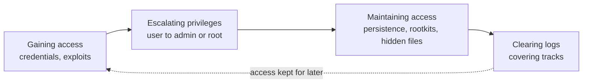
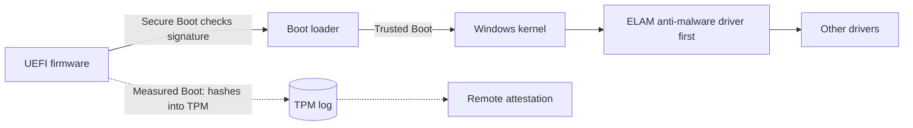
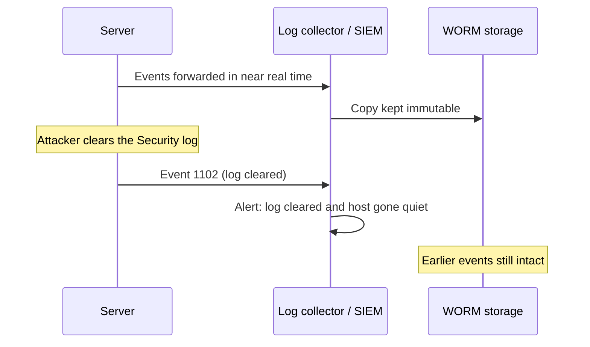

**The lifecycle in one picture.** System hacking is what happens after reconnaissance: the attacker gets a first account, raises it to administrator, makes the access survive reboots and password changes, then removes the evidence. Each step leaves its own traces, and each has its own controls. Learn the module as four questions a defender asks: *how did they get in, how did they get admin, how do they stay, and what did they erase?*

| Phase (CEH) | MITRE ATT&CK tactic | What a defender watches |
|---|---|---|
| Gaining access | Credential Access (TA0006), Initial Access | failed and unusual logons, credential theft |
| Escalating privileges | Privilege Escalation (TA0004) | new admin rights, elevated processes, group changes |
| Maintaining access | Persistence (TA0003) | new services, tasks, Run keys, accounts |
| Clearing logs | Stealth (TA0005) and Defense Impairment (TA0112) | log cleared events, audit policy changes, gaps in log flow |

ATT&CK renamed TA0005 from *Defense Evasion* to *Stealth* in 2026 and moved log clearing into the new **Defense Impairment** tactic. Older material still says Defense Evasion; the idea is the same.

## Gaining Access

**Plain English.** The easiest way into a system is to log in as someone. So most of this phase is about passwords: guessing them online, cracking stolen hashes offline, catching them on the network, or reusing a hash or ticket without ever knowing the password. The other way in is exploiting a software flaw, such as a buffer overflow, in a service or in a file the victim opens.

### Where Windows keeps credentials

| Store | What it holds | Protected by |
|---|---|---|
| **SAM** (local) | NT hashes of local accounts | registry hive readable only with SYSTEM rights; LAPS for the admin account |
| **NTDS.dit** (domain controller) | hashes of every domain account | DC access control, tiered admin |
| **LSASS memory** | credentials of signed-in users (hashes, tickets) | Credential Guard, LSA protection (RunAsPPL) |

The **LM hash** is a weak legacy format; Windows has not stored it by default since Vista. The **NT hash** is unsalted, so the same password gives the same hash everywhere. That is why a stolen hash can be reused (pass the hash) or looked up in precomputed tables. Linux stores salted hashes in `/etc/shadow`, readable only by root.

**NTLM** is challenge-response; **Kerberos** (KDC, ticket-granting ticket, service tickets) is the preferred protocol in Active Directory.

### Password attacks by log signature

| Attack | What it is | What the logs show | Control |
|---|---|---|---|
| **Guessing / brute force** | many passwords against one account | many failures on **one account**, then a lockout (4625 → 4740) | lockout or throttling, MFA |
| **Password spraying** | one common password against **many accounts** | a few failures per account across **many accounts**, same source, spread out in time | MFA, banned-password list, smart lockout, alert on failures across accounts |
| **Credential stuffing** | leaked username:password pairs from another site | logins from many IPs, many unknown usernames, some successes | MFA, breached-password checks, bot detection |
| **Offline cracking** | guessing against stolen hashes on the attacker's machine | nothing at guess time; look for the **hash theft** earlier | slow salted hashing, protect SAM/NTDS/LSASS |
| **Rainbow tables** | precomputed hash chains | nothing at guess time | unique salts |
| **Pass the hash** | reuse the NT hash over NTLM | NTLM logons (4624, type 3) without an interactive logon; 4776 | Credential Guard, LAPS, restrict NTLM |
| **Pass the ticket** | reuse a stolen Kerberos ticket | tickets used from an unusual host | Credential Guard, short ticket lifetimes |
| **Kerberoasting** | request service tickets, crack them offline | many **4769** with encryption type **0x17 (RC4)** | AES only, 25+ character service passwords, managed service accounts |
| **AS-REP roasting** | ask for tickets for accounts without pre-authentication | 4768 for accounts flagged "no pre-auth" | keep Kerberos pre-authentication on |
| **LLMNR/NBT-NS poisoning** | a LAN host answers failed name lookups and captures NTLM authentication | name-resolution replies from a workstation | disable LLMNR and NBT-NS, SMB signing |
| **Keylogging, sniffing** | capture passwords as typed or in transit | new drivers or processes; cleartext protocols | EDR, encrypted protocols, MFA |
| **MFA fatigue** | flood of push prompts until the user taps Approve | bursts of MFA requests for one user | number matching, phishing-resistant MFA |

**Windows events to know:** 4624 logon success · 4625 logon failure (status 0xC000006A = bad password, 0xC0000064 = unknown user, 0xC0000234 = account locked) · 4740 account locked out · 4776 NTLM credential check · 4768 TGT requested · 4769 service ticket requested · 4771 Kerberos pre-authentication failed (0x18 = wrong password). Spraying over Kerberos or LDAP shows up as **4771**, not 4625.

EC-Council sorts password attacks into four groups: **non-electronic** (shoulder surfing, social engineering, dumpster diving), **active online** (guessing, dictionary, brute force, spraying, pass the hash, poisoning, keyloggers), **passive online** (sniffing, man-in-the-middle, replay) and **offline** (rainbow tables, distributed cracking). Guess strategies: **dictionary** (word list), **brute force** (every combination), **hybrid** (words plus changes), **rule-based / mask** (known pattern, e.g. a capital letter then six digits).

### Password controls (NIST SP 800-63B-4 and friends)

- Length over complexity: at least **15** characters for a password used alone, **8** when it is one factor of MFA; accept at least 64.
- **No composition rules** and **no forced periodic changes**; change only on evidence of compromise.
- Check new passwords against a **blocklist** of common and breached passwords.
- **Rate-limit** failures (no more than 100 in a row per account); lockout thresholds are a trade-off because lockout itself can be abused for denial of service.
- Store passwords **salted** (salt of at least 32 bits, unique per password) with a slow password-hashing scheme: **Argon2id**, scrypt, bcrypt or PBKDF2.
- **MFA** everywhere it matters; prefer phishing-resistant methods (FIDO2, smart cards).
- **LAPS**: a unique, rotated local administrator password per machine, so one cracked hash does not open every PC.
- **Credential Guard** (virtualization-based isolation of NTLM hashes and TGTs), **LSA protection**, the **Protected Users** group.

### Exploitation and buffer overflows

Gaining access can also mean exploiting a flaw in a remote service or in a client program (a crafted document or web page). A **buffer overflow** writes more data than a buffer holds and overwrites nearby memory: on the **stack** (return addresses) or the **heap**. Defenses: **DEP/NX** (data areas cannot run code), **ASLR** (random memory layout), **stack canaries**, **Control Flow Guard**, safe coding with bounds checks, and patching.

### Tools (name and purpose)

| Tool | Purpose |
|---|---|
| John the Ripper, Hashcat | offline password crackers (hashes) |
| Hydra, Medusa | online logon guessing against network services |
| RainbowCrack, Ophcrack | rainbow-table crackers (Ophcrack: Windows hashes) |
| Mimikatz, pwdump, gsecdump, LaZagne | credential dumping / stored-password recovery |
| Responder | LLMNR/NBT-NS/mDNS poisoning and hash capture |
| Rubeus, Impacket | Kerberos and Windows protocol toolkits |
| Metasploit Framework | exploitation framework (exploits, payloads, post modules) |
| Exploit-DB | public archive of exploits |

### Exam traps

- **Spraying ≠ brute force.** Many accounts, one password = spraying; one account, many passwords = brute force.
- **Offline cracking leaves no failed logons.** Lockout does not help once the hashes are stolen.
- **Salts beat rainbow tables, not weak passwords.** A slow hash is still needed against GPU cracking.
- **Pass the hash needs no cracking.** Changing the password invalidates the hash; MFA on network logons and Credential Guard help.
- **Kerberoasting needs only a normal domain account.** The fix is on the service account (long password, AES).

## Escalating Privileges

**Plain English.** The first account is usually an ordinary user. To dump credentials, disable defenses or install persistence, the attacker needs administrator, root or SYSTEM. Privilege escalation is any way of getting from the rights you have to rights you should not have: a bug, a misconfiguration, or a feature used in a way nobody intended.

- **Vertical** escalation: user → admin/root/SYSTEM (a higher level).
- **Horizontal** escalation: user A → user B at the same level (another person's data or session).

### Escalation categories

| Category | Examples | How it is spotted | Hardening |
|---|---|---|---|
| **Unpatched vulnerability** (kernel, driver, service) | local exploit of an OS flaw, vulnerable signed driver | crash or odd child process under SYSTEM; EDR exploit alerts | patch fast, exploit protection, block vulnerable drivers |
| **Abusing elevation controls** | UAC bypass; setuid/setgid binaries; over-broad sudo rules | high-integrity process started without a consent prompt; unusual setuid files; sudo logs | UAC "always notify", no daily admin accounts, audit setuid, least-privilege sudoers |
| **Hijacking execution flow** | DLL placed where a privileged program loads it; PATH interception; **unquoted service path**; writable service binary | new DLL or EXE in program or service folders; service path changes | quote service paths, fix folder and service permissions, application control |
| **Token manipulation** | taking or impersonating another user's access token (e.g. SYSTEM) | process running as a different user than its parent | limit "impersonate" and "debug" privileges, EDR |
| **Scheduled tasks, cron, services** | modifying a task or service that runs as SYSTEM/root | **4698** task created, **4697** service installed, cron file changes | restrict who can create or edit them, monitor |
| **Credentials lying around** | passwords in scripts, config files, registry, browser stores | file access to credential files; LaZagne-type tools | secrets vault, no stored plaintext passwords |
| **Container escape** | privileged container reaches the host | container processes touching host resources | no privileged containers, patched runtime |

**Windows mechanics.** UAC gives an administrator a standard-user token until elevation is approved. Processes carry **integrity levels** (low, medium, high, system); a lower level cannot modify a higher one. An **access token** holds the user's SID, groups and privileges.

**Linux mechanics.** A **setuid** program runs with its owner's rights, so a setuid-root binary that can run commands or write files is an escalation path. **sudo** rules decide who may run what as root; allowing an editor, shell or interpreter as root is the same as giving root. **Capabilities** split root's powers into smaller rights.

### Detecting escalation

- **4672** special privileges assigned to a new logon (admin-equivalent logon).
- **4688** process creation (with command line if enabled), Sysmon **event 1**.
- **4732** member added to a local security group (e.g. Administrators).
- **4697** service installed, **4698** scheduled task created.
- EDR alerts on exploitation and token theft; sudo and auth logs on Linux.

### Hardening

Least privilege; separate admin accounts; tiered administration and privileged access workstations; no local admin for users; LAPS; patching; application control (App Control for Business, AppLocker); correct file, folder and service permissions; audit and remove unnecessary setuid files; mount user-writable file systems `nosuid`.

### Tools (name and purpose)

| Tool | Purpose |
|---|---|
| PEASS-ng (LinPEAS, WinPEAS) | list likely local escalation paths on Linux and Windows |
| PowerUp (PowerSploit) | PowerShell checks for Windows escalation misconfigurations |
| BloodHound | graph of Active Directory relationships and attack paths |
| Metasploit post modules | local exploit suggestion after access |

Defenders run the same checkers first and fix what they find.

### Exam traps

- **Horizontal is not lateral movement.** Horizontal escalation = same level, another account; lateral movement = another host.
- **Unquoted service path** needs a space in the path and a writable folder earlier in it; quoting the path fixes it.
- **UAC prompts are only as good as the account behind them.** A user who is a local admin can approve their own elevation; removing local admin rights is the stronger fix.
- **setuid on a script or editor** is a red flag; setuid on `passwd` is normal.

## Maintaining Access

**Plain English.** Access is fragile: a reboot, a password change or a patch can end it. So attackers plant something that brings them back: a program that starts at boot, a scheduled task, a new account, a web shell, or a rootkit that hides all of it. They also hide the tools and data they leave behind. Defenders find persistence by knowing every place that can start code automatically and watching for changes there.

### Persistence locations and their signals

| Persistence | Where | Signal |
|---|---|---|
| **Run keys / Startup folder** | registry Run and RunOnce keys, user Startup folder | Sysmon 12/13 registry events, 4657 (if audited), Autoruns entry |
| **Scheduled task / cron** | Task Scheduler, crontab | **4698** task created; changed cron files |
| **Service / systemd unit** | new or modified service | **4697** (Security) or 7045 (System) service installed; new unit files |
| **WMI event subscription** | WMI repository | WMI activity logs, Sysmon 19–21 |
| **New or changed account** | local or domain | **4720** user created, **4732** added to group, **4738** account changed |
| **SSH authorized keys** | `~/.ssh/authorized_keys` | file integrity monitoring |
| **Web shell** | script on a web server | new file in web root, web server spawning shells |
| **Domain persistence** | golden ticket (krbtgt hash), DCSync rights, skeleton key | TGTs with odd lifetimes, **4662** replication by a non-DC, DC patching alerts |
| **Bootkit / firmware** | MBR/VBR, UEFI | Secure Boot failures, Measured Boot attestation mismatch |

After a domain compromise, **reset the krbtgt password twice** to invalidate forged tickets.

### Executing applications: keyloggers, spyware, backdoors

EC-Council calls running tools on the victim "executing applications": **keyloggers** (software, or hardware devices between keyboard and PC) record keystrokes; **spyware** records screens, browsing and messages; a **backdoor** is an undocumented way back into a system. Controls: EDR/anti-malware, application control, MFA (a captured password alone is not enough), inspection of physical ports.

Remote execution tools used by both admins and attackers: **PsExec**, Impacket, CrackMapExec. Their use by non-admin accounts or at odd hours is the signal.

### Rootkits

A **rootkit** is a set of tools installed after gaining root or admin access to **hide** the attacker's activity and keep privileged access. It hides files, processes, registry keys and network connections by hooking or changing the OS.

| Level | Runs in | Notes |
|---|---|---|
| User mode (application, library) | user space | replaces or hooks programs and libraries; easiest to detect |
| Kernel mode | kernel drivers | same rights as the OS; can hide from anything running on it |
| Bootkit | boot sector, boot loader | loads **before** the OS |
| Hypervisor | below the OS as a virtual machine monitor | the OS runs inside it |
| Firmware / hardware | BIOS/UEFI, device firmware | survives reinstalling the OS |

**Indicators:** something visible from outside (offline scan, network traffic, a different OS) but not from inside; system-call hooks; unsigned or unknown drivers; changed boot records; security tools crashing. **Detection:** cross-view comparison, boot-time or offline scans, file integrity monitoring (AIDE, Tripwire, Wazuh), EDR, rootkit scanners (**chkrootkit**, **rkhunter**). **Prevention:** **Secure Boot** (firmware checks signatures of each boot component), **Trusted Boot** and **ELAM** (anti-malware driver loads first), **Measured Boot** (boot chain measured into the TPM for remote attestation), signed drivers, least privilege. A confirmed kernel or firmware rootkit means **rebuild from known-good media**.

### Hiding files: ADS and steganography

- **Hidden files and directories**: hidden attribute or dot-files.
- **NTFS alternate data streams (ADS)**: a file can carry named streams besides its default unnamed `$DATA` stream; hidden data does not change the size Explorer shows. Detection: stream-aware tools, EDR, FIM.
- **Steganography**: hiding the **existence** of a message inside something innocent. Encryption hides the meaning; steganography hides that there is a message at all (they are often combined).

| Carrier | Technique |
|---|---|
| Image | least-significant-bit (LSB) changes, palette tricks |
| Audio / video | LSB, echo or phase changes |
| Text / whitespace | spaces and tabs at line ends, formatting |
| Document | hidden fields, metadata |
| Network | covert channels in unused header fields or timing |

**Steganalysis** is detecting hidden content: statistical anomalies in LSBs, a file larger than its content explains, comparison with the original. Tools: **Steghide** (hides data in image or audio LSBs), **OpenStego** (image steganography and watermarking), **SNOW / stegsnow** (whitespace in text).

### Exam traps

- **Rootkit ≠ backdoor.** The rootkit hides; the backdoor lets you back in. A rootkit often protects a backdoor.
- **Bootkits load before the OS**, so only Secure Boot / Measured Boot or an offline scan can see them reliably.
- **Steganography is not encryption.** It hides that a message exists.
- **ADS do not change the file size shown**; look for them with stream-aware tools, not by size.

## Clearing Logs

**Plain English.** Logs are the defender's memory. An attacker with admin rights can delete them, switch off auditing, change timestamps or erase shell history. The good news: clearing a log is itself logged, and logs that were already copied somewhere else cannot be erased from the victim machine. So the defender's job is to ship logs off the box quickly and alert on the clearing event.

### What covering tracks looks like

| Action | Signal |
|---|---|
| Clear the Windows **Security** log | **Event 1102** "The audit log was cleared" (the last event in the log, with the account that did it) |
| Clear the **System** log | **Event 104** in the System log |
| Turn off or change auditing | **Event 4719** "System audit policy was changed"; EventLog service stopped |
| Delete .evtx files or stop the log service | log forwarding stops for that host: **gap in log flow** |
| Clear Linux logs | truncated or missing `/var/log/auth.log`, `secure`, `wtmp`/`btmp`, `kern.log` |
| Clear shell history | empty or missing `.bash_history`; history disabled in the shell |
| **Timestomping** | file times that do not match surrounding activity; Sysmon **event 2** (file creation time changed) |
| Delete tools and files | file deletion events, EDR telemetry, prefetch or other artifacts that remain |

EC-Council's covering-tracks list: disable auditing, clear logs, manipulate logs, delete files and history, hide artifacts, timestomp, and use track-covering tools. Built-in utilities such as **wevtutil**, Event Viewer and PowerShell can clear Windows logs; admin rights are required.

### Controls

1. **Central log forwarding in near real time**: Windows Event Forwarding to a Windows Event Collector, syslog or auditd forwarding, an agent to a SIEM. A log already forwarded cannot be erased from the host.
2. **WORM / immutable storage** for the central copy (write once, read many): not even an admin can change or delete it during the retention period.
3. **Restrict** who can clear logs or change audit policy (the "Manage auditing and security log" right; root-only log files).
4. **Alert** on 1102, 104, 4719, the EventLog service stopping, and on a host that goes quiet.
5. **Retention and integrity**: keep logs long enough (CIS Control 8 asks to collect, alert, review and retain), hash or sign log batches, synchronise clocks.
6. **Linux audit framework (auditd)** watches log files and privileged commands.

### Exam traps

- **1102 = Security log cleared; 104 = System log cleared; 4719 = audit policy changed.**
- **Rotation or bigger local logs do not protect evidence**; only a copy the attacker cannot reach does.
- **Timestomping changes times, not content.** Compare with other artifacts and Sysmon event 2.
- **No logs is also a signal.** A host that stops sending events deserves the same alert as a clear event.
