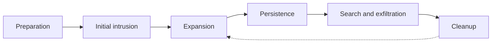
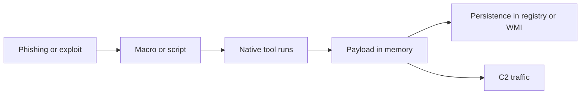
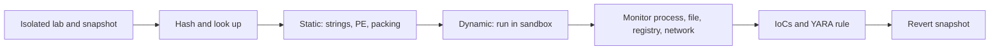

## Malware and APT Concepts

**Plain English.** Malware is any program written to do something harmful that the owner did not agree to. The exam wants you to name the malware from what it does: does it spread by itself, does it need a host file, does it pretend to be useful, does it hide? Get those four questions right and most malware questions answer themselves.

### The main families

| Type | Spreads by itself? | Needs a host file? | Key behavior |
|---|---|---|---|
| **Virus** | no, needs a user action | yes | inserts copies of itself into programs or documents |
| **Worm** | **yes** | no, self-contained | exploits a network service or mails itself |
| **Trojan** | **no, never replicates** | no | looks useful, hides a malicious function |
| **Ransomware** | depends on the carrier | no | encrypts data, demands payment (T1486) |
| **Rootkit** | no | no | hides the attacker and keeps privileged access |
| **Backdoor / RAT** | no | no | listens for remote commands |
| **Bot** | often, as part of a botnet | no | obeys a command-and-control (C2) server |
| **Spyware / keylogger** | no | no | secretly collects data or keystrokes |
| **Logic bomb** | no | lives inside legitimate code | fires when a condition is met (date, event) |
| **Coin miner** | varies | no | steals CPU/GPU to mine (resource hijacking) |

NIST SP 800-83 splits viruses into **compiled** (file infector, boot sector, multipartite = both) and **interpreted** (macro, scripting). A **blended** attack uses several ways to infect or spread at once; most modern malware is blended. EC-Council's longer virus list adds stealth (hides changes), **polymorphic** (changes its code or encryption on every copy), **metamorphic** (rewrites its whole body), encryption, cavity, sparse infector, companion and file-extension viruses.

Mnemonic for the big three: **a Virus needs a Vehicle, a Worm Walks alone, a Trojan Tricks you.**

### Parts of a malware kit

EC-Council names the building blocks you will see in scenarios:

- **Dropper**: carries the payload inside itself and installs it.
- **Downloader**: fetches the payload from the internet (T1105).
- **Crypter / obfuscator / packer**: hides or compresses the code so signatures miss it (T1027, T1027.002).
- **Wrapper / binder**: joins a Trojan to a legitimate program so both run.
- **Exploit**: the code that uses a vulnerability; **payload**: what runs afterwards.

Common ways in: phishing attachments (T1566.001), a user running a disguised file (T1204.002), drive-by downloads (T1189), removable media with AutoRun (T1091), a poisoned software update (T1195.002) and network worms exploiting a service (T1210). Real examples worth recognizing: **WannaCry** (2017, a ransomware worm over SMBv1, patch MS17-010), **Mirai** (IoT botnet built from default Telnet passwords), **Emotet** (phishing Trojan used as a loader for other malware).

### Advanced persistent threats

An **APT** is a skilled, well-funded adversary that gets in quietly and stays for months or years to steal data or prepare disruption. SP 800-83 notes that APT infections are so hard to remove that hosts usually need rebuilding. EC-Council's **APT lifecycle**:

### Exam traps

- **Replicates + needs a host = virus. Replicates alone = worm. Does not replicate = Trojan.**
- **A rootkit hides; it is not how the attacker got in.** Clean-up of a rootkit usually means a rebuild.
- **Ransomware deletes shadow copies first** (`vssadmin delete shadows`, T1490), so local restore points are not a backup.
- A **RAT** can be a real admin tool abused by attackers (T1219): the tool is legitimate, the use is not.

## Fileless Malware Concepts

**Plain English.** Fileless malware tries not to leave a program file on disk. It borrows tools that are already on the computer, such as PowerShell or WMI, and keeps its code in memory, the registry or the WMI database. Scanners that only look at files have nothing to scan.

### Microsoft's three types

| Type | Meaning | Example |
|---|---|---|
| **Type I** | no file activity at all | a network exploit that loads a backdoor straight into memory |
| **Type II** | indirect file activity | a PowerShell command stored in the WMI repository |
| **Type III** | needs files to operate | a registry handler that launches a script through `mshta.exe` |

### How a typical chain runs

**Living off the land (LOTL)** means using the system's own trusted binaries: PowerShell (T1059.001), WMI (T1047), `mshta`, `rundll32`, `regsvr32`, `certutil` (T1218 system binary proxy execution). The LOLBAS project lists Windows examples and GTFOBins lists Unix ones. In-memory tricks include **reflective loading** (T1620) and **process hollowing** (T1055.012: start a real process suspended, swap its memory). Persistence without an executable uses **registry run keys** (T1547.001), **scheduled tasks** (T1053.005) and **WMI event subscriptions** (T1546.003).

### Defenses

| Technique | What catches or stops it |
|---|---|
| Obfuscated PowerShell | **AMSI** hands the de-obfuscated script to the antivirus; **script block logging** (event **4104**) records it |
| PowerShell abuse | **Constrained Language Mode** enforced by App Control for Business or AppLocker |
| Office macro launching a shell | ASR rule "block Office apps from creating child processes"; internet macros blocked by default (Mark of the Web) |
| In-memory payloads | **EDR** behavior and memory telemetry; memory forensics (Volatility) |
| Registry or WMI persistence | **Autoruns**, Sysmon event 13 (registry value set), WMI subscription review |

### Exam traps

- **Fileless ≠ no trace.** The registry, WMI repository, event logs and memory still hold evidence.
- **Blocking PowerShell alone is not enough**: attackers switch to other LOLBins. Allowlisting plus logging works better.
- Signature-only antivirus is the control fileless malware is **designed** to beat; the answer is usually behavior monitoring or EDR.

## AI-based Malware Concepts

**Plain English.** Attackers use AI the same way everyone does: to write faster, translate, fix code and produce convincing text or voices. A few experimental malware families now ask a language model for new code while they run. Defenders use AI too, mainly to spot unusual behavior and explain suspicious code quickly.

> **v13 adds AI-based malware and AI-powered detection tools.** Expect questions on what AI changes for attackers, why it hurts signature detection, and where defenders use AI.

### What AI changes for attackers

| Use | What it looks like | Defensive answer |
|---|---|---|
| Productivity | research, debugging scripts, translating lures (ATT&CK T1588.007) | same controls as usual; AI does not add new access |
| AI phishing and deepfakes | fluent, personalized e-mails; cloned voice or video of an executive | call-back verification, awareness, phishing-resistant MFA |
| Runtime LLM calls | malware asks an LLM to rewrite or generate code "just in time" (PROMPTFLUX, PROMPTSTEAL, 2025) | behavior and network detection; block unapproved AI API use from servers |
| AI-generated variants | each sample differs, so hashes and simple signatures miss it | behavior, memory and YARA rules on stable features |
| Proof-of-concept AI ransomware | PromptLock (2025) used a local model to write scripts on the fly | same ransomware controls: backups, allowlisting, EDR |
| Attacks on ML detectors | **evasion** inputs that an ML classifier mislabels; **poisoning** of training data | model hardening, layered detection (NIST AI 100-2, MITRE ATLAS) |

Public assessments (NCSC, Google, Microsoft/OpenAI) agree that AI so far gives most **uplift in reconnaissance and social engineering**, and lowers the skill needed to build basic malware. It has not yet created fundamentally new attack types.

### AI on the defender's side

- **ML in antivirus and EDR**: cloud protection models score new files and behaviors in seconds.
- **LLM code explanation**: services such as VirusTotal Code Insight summarize what a suspicious script does.
- **SOC assistants**: summarize alerts and suggest queries. The analyst still checks every conclusion, because models can be wrong or manipulated.

### Exam traps

- **AI malware is still malware**: the same defenses (allowlisting, EDR, backups, patching, MFA) apply.
- **Polymorphism is the signature problem**, whether a packer or an LLM makes the variants.
- An ML detector can itself be attacked (evasion, poisoning). Do not treat a model's verdict as final.

## Malware Analysis

**Plain English.** Malware analysis answers three questions: what is it, what does it do, and how do we spot it elsewhere? You look at it first without running it (static), then run it in a locked-down lab and watch (dynamic). The output is a set of indicators and a detection rule.

### Setting up safely

- An **isolated** VM on a host-only network, with **snapshots** to revert after each run (SP 800-83).
- Fake internet services with **INetSim** so the sample "talks" without reaching the real internet.
- Ready-made toolkits: **REMnux** (Linux) and **FLARE-VM** (Windows).
- Some malware checks for virtual machines or sandboxes and stays quiet (T1497), so "nothing happened" is not proof of innocence.
- EC-Council calls a dedicated, isolated machine used to check incoming files and media a **sheep dip** computer.

### Static analysis (do not run it)

| Step | Tool | What you learn |
|---|---|---|
| Fingerprint | `certutil -hashfile file SHA256`, `Get-FileHash` | a unique ID to search and share |
| Reputation | VirusTotal hash lookup, Sigcheck `-v` | what many engines already say |
| Strings | Sysinternals **Strings** | URLs, IPs, file paths, messages |
| Packing | **Detect It Easy**; high entropy, few imports | whether the real code is hidden (UPX, crypters) |
| PE structure and imports | PE viewers, Detect It Easy | which Windows APIs it calls (network, crypto, injection) |
| Similarity | **ssdeep** fuzzy hash | related variants that differ slightly |
| Deep dive | **Ghidra**, IDA | disassembly and decompiled logic |

Look up by **hash** first: files uploaded to VirusTotal are shared with its partners and premium users, so never upload a confidential document.

### Dynamic analysis (run it in the lab)

| Watch | Tool |
|---|---|
| file, registry, process activity | **Process Monitor** |
| running processes, DLLs, handles | **Process Explorer** |
| network endpoints per process | **TCPView**, `netstat` |
| autostart entries | **Autoruns** |
| before/after registry diff | **Regshot** |
| traffic and DNS | **Wireshark**, INetSim logs |
| event telemetry | **Sysmon**: 1 process create, 3 network, 8 remote thread, 11 file create, 13 registry set, 22 DNS |
| debugging | **x64dbg** |
| memory | **Volatility 3** |

Automated sandboxes (CAPE, ANY.RUN, Hybrid Analysis, VirusTotal's own) run the sample and produce a behavior report.

### From analysis to detection

**Indicators of compromise** are the artifacts you extract: hashes, domains, IPs, file paths, registry keys, mutexes. The **Pyramid of Pain** reminds you that hashes are trivial for attackers to change, while TTPs are hardest. **YARA** rules describe a family with strings plus a condition, so they survive small changes that break a hash.

### Exam traps

- **Static = not executed; dynamic = executed.** Reading strings or imports is static even if a tool is involved.
- **Never analyze on a production host or a networked lab.** Isolation first, snapshot first.
- **A new hash does not mean a new family**: use fuzzy hashes, imports and YARA to link variants.

## Malware Countermeasures

**Plain English.** Stop malware from arriving, stop it from running, notice it fast if it does run, and be able to rebuild. No single product does all four, so you layer them.

### Layers

| Threat | Control | Example tool or setting |
|---|---|---|
| Known malware | antivirus signatures, kept updated | Microsoft Defender Antivirus, ClamAV |
| New or changed malware | heuristics, behavior monitoring, EDR | cloud ML protection, EDR telemetry |
| Unknown executables | **application allowlisting** (NIST SP 800-167) | App Control for Business, AppLocker |
| Macro and script abuse | block internet macros, ASR rules, AMSI, script logging | Microsoft 365 defaults, event 4104 |
| Worms | patching, segmentation, block the exploited port | MS17-010, SMB blocked at the edge |
| IoT botnets | change default credentials, disable Telnet | per the Mirai alert |
| Removable media | disable AutoRun, scan media | sheep dip station |
| Ransomware | **offline, encrypted, tested backups**, golden images, controlled folder access | CISA #StopRansomware Guide |
| Rootkits | Secure Boot, integrity checks, scan from trusted media | chkrootkit, rkhunter, AIDE |
| Phishing delivery | awareness training, mail filtering, sandboxing attachments | ATT&CK M1017, M1049 |

EC-Council's **virus detection methods**: **scanning** (signatures), **integrity checking** (compare checksums to a baseline), **interception** (watch OS requests such as writes to executables), **code emulation** (run the code in a virtual CPU) and **heuristic analysis** (look for suspicious traits in unknown code).

### Responding to an infection (NIST SP 800-83)

SP 800-83 follows the usual incident lifecycle: preparation → detection and analysis → containment, eradication and recovery → post-incident activity, with a jump back to analysis when containment reveals more.

- **Contain** first: isolate hosts, block C2 addresses, disable the abused service.
- **Rebuild instead of cleaning** when an attacker had admin access, system files were replaced (Trojan, backdoor, rootkit), the host is unstable, or nobody knows how far the infection went.
- **Check backups** for the dropper before restoring, or the attacker comes back with the data.

Mnemonic for the defense layers: **Patch, Permit, Protect, Prove, Prepare**: patch the holes, permit only approved apps, protect with AV and EDR, prove integrity with hashes and logs, prepare offline backups.

### Exam traps

- **Antivirus alone is not enough** against customized malware; the answer usually adds behavior monitoring or allowlisting.
- **Backups on a mapped network drive are not offline.** Ransomware encrypts what it can reach.
- **Integrity checking detects change, it does not identify the malware.**
- **Paying the ransom** is not a countermeasure; CISA and the FBI discourage it.
