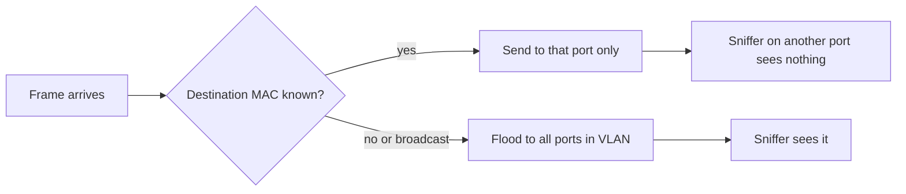
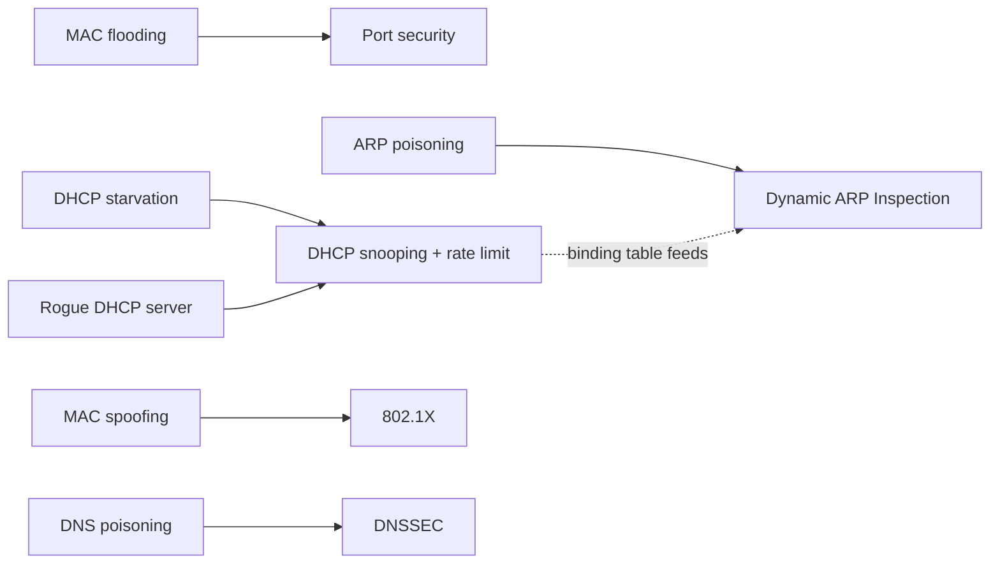
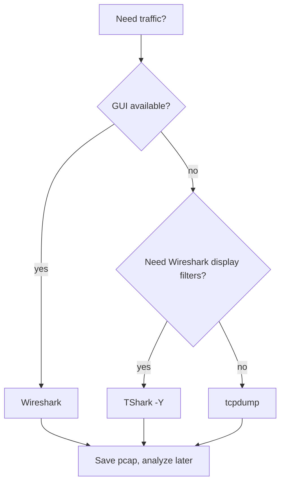
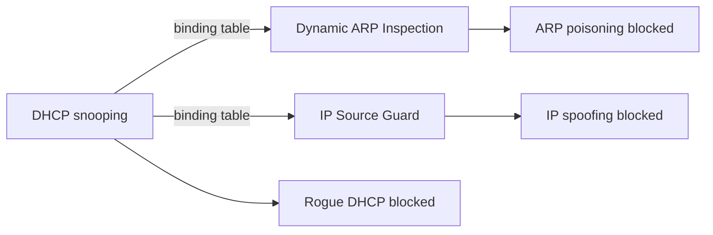

## Sniffing Concepts

**Plain English.** A sniffer is a program (or a box) that copies the packets going past a network card so someone can read them. Normally a card keeps only the frames addressed to it and ignores the rest; a sniffer switches that filter off. What it then sees depends on the network: on a hub it sees everyone's traffic, on a switch it mostly sees its own. Anything sent in clear text, such as a Telnet or FTP password, can be read straight out of the capture. MITRE ATT&CK files this under **T1040 Network Sniffing**.

### Passive vs active

RFC 4949 defines "sniffing" as slang for **passive wiretapping**: only observing. **Active wiretapping** changes the data or the flow, and a man-in-the-middle attack is a form of it.

| | Passive sniffing | Active sniffing |
|---|---|---|
| Where | hub, shared medium, open Wi-Fi channel, mirrored port | switched network |
| What the attacker does | listens only; sends nothing | injects traffic to make the switch or the hosts send frames its way |
| Needed because | every frame already reaches every port | a switch forwards unicast frames only to the port where the destination MAC was learned |
| Detection | very hard: no packets to spot | possible: the injected frames leave traces (floods, odd ARP or DHCP) |

The passive/active labels applied to hubs and switches are **EC-Council's framing**; the underlying hub/switch behavior is standard.

### How a switch limits a sniffer

A switch keeps a **MAC address table** (CAM table): which source MAC was seen on which port. A unicast frame goes only to the port of its destination MAC. **Broadcasts, multicasts and frames to unknown MACs are flooded** to every port of the VLAN. So a sniffer on an ordinary switch port sees its own traffic plus broadcast and multicast noise, not colleagues' sessions. To see more, an attacker has to trick the switch or the hosts (see Sniffing Techniques).

### Card modes

| Mode | What it does | Example |
|---|---|---|
| **Promiscuous mode** | the NIC passes up every frame it receives, not only those addressed to it | tcpdump enables it unless given `-p`; Linux `ip link set dev eth0 promisc on` |
| **Monitor mode** (Wi-Fi) | captures all 802.11 frames on a channel, including management and control frames, without joining a network | `tcpdump -I` |

Promiscuous mode does not make a switch send you more; it only stops your own card from throwing frames away.

### Legitimate capture points

| Method | How it works | Trade-off |
|---|---|---|
| **SPAN** (port mirroring) | the switch copies the traffic of chosen source ports or VLANs to one destination port | no extra hardware; the switch may drop copies under load and can drop malformed frames or VLAN tags |
| **RSPAN** | SPAN whose copies travel over a dedicated VLAN to a port on another switch | analyzer can sit far from the source |
| **Network TAP** | passive hardware inserted in a link; copies everything on the wire | full fidelity, no switch load; needs a brief cut to install |
| **Hardware protocol analyzer** | dedicated capture appliance | vendor cost |

An unexplained SPAN session is an audit finding: it is a ready-made sniffing point.

**Cloud.** Traffic-mirroring services (AWS Traffic Mirroring, GCP Packet Mirroring, Azure vTap) are the cloud equivalent of SPAN, and MITRE T1040 notes they can be abused to sniff virtual machines.

### Clear-text protocols

| Protocol | What leaks | Secure replacement |
|---|---|---|
| Telnet (23), rlogin | whole session, password included | SSH |
| FTP (21) | `USER` / `PASS` commands | SFTP or FTPS |
| HTTP Basic auth | username:password in **base64** (an encoding, not encryption) | HTTPS |
| POP3 (110), IMAP (143), SMTP | mail credentials and content | POP3S, IMAPS, SMTP with TLS |
| SNMPv1 / v2c | community string | SNMPv3 (USM authentication and privacy) |
| TFTP | no authentication at all, file contents | avoid; use SFTP |
| NNTP, LDAP (simple bind) | credentials | TLS versions |

The dsniff tool exists precisely to parse passwords out of these protocols.

### Lawful interception

**Lawful interception** is the monitoring of communications authorized by law and carried out by service providers for law enforcement (RFC 3924 describes one architecture). In the US, **CALEA** requires carriers to support it.

### Exam traps

- **Sniffing is passive; man-in-the-middle is active.** Pick "passive wiretapping" for RFC 4949's definition of sniffing.
- **A switch does not block promiscuous mode.** It simply never sends the other ports' unicast frames to you.
- **Passive sniffing is hard to detect** because the sniffer sends nothing.
- **Base64 is not encryption**: HTTP Basic auth over HTTP exposes the password.
- **TAP for fidelity, SPAN for convenience.** A question asking for every frame, including errors, without loading the switch, wants a TAP.
- **SNMPv3** is the version that protects credentials; v1 and v2c send the community string in clear.

## Sniffing Techniques

**Plain English.** On a switched network an attacker cannot just listen; they have to make traffic come to them. Every technique here works by telling a lie to one device on the LAN: the switch (fake MAC addresses), the DHCP server (fake clients), the clients (a fake DHCP server, fake ARP answers, fake DNS answers) or an access control (a borrowed MAC). None of these protocols checks who is speaking, which is why they work, and why the fixes are switch features that check it for them. For the exam you need to recognize each one from its symptom and pair it with its defense.

### Recognition table

| Technique | What it is | Signature a defender sees | Detection | Countermeasure |
|---|---|---|---|---|
| **MAC flooding** | the switch's MAC (CAM) table is filled with bogus source MACs; many switches then flood unicast frames to every port, like a hub | thousands of new MACs learned on **one access port** in seconds; MAC table full; unicast traffic suddenly visible on unrelated ports | switch MAC-table and port-security logs, SNMP traps, IDS | **port security** (limit MACs per port), MAC limiting |
| **DHCP starvation** | a flood of DHCP requests from spoofed MACs exhausts the server's address pool (a denial of service, often a prelude to a rogue server) | DHCP pool empty; bursts of DISCOVER/REQUEST messages from many MACs on one port; legitimate clients get no lease | DHCP server pool alerts, switch logs, IDS | **DHCP snooping** with rate limiting, **port security** |
| **Rogue DHCP server** (DHCP spoofing) | an unauthorized host answers DHCP and hands out its own address as gateway or DNS server, gaining a man-in-the-middle position | clients get leases whose gateway or DNS points to an unknown host; OFFER/ACK from an unexpected source on an access port | DHCP snooping drop counters, captures of DHCP offers, lease audits | **DHCP snooping** (server messages accepted only on trusted ports) |
| **ARP poisoning** (ARP spoofing) | forged ARP replies map the attacker's MAC to another host's IP, usually the gateway, so traffic flows through the attacker | unsolicited `is-at` replies repeated every few seconds; the gateway IP's MAC changes; Wireshark "Duplicate IP address configured" | arpwatch (`changed ethernet address`, `flip flop`), Wireshark Expert Information, IDS ARP rules | **Dynamic ARP Inspection**, static ARP entries for key hosts, encryption |
| **MAC spoofing** | the NIC's MAC is changed to an allowed device's MAC to pass MAC filtering or port security | the same MAC seen on two ports, or on a port where it never was; MAC "moves" between ports | MAC-move logs, NAC or 802.1X failures, port-security violations | **802.1X** (authenticate the device, not its MAC), MAC move limiting, port security with sticky MACs |
| **DNS poisoning** | forged DNS answers send a name to an attacker's IP, either on the LAN (answering first) or by poisoning a resolver's cache | a name resolves to an unexpected IP; two different answers to one query; responses with the wrong transaction ID or port | DNS logs, IDS, comparing answers with a trusted resolver | **DNSSEC** validation, source-port and ID randomization (RFC 5452), DoT/DoH for the client path |

### Why these protocols can be abused

- **ARP** (RFC 826) has no authentication and no state: a host accepts replies it never asked for, including **gratuitous ARP** (an announcement whose sender and target IP are both the host's own address, RFC 5227). MITRE: **T1557.002 ARP Cache Poisoning**.
- **DHCP** clients take the first offer they get. MITRE: **T1557.003 DHCP Spoofing** (which also covers DHCP exhaustion).
- **A switch learns MACs from source addresses** without checking them, and its table has a fixed size.
- **DNS over UDP** accepts the first answer that matches the query's ID and port; the 2008 Kaminsky flaw (CERT VU#800113) made cache poisoning practical until ports were randomized.

### Other layer-2 and name-resolution techniques

| Technique | Signature | Countermeasure |
|---|---|---|
| **Switch port stealing** | the victim's MAC keeps moving to the attacker's port | port security, MAC move limiting, 802.1X |
| **VLAN hopping, switch spoofing** | an access port negotiates a trunk (DTP) | `switchport mode access` and `switchport nonegotiate` |
| **VLAN hopping, double tagging** | frames with two 802.1Q tags on the native VLAN (one-way) | native VLAN set to an unused VLAN, native VLAN tagged |
| **STP attack** | a new device claims to be root bridge with superior BPDUs | BPDU guard on edge ports, root guard |
| **LLMNR / NBT-NS poisoning** | a host answers name queries that DNS could not resolve and collects NTLM hashes (T1557.001) | disable LLMNR and NetBIOS, SMB signing |
| **IPv6 rogue RA / NDP spoofing** | unexpected router advertisements; the IPv6 analog of ARP spoofing | RA Guard (RFC 6105), DHCPv6 Guard, SEND |
| **ICMP redirect / IRDP spoofing** | redirect or router-discovery messages naming a new "better" router | ignore ICMP redirects |
| **SSL stripping** | a site that should be HTTPS loads over HTTP on the LAN | HSTS (preloaded) |

EC-Council also sorts DNS poisoning into **intranet**, **internet** (changing the victim's DNS server setting), **proxy server** (a malicious proxy configuration) and **cache poisoning** variants; that four-way list is its own framing.

### Tools named with each technique (recognition only)

macof → MAC flooding · dhcpig, Yersinia → DHCP starvation · Ettercap, bettercap → rogue DHCP, ARP poisoning, port stealing · arpspoof → ARP poisoning · macchanger → MAC spoofing · dnsspoof, DNSChef, Ettercap `dns_spoof` → DNS spoofing · Yersinia → DTP, STP, VTP · Responder → LLMNR/NBT-NS · sslstrip → SSL stripping.

### Exam traps

- **MAC flooding targets the switch; ARP poisoning targets the hosts.** Many MACs on one port = flooding; a gateway IP whose MAC changed = ARP poisoning.
- **DHCP starvation is denial of service; the rogue server is the interception.** They are often used together, and DHCP snooping covers both.
- **DAI depends on DHCP snooping's binding table** (or ARP ACLs for static hosts).
- **MAC filtering does not stop MAC spoofing.** Authenticate the device with 802.1X.
- **DNSSEC gives integrity and origin authentication, not confidentiality.** DoT/DoH hide the query; they do not prove the answer is genuine.
- **Gratuitous ARP is legitimate by itself** (address announcements, failover). It becomes a signature when it claims someone else's IP.

## Sniffing Tools

**Plain English.** Two tools do most of the work: **Wireshark** (graphical, deep protocol decoding) and **tcpdump** (command line, runs anywhere). Both sit on a capture library (libpcap on Unix, **Npcap** on Windows, the successor of WinPcap). The skill the exam tests most is filtering: a **capture filter** decides what is recorded at all, a **display filter** decides what you look at afterwards. Mixing them up can mean throwing away evidence you needed.

### Capture filter vs display filter

| | Capture filter | Display filter |
|---|---|---|
| Syntax | libpcap / **BPF** (`pcap-filter`) | Wireshark field names and operators |
| When | set **before** capture | applied **after**, any time |
| Effect | packets that do not match are **never saved** | packets are only **hidden**; the file keeps everything |
| Examples | `host 10.0.0.5`, `port 53`, `arp`, `not port 22`, `ether host 00:0c:29:aa:bb:cc`, `src net 10.1.0.0/16` | `ip.addr == 10.0.0.5`, `tcp.port in {80,443}`, `arp.opcode == 2`, `dns.flags.response == 1`, `http contains "password"` |
| Where set | Wireshark capture options, `tcpdump <expr>`, `tshark -f` | Wireshark filter bar, `tshark -Y` |

Rule of thumb: when evidence matters, capture broadly and narrow with display filters.

### Display filter building blocks

- Comparison: `==` / `eq`, `!=` / `ne`, `>`, `<`, `contains`, `matches` (`~`, a case-insensitive regular expression), `in {…}`.
- Logic: `&&` / `and`, `||` / `or`, `!` / `not`.
- Fields worth knowing: `eth.addr`, `ip.src`, `ip.dst`, `ip.addr`, `tcp.port`, `udp.port`, `tcp.flags.syn`, `tcp.flags.ack`, `tcp.stream`, `arp.opcode` (1 request, 2 reply), `arp.duplicate-address-detected`, `dhcp.option.dhcp` (1 Discover, 2 Offer, 3 Request, 5 ACK), `dns.qry.name`, `dns.flags.response`, `http.request.method`.

### Wireshark features

| Feature | Use |
|---|---|
| **Follow TCP Stream** | rebuilds one conversation, both directions, as the application saw it |
| **Export Objects** | saves files carried in HTTP, SMB and other protocols |
| **Statistics → Conversations** | who talked to whom, how much |
| **Expert Information** | flags anomalies, e.g. "Duplicate IP address configured" or TCP retransmissions |
| **TShark** | command-line Wireshark: `-i` interface, `-f` capture filter, `-Y` display filter, `-r` read, `-w` write |
| **dumpcap** | the capture engine behind both |

### tcpdump essentials

| Option | Meaning |
|---|---|
| `-i eth0` / `-D` | capture on an interface / list interfaces |
| `-n` | no name resolution (numbers only) |
| `-w file` / `-r file` | write raw packets / read them back |
| `-c N` | stop after N packets |
| `-A` / `-X` | payload in ASCII / in hex and ASCII |
| `-e` | print the link-level (MAC) header |
| `-s` | snapshot length (default 262144 bytes) |
| `-p` / `-I` | do not use promiscuous mode / use monitor mode |

**Reading output.** TCP flags print as `S` SYN, `F` FIN, `P` PSH, `R` RST, `U` URG and `.` ACK, so `Flags [S.]` is a SYN-ACK and `Flags [R.]` a RST-ACK. ARP prints `Request who-has 10.0.0.1 tell 10.0.0.50` (a question, sent to broadcast) and `Reply 10.0.0.1 is-at 00:0c:29:aa:bb:cc` (an answer). With `-e`, a reply sent to `ff:ff:ff:ff:ff:ff` is a gratuitous announcement.

### Other tools to recognize

| Tool | What it is |
|---|---|
| **Ettercap** | LAN man-in-the-middle suite: ARP poisoning, ICMP redirect, DHCP spoofing, port stealing, NDP poisoning; plugins such as `dns_spoof` |
| **bettercap** | Go framework for recon and MITM on Wi-Fi, BLE, IPv4 and IPv6 |
| **dsniff suite** | dsniff (password sniffer), arpspoof, macof, dnsspoof and others |
| **Yersinia** | layer-2 protocol attack framework: STP, CDP, DTP, DHCP, HSRP, 802.1Q, 802.1X, VTP |
| **Responder** | LLMNR, NBT-NS and mDNS poisoner |
| **Driftnet** | pulls images out of observed TCP streams |
| **DNSChef** | DNS proxy ("fake DNS") |
| **dhcpig** | DHCP exhaustion |
| **macchanger** | changes a MAC address |
| **arpwatch** | defender tool: database of IP/MAC pairs, reports `new station`, `changed ethernet address`, `flip flop` |
| **Nmap `sniffer-detect`** | defender check: is a host on the local Ethernet in promiscuous mode? |

### Exam traps

- **`-f` is a capture filter, `-Y` a display filter** in TShark.
- **`ip.addr == x` matches source or destination**; use `ip.src` for "sent from".
- **BPF uses words (`host`, `port`), Wireshark uses fields (`ip.addr`, `tcp.port`).** `tcp.port == 80` in a capture filter box is a syntax error.
- **`arp.opcode == 2` = replies.** Unsolicited replies are what ARP poisoning looks like.
- **Npcap, not WinPcap**, is the current Windows capture library.

## Sniffing Countermeasures

**Plain English.** Two layers of defense. First, **encrypt** so a capture is useless even if someone gets one: this is the fix that works everywhere. Second, **make the switch check who is talking**: limit MACs per port, accept DHCP answers only from the real server, and drop ARP and IP packets that do not match what DHCP handed out. Then watch for the traces active attacks leave.

### Encryption first (MITRE M1041)

| Clear text | Use instead |
|---|---|
| HTTP | HTTPS (TLS 1.2/1.3) plus **HSTS** |
| Telnet, rlogin | **SSH** |
| FTP | SFTP or FTPS |
| POP3, IMAP, SMTP | POP3S, IMAPS, SMTP with TLS (RFC 8314) |
| SNMPv1/v2c | **SNMPv3** with authentication and privacy |
| any IP traffic | **IPsec** (ESP for confidentiality) |
| a switch-to-switch or host-to-switch link | **MACsec** (IEEE 802.1AE), layer-2 encryption |

### Switch features (layer 2)

| Feature | What it checks | Stops | Key facts |
|---|---|---|---|
| **Port security** | number and identity of source MACs per port | MAC flooding, unknown devices | default 1 MAC; static or **sticky** learning; violation modes **protect** (drop silently), **restrict** (drop + SNMP trap + syslog + counter), **shutdown** (err-disable, the default) |
| **DHCP snooping** | DHCP server messages arrive only on **trusted** ports | rogue DHCP servers, starvation (with rate limiting) | OFFER, ACK, NAK on untrusted ports are dropped; builds the **binding table** (MAC, IP, lease, VLAN, port) |
| **Dynamic ARP Inspection (DAI)** | ARP IP-to-MAC pairs against the binding table (or ARP ACLs) | ARP poisoning | untrusted ports only; default limit **15 ARP pps** on untrusted ports, then err-disable |
| **IP Source Guard (IPSG)** | source IP (and optionally MAC) against the binding table | IP spoofing from an access port | only DHCP passes until a binding exists |
| **802.1X** | device or user authenticated through RADIUS before the port opens | MAC spoofing, rogue devices | supplicant (client), authenticator (switch), authentication server (RADIUS) |
| **BPDU guard / root guard** | BPDUs on edge ports / superior BPDUs on ports that must not lead to the root | STP attacks | BPDU guard err-disables; root guard sets root-inconsistent (blocked) |
| **DTP off, native VLAN change** | no trunk negotiation on access ports; native VLAN not VLAN 1 | VLAN hopping | `switchport mode access`, `switchport nonegotiate`, prune trunks, shut unused ports |
| **IPv6 first-hop security** | RA Guard, DHCPv6 Guard, ND inspection, IPv6 source guard | rogue RAs, NDP spoofing | IPv6 analog of the IPv4 set |

DHCP snooping comes first: DAI and IPSG cannot check dynamic clients without its table.

### Host and name-resolution defenses

- **Static ARP entries** for the gateway and key servers stop poisoning on those hosts; they do not scale (MITRE M1035).
- **DNSSEC** (RFC 4033) proves an answer's origin and integrity; it gives **no confidentiality**. **DoT** (TCP 853) and **DoH** protect the query path. **RFC 5452** source-port and ID randomization makes forged answers hard to land.
- **LLMNR / NBT-NS**: disable them where not needed and enable **SMB signing**.
- **HSTS** makes browsers refuse plain HTTP for a site, defeating SSL stripping; the **preload list** covers the first visit.
- **Segmentation** (MITRE M1030) limits what one compromised host can observe.

### Detecting sniffers and poisoning

| Method | What it looks for |
|---|---|
| **ARP method** | send an ARP request to a fake, non-broadcast MAC: only a card in promiscuous mode passes it up and answers (Nmap `sniffer-detect`) |
| **DNS method** | sniffers that resolve the IPs they see make reverse lookups for addresses nobody else uses |
| **Ping method** | ping the suspect's IP with a wrong MAC; a reply suggests promiscuous mode |
| **Latency method** | load the network and watch the suspect's response time |
| **arpwatch** | `changed ethernet address`, `flip flop` for an IP |
| **Wireshark Expert Information** | "Duplicate IP address configured" |
| **IDS / IPS** (NIST SP 800-94) | ARP anomalies, DHCP floods, known MITM tool traffic |
| **Switch logs** | port-security violations, DHCP snooping and DAI drops, MAC moves |

The four detection method names (ARP, DNS, ping, latency) are **EC-Council's list**. A purely passive sniffer on a hub or mirror port may never be detected; encryption is the answer to that case.

### Mnemonic: "SEPARATE"

**S**NMPv3, SSH, SFTP (secure protocols) · **E**ncrypt (TLS, IPsec, MACsec) · **P**ort security · **A**RP inspection · **R**ogue DHCP blocked by snooping · **A**uthenticate ports with 802.1X · **T**runks and trees locked (DTP off, BPDU guard) · **E**nforce DNSSEC and HSTS.

### Exam traps

- **Encryption is the answer to "make sniffed data useless";** switch features are the answer to "stop the attacker getting the traffic".
- **Default port-security violation mode = shutdown.** Restrict = drop and alert; protect = drop silently.
- **Trusted DHCP snooping ports face the server or the uplink**, never user access ports.
- **DAI without DHCP snooping** only works for hosts listed in ARP ACLs.
- **DNSSEC ≠ privacy.** Pick DoT or DoH for confidentiality of queries.
- **IPSG stops IP spoofing, DAI stops ARP spoofing.** Both read the same binding table.
