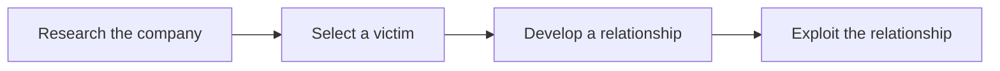
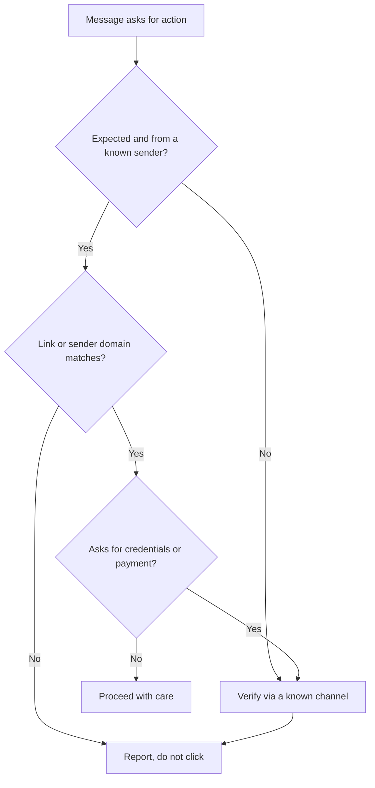
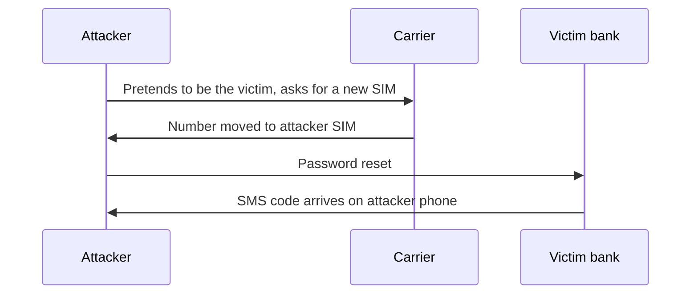

## Social Engineering Concepts

**Plain English.** Social engineering is hacking the person instead of the computer. The attacker gets someone to hand over a password, open a file, hold a door or send a payment, by making the request feel normal, urgent or rewarding. Firewalls do not stop a user who willingly clicks "Allow". That is why nearly every real intrusion has a human step somewhere.

NIST defines it as an attempt to trick someone into revealing information (for example a password) that can be used to attack systems. CISA adds a detail worth remembering: attackers collect small facts from several people in the same organization and reuse each answer to sound credible to the next person.

### Why it works

Attackers pull on a few predictable levers. The NCSC lists five signs in scam messages; EC-Council's list overlaps and adds a few words of its own.

| Lever | What the message does | Example cue |
|---|---|---|
| **Authority** | claims to come from a boss, bank, police, IT | "The CEO needs this now" |
| **Urgency** | sets a short deadline or a threat | "within 24 hours or your account closes" |
| **Scarcity** | offers something rare | last tickets, limited refund |
| **Emotion** | fear, curiosity, hope, greed | "You have won", "Your parcel is held" |
| **Social proof / consensus** | says everyone else already did it | "All staff have updated their details" |
| **Familiarity / trust** | uses a known name, logo or thread | reply inside a real email thread |
| **Intimidation** | pressures or threatens | "Your manager will hear about this" |

Mnemonic: **A U S E** the victim (**A**uthority, **U**rgency, **S**carcity, **E**motion), then add **T**rust.

### EC-Council's attack phases

The research step uses OSINT (websites, social media, job ads, even rubbish bins). The victim is often someone frustrated, new or helpful by role, such as a receptionist or help desk agent. EC-Council also names the factors that make a company vulnerable: **insufficient training, unregulated access to information, many organizational units, and missing security policies**.

### Three families of techniques

| Family | Channel | Examples |
|---|---|---|
| **Human-based** | in person, phone | impersonation, vishing, tailgating, dumpster diving |
| **Computer-based** | email, web, chat, social media | phishing, spear phishing, pharming, fake profiles |
| **Mobile-based** | SMS, apps, QR codes | smishing, quishing, repackaged apps |

### Where it sits in MITRE ATT&CK

- **T1598 Phishing for Information** (Reconnaissance tactic): the goal is data, usually credentials.
- **T1566 Phishing** (Initial Access tactic): the goal is to run code or get access. Sub-techniques: attachment, link, via service, voice.
- **T1684 Social Engineering** (added in 2026): trust-building across email, chat, voice (including AI voice) and help desks to get password resets, MFA changes or payments approved. **T1684.001 Impersonation**, **T1684.002 Email Spoofing**.

### Exam traps

- Social engineering targets **people and process**, not a software flaw. A patch does not fix it; training, policy and verification do.
- **T1598 collects, T1566 executes.** Same lure, different goal.
- The first phase is **research**, not contact.

## Human-based Techniques

**Plain English.** These attacks happen face to face or on the phone. The attacker plays a role, such as a courier, auditor, new colleague or IT technician, and relies on people being polite and helpful.

| Technique | How it works | Countermeasure |
|---|---|---|
| **Impersonation** | poses as staff, vendor, repair person, executive | verify identity through a known channel, escort visitors |
| **Vishing** | phishing by voice; caller ID can be spoofed over VoIP | call back on a number you already have |
| **Eavesdropping** | listens to conversations or reads messages not meant for them | discreet areas, need-to-know |
| **Shoulder surfing** | watches someone type a PIN or password | privacy screens, awareness |
| **Dumpster diving** | searches rubbish for documents, drives, org charts | shredding, locked bins, media sanitization |
| **Reverse social engineering** | creates a problem, then poses as the helper so the victim calls them | publish the real support number, verify callers |
| **Piggybacking** | an authorized person **knowingly** lets the attacker in ("I forgot my badge") | policy: never hold the door, report |
| **Tailgating** | the attacker slips in **without** the authorized person's consent | access vestibules (mantraps), turnstiles, guards |
| **Diversion theft** | redirects a delivery or courier to the wrong place | delivery verification procedures |
| **Honey trap** | a romantic or friendly persona lures the target | awareness, reporting |
| **Baiting** | leaves infected USB drives or "free" downloads for curious finders | block removable media, never plug in found drives |
| **Quid pro quo** | offers help or a gift in return for credentials or access | IT never asks for passwords |
| **Elicitation** | steers a casual chat to extract facts without direct questions | train staff on what is sensitive |

**Pretexting** is the invented scenario behind most of these ("I'm from the auditors, we're checking badge records"). The pretext gives the request a reason to exist.

Many public sources treat piggybacking and tailgating as synonyms; EC-Council separates them by **consent**.

### Insider threats

An **insider** already has authorized access. The threat is that they use that access or knowledge, **wittingly or unwittingly**, to harm the organization.

| CISA type | Meaning | EC-Council name |
|---|---|---|
| Unintentional: **negligent** | knows the rules, ignores them (lets someone piggyback, loses a laptop) | negligent insider |
| Unintentional: **accidental** | makes an honest mistake (wrong recipient, clicks a phish) | negligent insider |
| **Intentional (malicious)** | harms for gain or revenge | malicious insider |
| **Collusive** | works with an outside actor | (malicious) |
| **Third-party** | contractor or vendor with access | (varies) |
| — | outsider controls a stolen insider account | compromised insider |
| — | hired or planted to steal from the inside | professional insider |

Insiders rarely join to do harm; motivation builds through stress and grievances, so behavior (sudden downloads, working odd hours, conflicts after a demotion) is the early signal. CISA frames a program as **detect and identify → assess → manage**.

### AI-powered impersonation (new in v13)

> **v13 adds AI to social engineering.** Expect questions on cloned voices, deepfake video calls and AI-written phishing.

Criminals clone a voice from a short public clip, join video calls with a deepfaked "executive", and use AI to write fluent, personalized messages at scale (FBI IC3, 2024). Tells such as bad grammar disappear, so the defense moves from spotting mistakes to **process**: verify through a separate channel you already know, use an agreed secret word or phrase for urgent money requests, and require a second approver for payments.

### Exam traps

- **Consent decides piggybacking vs tailgating** in EC-Council wording.
- In **reverse** social engineering the **victim contacts the attacker**.
- A negligent insider who lets someone in is still an **insider threat**, even without bad intent.

## Computer-based Techniques

**Plain English.** The same tricks, delivered through a screen. Email is the main channel, but chat, social media, fake websites and pop-ups work too. The message imitates someone you trust and pushes you toward one click.

### Phishing family

| Variant | Target / trick | Key clue |
|---|---|---|
| **Phishing** | anyone; generic lure from a "bank" or "service" | generic greeting |
| **Spear phishing** | one person or team; researched details | personal details, plausible context |
| **Whaling** | senior executives | board, legal or finance themes |
| **Business email compromise (BEC)** | finance staff; fake CEO or supplier asks for a payment or bank change | "urgent", "payment", new bank details |
| **Pharming** | redirects via poisoned DNS or hosts file; no bad link needed | correct URL typed, wrong site |
| **Watering hole** | infects a site the target group visits (ATT&CK T1189) | trusted industry site |
| **Spimming** | spam over instant messaging | unexpected chat link |
| **Angler phishing** | fake customer-support account on social media | replies to your public complaint |
| **Pop-up scareware** | fake virus alert with a phone number | "call Microsoft support now" |
| **Hoax / chain letters** | false warnings that ask to be forwarded | "send to 10 friends" |

### Spotting a phishing message

CISA and the FTC list the same indicators:

- the sender address is close to, but not exactly, the real one (swapped letters, extra words, a different TLD);
- a generic greeting and no real contact details;
- the link text differs from the real target (hover to check); URL shorteners hide the destination;
- spelling and layout errors (less reliable now that AI writes the text);
- an unexpected attachment and a deadline.

To read a link, find the **registered domain**: the part just before the top-level domain. In `bank.example.com.secure-login.net/path`, the real domain is `secure-login.net`, not `example.com`. Punycode (`xn--`) in a hostname can mean a homoglyph domain.

### Impersonation on social networks

Attackers build a believable persona (ATT&CK **T1585.001**) or take over a real account, connect with staff, then ask for information, money or a file. Fake recruiters on professional networks are a classic route (**spearphishing via service**, T1566.003). Social media also feeds the research phase (**T1593.001**): names, roles, holidays, pets and schools become pretexts and password guesses. Defense: private settings, verified badges, report fake profiles, and a policy on what staff post about work.

### Identity theft

Identity theft is **using someone's personal or financial information without permission** (FTC).

| Kind | Stolen data used to… |
|---|---|
| **Financial** | open credit, take over bank or card accounts |
| **Medical** | get care, drugs or insurance payments |
| **Tax** | file a return and claim the refund |
| **Child** | open accounts on a clean credit file |
| **Criminal** | give the victim's name when arrested |
| **Synthetic** | mix real and invented PII into a new, fake person |

Signs: bills for unknown accounts, calls from debt collectors, a rejected tax return, medical bills for care you never had.

### Tools to recognize

| Tool | What it is |
|---|---|
| **Social-Engineer Toolkit (SET)** | TrustedSec's open-source framework for authorized SE assessments; started with `setoolkit` on Kali |
| **Gophish** | open-source phishing **simulation** platform: templates, landing pages, campaigns, results |
| **Evilginx** | adversary-in-the-middle proxy that captures credentials **and session cookies**, so OTP-based MFA is bypassed |
| **Microsoft Attack Simulation Training** | Defender for Office 365 simulations: credential harvest, malware attachment, link in attachment, link to malware, drive-by, OAuth consent grant |

### Exam traps

- **Pharming needs no click on a bad link**; phishing does.
- **Whaling = executives**, spear phishing = any chosen person.
- **BEC often has no link or malware at all**: just a convincing request. Content filters miss it; process catches it.

## Mobile-based Techniques

**Plain English.** Phones mix calls, texts, apps, QR codes and login codes on one small screen where full URLs are hidden. That makes them a comfortable place for lures.

| Technique | How it works | Countermeasure |
|---|---|---|
| **Smishing** | text message with a link or callback number, often a parcel, bank or toll lure | do not tap; forward to **7726** (SPAM); use the official app |
| **Quishing** | QR code leads to a phishing site; stickers over real codes on parking meters | check the preview URL; type the address yourself |
| **Malicious apps** | apps that masquerade as real ones (name, icon) | official stores only, Play Protect on |
| **Repackaged apps** | a legitimate app modified with malware and republished | store vetting, app integrity checks (MASVS resilience) |
| **Fake security apps** | "antivirus" that is the malware | install only known vendors |
| **SIM swap** | attacker impersonates the victim to the carrier and moves the number to their SIM | carrier PIN or port-out lock, non-SMS MFA |
| **MFA fatigue** | repeated push prompts until the user taps Approve (ATT&CK T1621) | number matching, phishing-resistant MFA, report unexpected prompts |

ATT&CK for Mobile groups smishing and quishing under **T1660 Phishing**, and the SIM swap under **T1451**.

### Exam traps

- **Smishing = SMS, vishing = voice, quishing = QR.**
- A SIM swap defeats **SMS-based** codes, not FIDO2 security keys.
- A repackaged app looks and works like the original; only store vetting or integrity checks reveal it.

## Social Engineering Countermeasures

**Plain English.** People will always click something. Good defense makes phishing hard to deliver, easy to report, and cheap when it succeeds, and it gives staff a safe, known way to check any strange request.

### The NCSC's four layers

| Layer | Goal | Examples |
|---|---|---|
| 1 | Make it hard to reach users | SPF, DKIM, DMARC, mail filtering, less public staff data |
| 2 | Help users spot and report | training, a report button, a no-blame reporting culture |
| 3 | Limit the effect of a click | phishing-resistant MFA, patching, least privilege, malware protection |
| 4 | Respond quickly | detect, reset credentials, block the domain, learn |

### Email authentication

| Record | Does | Where |
|---|---|---|
| **SPF** (RFC 7208) | lists servers allowed to send for the domain; `-all` = fail, `~all` = softfail | TXT at the domain |
| **DKIM** (RFC 6376) | signs headers and body with the domain's private key | TXT at `selector._domainkey` |
| **DMARC** (RFC 7489) | checks that SPF or DKIM passes **and aligns** with the From domain; policy `p=none`, `quarantine` or `reject`; `rua=` for reports | TXT at `_dmarc` |

Receivers record the results in an `Authentication-Results` header, for example `spf=fail dkim=none dmarc=fail`.

### Authentication that resists phishing

NIST SP 800-63B-4: a code the user **types** (SMS, OTP app, push code) is **not** phishing-resistant, because a fake site can relay it. Phishing resistance comes from binding the login to the real site (channel binding or verifier name binding). CISA: the only widely available phishing-resistant option is **FIDO2/WebAuthn** (security keys, passkeys).

### Policies and controls

| Area | Controls |
|---|---|
| People | awareness program with metrics (NIST SP 800-50r1), phishing simulations used for learning not blame |
| Process | callback verification on a known number, two-person approval for payments and bank changes, help desk identity checks before resets |
| Physical | badges, visitor escort, access vestibules, turnstiles, shredding, clean desk |
| Insider | least privilege, separation of duties, job rotation, monitoring, fast offboarding |
| Social media | privacy settings, rules on what staff post, report fake profiles |
| Browsing | anti-phishing toolbars (Netcraft extension), reputation feeds (PhishTank, Google Safe Browsing) |

### Identity theft response (US)

1. Report it and get a recovery plan at **IdentityTheft.gov**.
2. Place a **credit freeze** (free; nobody can open new credit) and a **fraud alert**: initial 1 year; extended 7 years with an identity theft report.
3. Change passwords, check accounts, contact the companies involved.

### Reporting phishing

- Email: **reportphishing@apwg.org**; in the UK, the NCSC Suspicious Email Reporting Service.
- Text: forward to **7726**.
- US fraud: ReportFraud.ftc.gov; BEC and internet crime: IC3.

### Exam traps

- **Training alone is not enough**: layer technical controls around it.
- **DMARC needs SPF or DKIM** and adds alignment and a policy; alone it checks nothing.
- **Any MFA beats none**, but only FIDO2/WebAuthn-style MFA stops a real-time phishing proxy.
- The best answer to an unusual request by phone or email is **verify through a different, known channel**.
