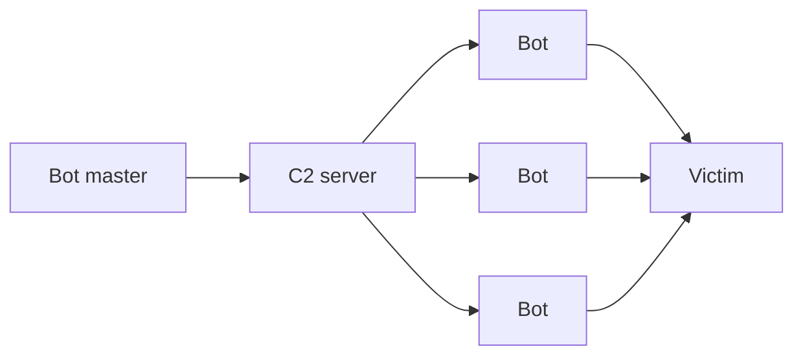
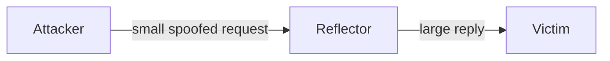
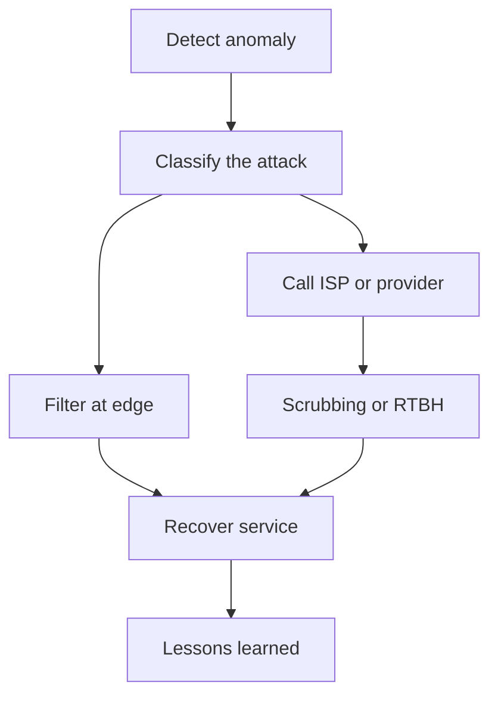

## DoS/DDoS Concepts

**Plain English.** A denial-of-service (DoS) attack does not steal anything: it stops real users from getting a service. The attacker either uses up a resource the service needs (bandwidth, connection slots, CPU, memory) or crashes the software. When the traffic comes from many machines at once it is a **distributed** DoS (DDoS), and you can no longer fix it by blocking one address.

DoS is an attack on **availability**, the A in the CIA triad. Typical symptoms: the network is unusually slow, one website stops answering, or nothing can be reached at all. Monitoring and analyzing traffic (firewall, IDS, flow data) is how you tell an attack from a busy day.

### Three categories

| Category | What runs out | Examples | Measured in |
|---|---|---|---|
| **Volumetric** | bandwidth of the link | UDP flood, ICMP flood, reflection/amplification | bits per second (bps) |
| **Protocol** | state tables and packet processing in hosts, firewalls, load balancers (layers 3–4) | SYN flood, fragmentation attacks, ACK floods | packets per second (pps) |
| **Application layer** | server resources behind one web page or API (layer 7) | HTTP GET/POST flood, Slowloris, DNS query flood | requests per second (rps) |

The "measured in" column is how EC-Council frames it; the three categories themselves are also used by CISA, Microsoft and Cloudflare. A **multi-vector** attack mixes categories at the same time, so one defense is never enough.

### Botnets

A **botnet** is a set of compromised machines (**bots** or **zombies**) run by a **bot master** through **command and control (C2)**. Old botnets used IRC channels; modern ones use HTTP(S) or peer-to-peer C2 so there is no single server to take down. Attackers build their own or rent one ("DDoS-for-hire", "booter" or "stresser" services). In MITRE ATT&CK, getting a botnet is **T1583.005** (acquire) or **T1584.005** (compromise).

**Mirai** (2016) is the example to know: it scanned for IoT devices (cameras, routers, DVRs) with Telnet open and logged in with a short list of **default usernames and passwords**. Its source code was published, so many variants followed. Lesson: IoT devices with factory credentials are botnet recruits.

EC-Council also names how bots find new victims (**random, hit-list, topological, local subnet, permutation scanning**) and how the malicious code is copied to them (**central source, back-chaining, autonomous**). These labels are EC-Council's; learn them as names.

### ATT&CK mapping

| Technique | Meaning |
|---|---|
| **T1498** Network Denial of Service | exhaust network bandwidth: **.001** direct network flood, **.002** reflection amplification |
| **T1499** Endpoint Denial of Service | exhaust or crash a host or service: **.001** OS exhaustion flood (e.g. SYN flood), **.002** service exhaustion flood (e.g. HTTP flood), **.003** application exhaustion flood, **.004** application or system exploitation (crash bug) |

Both sit under the **Impact** tactic (TA0040).

### Why attackers do it

Hacktivism, extortion (**ransom DDoS**: pay or the attack continues), competition, revenge, or a **smokescreen** that keeps defenders busy while another intrusion happens.

### Exam traps

- **DoS vs DDoS** is about the number of sources, not the size of the flood or the protocol.
- A DoS **violates availability**, not confidentiality or integrity.
- A bot is the infected machine; the **bot master** is the human; the **C2** is the channel.

## DoS/DDoS Attack Techniques

**Plain English.** There are only a few tricks behind the long list of attack names: send more than the pipe can carry, make the victim hold on to state it cannot afford, get someone else to send the traffic for you, or send something the software cannot handle. Recognize the trick, and the name and the fix follow.

### SYN flood (protocol)

TCP opens connections with a three-way handshake (SYN, SYN/ACK, ACK). The server keeps each half-open connection in the **SYN-RECEIVED** state while it waits for the final ACK. A SYN flood sends many SYNs, usually from **spoofed** addresses, and never completes the handshake. The backlog of half-open connections fills up and new, legitimate clients are refused. On a Linux server under attack you see many connections in `SYN_RECV` and a kernel warning about possible SYN flooding.

### Reflection and amplification (volumetric)

- **Reflection**: the attacker sends requests with the **victim's address as the source** to third-party servers (**reflectors**), which answer the victim. The victim sees traffic from innocent servers, not from the attacker.
- **Amplification**: the reply is much larger than the request, so the attacker multiplies its bandwidth.
- Together: **DRDoS** (distributed reflection DoS). It relies on **UDP**, which has no handshake to check the source address.

Bandwidth amplification factors from CISA alert TA14-017A (learn the order, not every decimal):

| Protocol (UDP port) | Factor | Abused feature |
|---|---|---|
| **Memcached** (11211) | 10,000–51,000 | cache stats/get over UDP |
| **NTP** (123) | 556.9 | `monlist` (CVE-2013-5211) |
| **CharGEN** (19) | 358.8 | character generation |
| **QOTD** (17) | 140.3 | quote request |
| **CLDAP** (389) | 56–70 | connectionless LDAP |
| **DNS** (53) | 28–54 | open resolvers, large (ANY, DNSSEC) answers |
| **SSDP** (1900) | 30.8 | UPnP SEARCH |
| **WS-Discovery** (3702) | 10–500 | device discovery |
| **SNMPv2** (161) | 6.3 | GetBulk |
| **NetBIOS** (137) | 3.8 | name resolution |

Mnemonic for the top three: **"Many Nasty Chars"** (Memcached, NTP, CharGEN).

### ICMP and fragment-based attacks

| Attack | What happens | Fix |
|---|---|---|
| **ICMP (ping) flood** | echo requests use up bandwidth and reply work | rate-limit ICMP at the edge |
| **Smurf** | ICMP echo to a **directed broadcast** address with the victim's spoofed source; every host on that subnet replies to the victim | routers drop directed broadcasts (RFC 2644, the default since 1999) |
| **Fraggle** | same idea with UDP (echo, chargen) instead of ICMP | disable those small UDP services, block directed broadcasts |
| **Ping of death** | fragments that reassemble into an IP packet above the **65,535-byte** limit crash old stacks | patched stacks (1990s) |
| **Teardrop** | **overlapping** fragment offsets the stack cannot reassemble | patched stacks, fragment inspection |
| **Land** | same **source and destination** IP and port, the host replies to itself | patched stacks, anti-spoofing filters |

These old attacks still appear on the exam as recognition questions: match the description to the name.

### Application layer attacks

- **HTTP flood**: many valid-looking GET or POST requests, often aimed at expensive pages (search, login). Each request is legal, so filtering by packet shape does not work.
- **Slowloris**: opens many connections and keeps each one open by sending **partial HTTP headers** slowly. The server's connection pool fills while the attacker uses very little bandwidth (CVE-2007-6750 on Apache).
- **R.U.D.Y.** (R-U-Dead-Yet): the same "low and slow" idea with a POST **body** sent a few bytes at a time.
- **HTTP/2 Rapid Reset** (CVE-2023-44487): the client opens streams and cancels them immediately, over and over; the server does work for each one. It set records in 2023.

### Other names to recognize

| Term | Meaning |
|---|---|
| **Permanent DoS (PDoS)**, **phlashing** | damages firmware or hardware so the device must be reflashed or replaced (ATT&CK T1495 Firmware Corruption is related) |
| **Peer-to-peer attack** | clients of a file-sharing hub are told to connect to the victim instead (EC-Council term) |
| **Pulse wave** | short, repeated bursts that switch between targets (EC-Council term) |
| **Zero-day DDoS** | uses a flaw with no patch yet |
| **Spoofed session flood** | fake TCP sessions (SYN, ACK, RST/FIN) to get past stateful devices |

### Toolkits (recognize the name only)

| Tool | Recognize it as |
|---|---|
| **LOIC** (Low Orbit Ion Cannon) | open-source TCP/UDP/HTTP flooder used by hacktivist groups; does **not** hide the user's IP address |
| **HOIC** (High Orbit Ion Cannon) | LOIC's successor, HTTP floods, "booster" scripts to vary requests |
| **Slowloris**, **R.U.D.Y.** | low-and-slow HTTP tools, named after the attacks |
| **Booter / stresser services** | DDoS-for-hire websites backed by botnets or amplifiers |

### Exam traps

- **Reflection ≠ amplification.** Reflection hides the source; amplification multiplies the size. DNS and NTP attacks usually do both.
- In a reflection attack the **reflectors are victims too**, not the attackers.
- **Slowloris is low bandwidth.** If the scenario stresses few packets and many open connections, it is not a flood.
- **Smurf = ICMP**, **Fraggle = UDP**; both need a directed broadcast.

## DoS/DDoS Countermeasures

**Plain English.** You cannot stop someone from sending you traffic. You can make yourself harder to knock over (spare capacity, no single point of failure), throw away bad traffic as early as possible, and have a plan and a provider ready before the attack starts.

### By attack type

| Attack | Detect it by | Countermeasure |
|---|---|---|
| SYN flood | many `SYN_RECV` sockets, kernel "SYN flooding" warnings | **SYN cookies**, bigger backlog, shorter SYN-RECEIVED timeout, firewall/proxy SYN protection (RFC 4987) |
| Reflection/amplification | large unsolicited UDP from ports 53, 123, 11211…, high bytes per packet | upstream filtering or scrubbing, RTBH, block unused UDP source ports; as an operator: close open resolvers, patch `monlist`, disable unneeded UDP services, response rate limiting |
| Smurf/Fraggle | ICMP or UDP replies from a whole subnet | no directed broadcasts (RFC 2644) |
| HTTP flood | requests per second per client, odd user agents | WAF, rate limiting, challenges, caching/CDN |
| Slowloris/R.U.D.Y. | many connections stuck reading the request | request timeouts and minimum data rates (Apache **mod_reqtimeout**), connection limits per IP, reverse proxy |
| Botnet recruitment | IoT devices talking to unknown hosts | change default passwords, patch, do not expose Telnet |

**SYN cookies** in one line: during a SYN flood the server stops keeping a table entry for each half-open connection and only commits memory once a client completes the handshake. On Linux they are on by default (`net.ipv4.tcp_syncookies = 1`) and kick in only when the SYN backlog overflows. They are a fallback for attacks, not a fix for a server that is simply overloaded by real users.

### Stop spoofing at the source

- **Ingress filtering, BCP 38 (RFC 2827)**: an ISP drops packets from a customer whose source address does not belong to that customer. If every network did this, reflection attacks would be impossible.
- **BCP 84 (RFC 3704)** extends it to multihomed networks with **unicast Reverse Path Forwarding (uRPF)**.
- **Egress filtering**: your own firewall drops outbound packets with source addresses that are not yours, so your hosts cannot join a spoofed attack.

### Absorb and divert

| Technique | How it helps | Trade-off |
|---|---|---|
| **Over-provisioning** | spare bandwidth and servers absorb smaller floods | costly; loses against large volumetric attacks |
| **Anycast** | the same IP is announced from many data centers, so the flood is split | needs a global network (CDN, DNS provider) |
| **Scrubbing center** | traffic is rerouted (BGP or DNS) to a provider that filters it and sends clean traffic back | added latency, provider cost |
| **RTBH (RFC 5635)** | the ISP drops all traffic to the attacked address, protecting the rest of the network | the target is offline: the attacker's goal is achieved for that address |
| **Rate limiting** | caps requests per client (nginx `limit_req` rejects excess with 503 by default) | shared NAT addresses can hit the limit |
| **WAF** | filters layer 7 requests by rule and reputation | does not help against volumetric floods |

**DDoS protection services**: Cloudflare, Akamai (Prolexic), AWS Shield (Standard is automatic, Advanced adds response team and cost protection), Azure DDoS Protection, Google Cloud Armor. **DOTS** (RFC 8811) is a standard protocol for a network under attack to ask its mitigation provider for help.

### Plan before the attack

The UK NCSC and the CISA/FBI/MS-ISAC guide agree on the basics: **understand your service** (what depends on what, where the bottlenecks are), **know your upstream defenses** (what your ISP and cloud provider can filter, and how to reach them fast), **plan to scale or degrade** gracefully, and **test the plan**. Handle a DDoS as any incident (NIST SP 800-61): prepare, detect, respond, recover, learn.

EC-Council lists its own strategies and techniques; learn them as names:

- **Strategies**: absorb the attack (extra capacity), degrade services (switch off non-critical features), shut down services until the attack ends.
- **Deflect** attacks with honeypots; **neutralize handlers**; protect **secondary victims** (keep your hosts from becoming bots).
- **Detection techniques**: **activity profiling** (average packet rate per flow), **sequential change-point detection** (sudden change in traffic statistics, e.g. CUSUM), **wavelet-based signal analysis** (spectral view of traffic).
- **Post-attack forensics**: traffic pattern analysis, packet traceback, event log analysis.

In ATT&CK, the matching mitigation is **M1037 Filter Network Traffic**, often done upstream by the ISP or a protection service.

### Exam traps

- **SYN cookies protect the server's state, not the link.** A volumetric flood still fills the pipe.
- **BCP 38 helps everyone else**: it stops your network being the source of spoofed traffic. It does not filter what arrives at you from elsewhere.
- **Blackholing works for the network, not for the target**: the attacked address goes offline.
- **Firewalls and IPSs can be the bottleneck**: their state tables fill during SYN or session floods. Stop volumetric attacks upstream.
- **Slow attacks** are fixed with **timeouts**, not bandwidth.
