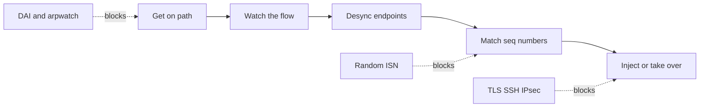
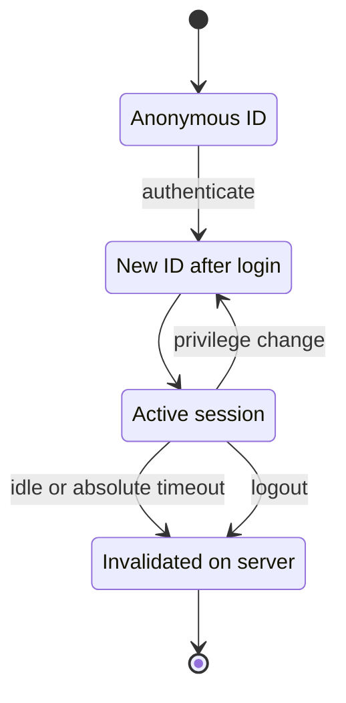

## Session Hijacking Concepts

**Plain English.** A website forgets you between clicks, because HTTP is stateless. To remember that you logged in, the server gives your browser a **session token** (usually a cookie) and trusts whoever presents it. Session hijacking means someone else gets hold of that token, or guesses it, and the server then treats them as you. They never need your password, and often not your MFA either, because the session is already authenticated.

### What a session token is

| Where the token travels | Typical example | Main risk |
|---|---|---|
| Cookie | `Set-Cookie: id=…` | read by script (XSS) or sniffed over HTTP |
| URL parameter | `…/cart;jsessionid=…` | leaks via history, logs, the Referer header |
| Hidden form field | `<input type="hidden" name="sid">` | exposed in page source and caches |
| Custom header | `Authorization: Bearer …` | same as any bearer token: whoever holds it wins |

OWASP lists the usual ways a token is compromised: a **predictable** token, **session sniffing**, **client-side attacks** (XSS, malicious JavaScript, trojans), **man-in-the-middle** and **man-in-the-browser**.

### Two levels

| Level | What the attacker targets | Examples |
|---|---|---|
| **Application level** | the HTTP session token | theft through XSS, sniffing, fixation, prediction, replay, man-in-the-browser |
| **Network level** | the transport flow (TCP or UDP) | TCP/IP hijacking, blind hijacking, RST hijacking, UDP hijacking, man-in-the-middle through ARP spoofing or ICMP redirects |

### Hijacking vs spoofing, active vs passive

- **Spoofing** starts a *new* session while pretending to be someone else. **Hijacking** takes over a session that *already exists*. MITRE draws the same line for T1563: the attacker hijacks an existing remote session instead of opening a new one with valid credentials.
- **Passive** hijacking watches and records the session. **Active** hijacking takes the session over and acts in it, often pushing the real user off. This split is EC-Council's framing.

### Why sessions are hijackable

Tokens sent in cleartext, predictable or low-entropy IDs, IDs placed in URLs, IDs that are not renewed at login, no idle or absolute timeout, logout that never kills the session on the server, and missing cookie attributes.

### MITRE ATT&CK mapping

| ID | Name | Tactic | Idea |
|---|---|---|---|
| **T1539** | Steal Web Session Cookie | Credential Access | take the cookie from disk, memory or traffic |
| **T1550.004** | Web Session Cookie | Lateral Movement | *use* the stolen cookie to act as the user and bypass MFA |
| **T1185** | Browser Session Hijacking | Collection | abuse the victim's own browser (injection, pivoting) |
| **T1563** | Remote Service Session Hijacking | Lateral Movement | take over an existing SSH (.001) or RDP (.002) session |

### Exam traps

- **Hijacking needs an existing session.** If the attacker creates a new session with a forged identity, that is spoofing.
- **A stolen session cookie can bypass MFA.** MFA protects the login, not a session that is already open.
- **Stealing vs using.** T1539 is stealing the cookie; T1550.004 is using it.

## Application-Level Session Hijacking

**Plain English.** At the application level the prize is the session token. An attacker can steal it (from traffic, from the page through injected script, or from the browser itself), guess it (if it is predictable), or plant a known one before you log in (fixation). Each route has a clear defense, so exam questions usually ask you to match the route to its fix.

### Ways to compromise a session ID

| Technique | What happens | Tool you may see named | Countermeasure |
|---|---|---|---|
| **Session sniffing / sidejacking** | the cookie is captured from unencrypted HTTP | Wireshark; ferret and hamster (Kali "sidejacking" tools) | HTTPS everywhere, `Secure` cookies, HSTS |
| **Cookie theft through XSS** | injected script reads the cookie through the DOM | an XSS flaw in the app | output encoding, CSP, `HttpOnly` |
| **Session fixation** | the victim logs in with an ID the attacker already knows | proxy tools; ZAP active rule "Session Fixation" | new session ID at login; reject IDs the server did not issue |
| **Session prediction** | IDs are sequential, time-based or low-entropy | Burp Sequencer (randomness analysis) | CSPRNG, ≥ 64 bits of entropy, meaningless values |
| **Session replay** | a captured token or request is sent again | intercepting proxy | short lifetimes, one-time nonces, TLS |
| **Man-in-the-browser** | malware inside the browser alters pages and transactions | banking trojans, malicious extensions | endpoint protection, out-of-band confirmation |
| **Adversary-in-the-middle phishing** | a reverse proxy captures the cookie after the user completes MFA | phishing proxy kits (per MITRE T1539) | phishing-resistant MFA (FIDO keys), anomaly detection |
| **CRIME / BREACH** | compression leaks secrets such as cookies through ciphertext length | — | disable TLS compression (gone in TLS 1.3), limit secrets in compressed bodies |

### Session fixation vs session theft

OWASP notes that fixation is not strictly a class of hijacking: theft grabs a session *after* login, while fixation sets up the session *before* login. The bug that makes fixation possible is simple: the application **keeps the same session ID across authentication**. OWASP calls an app that accepts any ID the client offers **permissive** session management. A **strict** app only accepts IDs it generated itself, which blocks fixation.

### XSS and HttpOnly

`HttpOnly` tells the browser to hide the cookie from scripts (`document.cookie`). It stops the classic "script reads the cookie" theft. It does **not** fix the XSS: injected script can still send requests from the victim's browser, and the browser attaches the cookie to them. Fix the injection first, and treat `HttpOnly` as damage limitation.

### Related attacks you must tell apart

- **CSRF** *rides* the victim's session: the browser sends the cookie automatically, so the attacker never needs to see the token. Defenses: anti-CSRF tokens and `SameSite` cookies.
- **Session puzzling** (session variable overloading) happens when one session variable is used for two purposes. It is set through a harmless flow, such as password reset, and then trusted by another.
- **"Forbidden attack"** is EC-Council's name for reusing an AES-GCM nonce with the same key in TLS. RFC 5116 says nonces must never repeat under one key, because reuse breaks both confidentiality and integrity.

### Testing tools (identification level)

| Tool | Role in session testing |
|---|---|
| **Burp Suite** (Proxy, Sequencer) | intercepts traffic; Sequencer rates the randomness of token samples |
| **OWASP ZAP** | passive alerts for cookies without HttpOnly (10010), Secure (10011) or SameSite (10054); active Session Fixation rule (40013); HTTP Sessions view |
| **Hetty**, **Caido** | open or lightweight HTTP toolkits with a MITM proxy, used in EC-Council's hijacking labs |

### Exam traps

- **HttpOnly ≠ XSS fix.** It hides the cookie, not the vulnerability.
- **The fixation fix is regenerating the ID at login**, not encrypting the ID and not making it longer.
- **"Test whether session tokens are predictable" → Burp Sequencer.**
- **CSRF does not steal the token**; it abuses the browser sending it automatically.

## Network-Level Session Hijacking

**Plain English.** Below HTTP, a conversation between two machines is a TCP connection identified by four values (two IPs and two ports) and kept in order by sequence numbers. If an attacker can send packets with the right addresses *and* acceptable sequence numbers, the receiver cannot tell them from the real sender. Network-level hijacking is about getting into that flow. Modern TCP stacks make blind guessing very hard, so the realistic path is getting *on* the path with a man-in-the-middle position.

### Why sequence numbers matter

TCP sequence and acknowledgment numbers are **32-bit** fields. A receiver accepts a segment only if its sequence number falls **inside the current receive window** (RFC 9293). Old stacks picked initial sequence numbers (ISNs) predictably, which allowed off-path injection. **RFC 6528** computes the ISN as a timer plus a keyed hash of the connection's addresses, ports and a secret (ISN = M + F(localip, localport, remoteip, remoteport, secretkey)), so another connection's ISN tells an attacker nothing. **RFC 5961** tightens RST, SYN and data acceptance with "challenge ACKs".

### Network-level techniques

| Technique | Idea | What stops it |
|---|---|---|
| **TCP/IP hijacking** | take over an established connection by injecting in-window segments; the real endpoints fall out of sync | encryption (TLS, SSH, IPsec) so injected data fails integrity checks |
| **Blind hijacking** | inject without seeing replies, which means predicting sequence numbers | random ISNs (RFC 6528), RFC 5961 checks |
| **RST hijacking** | a forged RST with an acceptable sequence number tears the connection down | RFC 5961 challenge ACKs, encrypted or authenticated sessions |
| **UDP hijacking** | UDP has no handshake or sequence numbers, so a forged reply that arrives first is accepted | application checks (DNS source-port and ID randomization, RFC 5452), DNSSEC, DTLS |
| **MITM through ARP spoofing** | forged ARP replies map the gateway's IP to the attacker's MAC (T1557.002) | dynamic ARP inspection, static entries, arpwatch alerts |
| **MITM through forged ICMP redirects** | a fake redirect tells a host to route through the attacker | ignore ICMP redirects (for example Linux `accept_redirects = 0`) |
| **IP spoofing with source routing** | LSRR/SSRR options pull replies back through the attacker | drop source-routed packets (RFC 7126 default), anti-spoofing filters (BCP 38) |

When injected data desynchronizes the client and the server, they keep correcting each other with ACKs. EC-Council calls this an **ACK storm**, and it is a detection clue.

EC-Council teaches a generic sequence for TCP hijacking: **sniff → monitor → desynchronize → predict sequence numbers → take over**. Learn the order for the exam, and remember that encryption breaks the last step.

### Tools you should recognize (by description)

| Tool | Description from its documentation |
|---|---|
| **Ettercap** | sniffer and interceptor for switched LANs; can inject data into an established connection while keeping it synchronized |
| **bettercap** | modular framework for network sniffing, spoofing and MITM |
| **sslstrip** | on a MITM position, rewrites HTTPS links and redirects into HTTP |
| **Wireshark** | packet analysis; TCP analysis flags such as "ACKed unseen segment", retransmissions and duplicate ACKs point to injected or broken flows |
| **arpwatch** | keeps a database of IP/MAC pairs and alerts when a pair changes |

### Remote-service sessions

MITRE T1563 also covers taking over **SSH** sessions (abusing an SSH agent socket or agent forwarding, T1563.001) and **RDP** sessions (reconnecting another user's session with SYSTEM rights, T1563.002). Mitigations: disable agent forwarding where it is not needed, restrict admin rights, segment networks, and audit Remote Desktop Users.

### Exam traps

- **Blind = cannot see responses**, so the attacker must predict sequence numbers.
- **UDP hijacking is easier** than TCP hijacking because UDP has no sequence numbers.
- **A RST only needs an in-window sequence number** on old stacks; RFC 5961 requires an exact match.
- **Encryption is the root fix** for network-level hijacking: injected bytes fail the integrity check even when they are accepted at the TCP layer.

## Session Hijacking Countermeasures

**Plain English.** Protecting a session means four things: make the token impossible to guess, keep it off the wire in cleartext, keep scripts and other sites away from it, and make it die quickly and completely. Then watch for signs that someone else is using it.

### Cookie attributes

| Attribute | Effect | Stops |
|---|---|---|
| **Secure** | sent only over HTTPS | sniffing on HTTP |
| **HttpOnly** | hidden from scripts | cookie theft through XSS |
| **SameSite=Strict / Lax** | not sent (Strict) or sent only on top-level safe navigations (Lax) for cross-site requests; `None` requires `Secure` | CSRF (defense in depth only) |
| **`__Host-` prefix** | must be Secure, set from HTTPS, no Domain, `Path=/` | subdomain cookie injection, fixation |
| **No Expires / Max-Age** | a non-persistent session cookie, never written to disk | theft from the disk cache |
| **Narrow Domain / Path** | fewer hosts receive the cookie | leaks to sibling subdomains |

Example of a strong session cookie from OWASP: `Set-Cookie: __Host-SessionID=…; Secure; HttpOnly; SameSite=Strict; Path=/`. Secure and HttpOnly come from **RFC 6265**; SameSite and the prefixes come from the RFC 6265bis update that browsers implement.

### Session ID life cycle

| Rule | Value or practice |
|---|---|
| Entropy | ≥ **64 bits** from a CSPRNG (OWASP; NIST requires ≥ 64-bit session secrets) |
| Content | meaningless; no user data; rename default names such as PHPSESSID or JSESSIONID |
| Renewal | **new ID at login** and at every privilege change |
| Acceptance | strict: accept only IDs the server issued |
| Idle timeout | OWASP: 2–5 min for high-value apps, 15–30 min for low-risk apps; NIST AAL2 ≤ 1 h, AAL3 ≤ 15 min |
| Absolute timeout | OWASP: 4–8 h for an office-day app; NIST AAL2 ≤ 24 h, AAL3 ≤ 12 h |
| Logout | invalidate on the **server**, not only by deleting the cookie |
| Storage | cookies over localStorage (any script on the page can read localStorage) |

### Transport protections

- **HTTPS everywhere plus HSTS** (RFC 6797): `Strict-Transport-Security: max-age=…; includeSubDomains`. The browser then refuses plain HTTP, which defeats SSL stripping. The header only counts when it arrives over HTTPS, and the very first visit is still exposed. The **preload list** fixes that, and requires `max-age` ≥ 1 year plus `includeSubDomains`. `max-age=0` deletes the policy.
- Use **full HSTS** (with includeSubDomains) when session cookies carry a `Domain` attribute, otherwise one plain-HTTP subdomain can leak or plant them (WSTG).
- **HPKP is obsolete**: do not pick it as a modern defense.
- Network level: **TLS, SSH instead of Telnet, and IPsec** (ESP for confidentiality and integrity, AH for integrity and origin authentication only), randomized ISNs, RFC 5961 behavior, anti-spoofing filters (BCP 38), dynamic ARP inspection, and no ICMP redirects or source routing.

### Binding, reauthentication and newer ideas

- **Bind the session to client properties** (IP, User-Agent, client certificate) and treat a mid-session change as a hijack indicator. Treat it as a detection signal, since IPs change for legitimate reasons.
- **Reauthenticate** for risky events: password change, new device or location, high-value transactions.
- **Device-bound sessions** (Chrome DBSC; earlier, Token Binding in RFC 8471) tie the session to a key held on the device, so a copied cookie is useless elsewhere. This is emerging and browser-specific.
- **Phishing-resistant MFA** (FIDO keys) defeats proxy phishing kits that capture cookies after login.

### Detection

| Method | What it catches |
|---|---|
| Session logging (creation, use, destruction) | reuse of a session from a new IP or device, "impossible travel" (MITRE M1047) |
| Many requests with different IDs from one source | session ID guessing or brute force (OWASP) |
| IDS/IPS (Snort, Suricata) | ARP and ICMP anomalies, known MITM tool signatures |
| Wireshark | ACK storms, unexpected RSTs, "ACKed unseen segment" |
| arpwatch | IP/MAC pairs that suddenly change |

EC-Council groups detection into **manual** (packet analysis with a sniffer) and **automatic** (IDS/IPS) methods.

### Mnemonic: "SHORT"

**S**ecure and HttpOnly flags · **H**STS and HTTPS everywhere · **O**ne new ID at login · **R**andom IDs (≥ 64 bits) · **T**imeouts plus server-side logout.

### Exam traps

- **HSTS beats SSL stripping; `Secure` alone does not stop the stripped first request.** Use both.
- **SameSite is defense in depth against CSRF**, not a replacement for anti-CSRF tokens.
- **Logging out must kill the server-side session.** Deleting the browser cookie leaves a stolen copy valid.
- **IPsec AH does not encrypt.** Pick ESP when the question asks for confidentiality.
- **HPKP is obsolete**; for transport the modern answer is HTTPS plus HSTS (preloaded).
