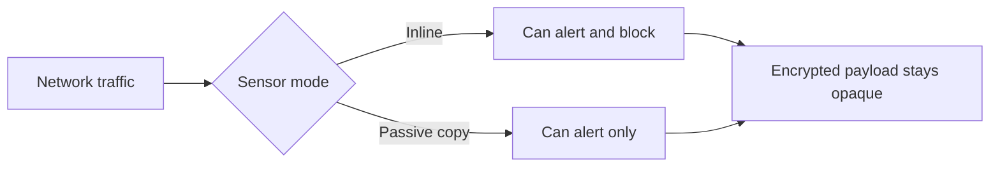
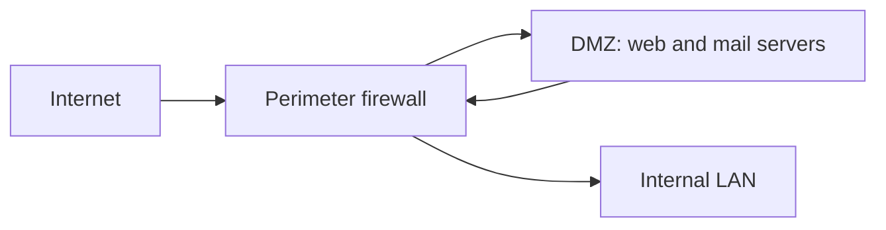
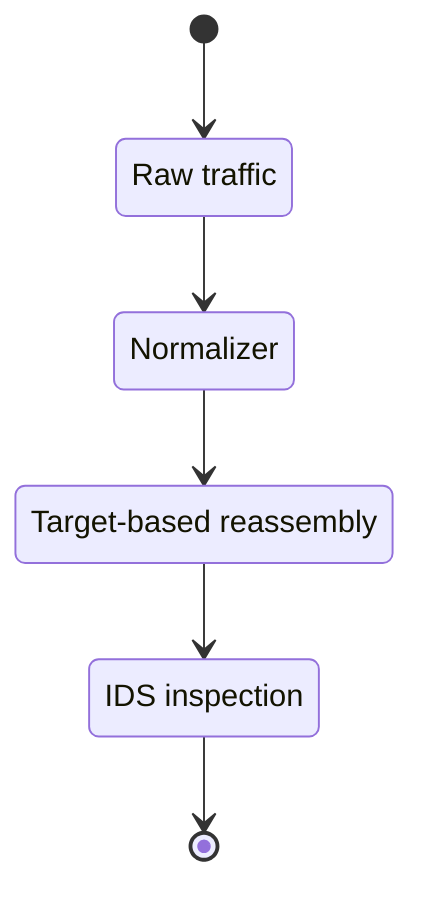

## IDS, IPS, and Firewall Concepts

**Plain English.** A firewall decides what traffic may cross a boundary. An IDS watches traffic and raises an alarm when it looks like an attack; an IPS does the same but can also stop the traffic. This module is about how these defences work, where their blind spots are, and how a defender hardens them. Learn the vocabulary exactly: the exam leans on precise terms.

### IDS vs IPS

A **firewall** is a gateway that limits access between networks according to a policy. An **IDS** (intrusion detection system) automates the job of spotting attacks: it monitors and analyses events and raises an **alert**. An **IPS** (intrusion prevention system) does everything an IDS does and can also **respond** to stop the attack before it reaches the target. That response is the only real difference between them.

An IPS response falls into three groups (SP 800-94):

| Response | Example |
|---|---|
| Stop the attack itself | terminate the TCP connection or session; block the source IP, account or target |
| Change the environment | reconfigure a firewall/router to block the attacker |
| Change the attack's content | drop the malicious packet, strip a bad e-mail attachment, normalize the request |

### Three detection methodologies

| Method | How it decides | Strength | Weakness |
|---|---|---|---|
| **Signature-based** | matches traffic to patterns of known threats | precise on known attacks, simple | blind to unknown/zero-day attacks and to variants |
| **Anomaly-based** | compares to a learned baseline of normal | can catch unknown threats | many false positives; needs a training period |
| **Stateful protocol analysis** | compares to vendor profiles of benign protocol state | understands protocol state, pairs request/response | resource-heavy; misses attacks that look protocol-legal |

A **false positive** is benign activity flagged as malicious; a **false negative** is a real attack missed. Reducing one usually raises the other. Adjusting the IDPS to improve accuracy is called **tuning**, using **thresholds** (e.g. x failed logins in 60 s), **blacklists** and **whitelists**.

### IDPS types and deployment

By what they monitor, IDPS come in four types (SP 800-94): **network-based (NIDS)**, **wireless**, **network behavior analysis (NBA)**, and **host-based (HIDS)**. A HIDS watches a single host: its logs, processes, file integrity, config changes and its own network traffic. A NIDS watches a network segment.

A NIDS sensor is deployed one of two ways:

- **Inline** — traffic must pass through it, like a firewall, so it can **block** (this is how an IPS sits).
- **Passive** — it reads a **copy** of the traffic via a switch SPAN/mirror port, a network **tap**, or an IDS load balancer. It can alert but cannot reliably block.

Two hard limits: a NIDS **cannot see inside encrypted traffic** (VPN/TLS/SSH), and it is inherently **fail-open** — if a DoS disables it, protection simply stops (unlike a fail-closed firewall).

### Exam traps

- **IDS alerts, IPS can also block.** If the scenario needs the attack *stopped in real time*, it is an IPS, and it must be **inline**.
- **Signature = known only.** A brand-new attack with no signature is caught by **anomaly** detection, at the cost of false positives.
- **Encrypted traffic blinds a NIDS.** The answer is TLS inspection or a host-based agent, not "buy a bigger NIDS".

## IDS, IPS, and Firewall Solutions

**Plain English.** Firewalls differ by how deep they look. The cheapest judges each packet by its address and port; the most capable understands the application and the user. Knowing which type inspects what — and being able to read a Snort or Suricata rule — answers most questions in this module.

### Firewall types

| Type | Works at | Inspects | Note |
|---|---|---|---|
| **Packet filter (stateless)** | network layer | src/dst IP, protocol, port | judges each packet alone; no memory of the session |
| **Stateful inspection** | network + transport | above + connection state table | blocks packets that break the expected TCP state |
| **Circuit-level gateway** | session layer | that the session is valid | relays approved sessions (SOCKS); no payload check |
| **Application / proxy gateway** | application layer | full content; terminates and re-opens the connection | hosts never connect directly; hides internal IPs |
| **Stateful protocol analysis / DPI** | application layer | protocol behaviour vs vendor profile | stateful inspection plus basic IDS |
| **NGFW** | up to application | app-ID + integrated IPS + DPI, often TLS inspection | stateful firewall plus threat awareness |
| **UTM** | multiple | firewall + AV + IDS/IPS in one box | one appliance must resource every task |
| **WAF** | application (HTTP) | web attacks (XSS, SQLi) in front of a web server | protects the server, not the client |

Two rules that come up constantly: firewalls should be **deny-by-default** (block everything not explicitly allowed), and on firewalls that match sequentially, put the **most-matched rules near the top**. **NAT** hides internal addresses but is a *routing* feature, not a security control — a stateful firewall gives the same protection.

### Network architecture

A **DMZ** (screened subnet) is a perimeter segment logically between the internal and external networks. Public-facing servers (web, mail) live there so outside traffic never touches the internal LAN directly. A **bastion host** is a hardened, single-purpose host, typically exposed in the DMZ.

### Reading a Snort / Suricata rule

Open-source sensors you should recognize: **Snort** and **Suricata** (signature IDS/IPS), **Zeek** (network behaviour/analysis), **OSSEC / Wazuh** (host IDS with file-integrity monitoring), **AIDE** (file-integrity checker).

A Snort rule is a **header** plus **options**. The header is `action protocol src_ip src_port direction dst_ip dst_port`; the direction operator is `->` (one way) or `<>` (both ways). Example on one line: `alert tcp $EXTERNAL_NET any -> $HOME_NET 80 (msg:"suspicious"; content:"/cgi-bin/"; flow:established,to_server; sid:1000001; rev:1;)`.

| Option | Meaning |
|---|---|
| `msg` | text shown with the alert |
| `sid` | unique rule id — 1–999999 are reserved, **local rules start at 1000000** |
| `rev` | revision number of the rule |
| `classtype` | category (e.g. web-application-attack) |
| `content` | payload string to match |
| `flow` | connection state, e.g. `established,to_server` |
| `detection_filter` | require a rate, e.g. 30 hits in 60 s, before alerting |

Snort actions: `alert, log, pass, drop, block, reject, react, rewrite`. Suricata is largely Snort-compatible; its actions are `alert, pass, drop, reject`, and its **action-order** is pass, drop, reject, alert. Suricata adds rich app-layer keywords (`http.uri`, `http.method`) and can normalize HTTP and reassemble streams per the destination OS.

### Exam traps

- **Stateless packet filter has no state table** — it cannot tell a legitimate return packet from a crafted one. That is the whole point of stateful inspection.
- **Proxy firewall breaks the direct connection**; a circuit-level gateway checks the *session* but not the *payload*.
- **Local Snort sids start at 1000000.** A rule with `sid:1;` is a distribution rule, not yours.

## Honeypot Concepts and Detecting Honeypots

**Plain English.** A honeypot is a decoy with no real job. Because nobody legitimate should ever touch it, almost any interaction is an attack — which is why its alerts are so clean. Defenders use honeypots as tripwires.

### What a honeypot is

A **honeypot** is a decoy system or resource made attractive to attackers and serving no production purpose, so **almost any interaction with it is suspicious** — hence very **few false positives**. It **supplements**, never replaces, IDS/IPS and other controls, and its legality should be reviewed before deployment.

### Classifying honeypots

| Axis | Classes |
|---|---|
| Interaction | **Low-interaction** (emulates a few services; cheap; limited data; easier to fingerprint) vs **High-interaction** (real OS/services; richest data; more risk of being used as a pivot) |
| Purpose | **Production** (beside real servers, to detect internal compromise) vs **Research** (study attacker tools and trends) |

A **honeynet** is a network of honeypots. D3FEND distinguishes **standalone** (not connected to production), **integrated** (inside the production environment) and **connected** honeynets. **Honeytokens** — decoy credentials, files or URLs (canary tokens) — are non-system decoys: they should never be used, so any use is a high-signal alert.

| Tool | Kind |
|---|---|
| **Cowrie** | medium/high-interaction SSH/Telnet honeypot |
| **Dionaea** | traps malware over SMB/HTTP/FTP and more |
| **Conpot** | ICS/SCADA honeypot |
| **Honeyd** | emulates many virtual hosts and OS personalities |
| **KFSensor** | Windows honeypot / IDS |
| **T-Pot** | all-in-one multi-honeypot platform |

### Keeping decoys credible

A decoy only works if it looks like a real, used system. Low-interaction decoys that emulate only a few services are the easiest to tell apart from production hosts. Defenders keep decoys credible by making them realistic, giving them plausible data and activity, and **integrating** them with normal assets (D3FEND integrated honeynet).

### Exam traps

- **Few false positives** is the honeypot's signature property — it has no legitimate users.
- **A honeypot observes and deceives; it does not block.** If the scenario needs blocking, that is an IPS/firewall.
- **Honeytoken = a decoy artifact** (credential/file/URL), not a whole system.

## IDS/Firewall Evasion Countermeasures

**Plain English.** The defender's job is to see traffic the way the target host sees it, allow only what is needed, and layer detection so no single gap is fatal.

### Countermeasure table

| Control | What it does | Reference |
|---|---|---|
| **Traffic normalization** and **target-based reassembly** | rewrite ambiguous traffic to one interpretation and reassemble fragments and streams the way the destination OS would, before inspection (Snort frag3, Suricata host-os-policy) | Handley/Paxson (normalization); Snort frag3; Suricata docs |
| **Deny-by-default** | block everything not explicitly allowed | NIST SP 800-41 §4 |
| **Ingress + egress filtering** | block RFC 1918 and invalid source addresses at the perimeter; egress filtering (BCP 38 / RFC 2827, RFC 3704) stops spoofed traffic leaving | NIST SP 800-41 §4.1; RFC 2827; RFC 3704 |
| **Drop unneeded IP options** | block IP source routing and rarely-needed options; drop overlapping fragments | NIST SP 800-41 §4.1.1; RFC 7126; RFC 5722 |
| **TLS inspection + host sensors** | close the encrypted-traffic blind spot of a network IDS | NIST SP 800-94 §4.3.5 |
| **Layered detection** | signature + anomaly + protocol analysis, and NIDS + HIDS + NBA; keep signatures updated; tune thresholds | NIST SP 800-94 §2.3, §2.4 |
| **Traffic analysis + egress allow-list** | watch DNS and flow volumes and beaconing; allow out only required protocols | D3FEND Network Traffic Analysis; ATT&CK M1037, M1031 |
| **Segmentation and DMZ** | a perimeter failure does not reach the internal LAN; rulesets under change control | NIST SP 800-41 §3-4; ATT&CK M1030 |
| **Decoys** | honeypots and canary tokens as high-signal tripwires | NIST SP 800-94 §8.3.4; Canarytokens |

**Mnemonic, NORMAL:** **N**ormalize traffic, **O**nly-allow (deny-by-default), **R**eassemble by target OS, **M**ultiple detection layers, **A**lert on and review logs, **L**og and segment.

### Exam traps

- **Target-based reassembly and normalization** are the answer when an IDS and the host interpret the same packets differently.
- **Egress filtering counts as a countermeasure**, not only ingress: it stops spoofed traffic and unwanted protocols leaving.
