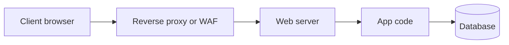
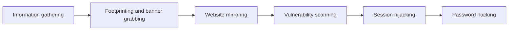
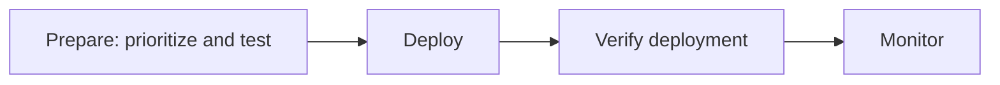

## Web Server Concepts

**Plain English.** A web server is a program that listens on ports 80 and 443, receives HTTP requests and sends back files or the output of application code. It is on the internet all day, it usually comes with more features switched on than it needs, and it tells strangers a lot about itself. That is why it is one of the most attacked pieces of any network.

### How a request reaches the code

- **Document root**: the folder the server maps to `/`. Anything under it can be requested, so configs, backups, `.git/` folders and logs belong outside it.
- **Virtual hosts**: one server answering for many sites; name-based virtual hosts pick the site from the `Host` header.
- **Reverse proxy**: a server in front (often nginx) that terminates TLS, caches, balances load, filters requests and can rewrite banners.

### The three servers you must know

| Server | Moving parts | Things that leak by default |
|---|---|---|
| **Apache httpd** | modules, per-directory `.htaccess`, MPMs (prefork, worker, event) | `ServerTokens` defaults to **Full**; `TraceEnable` is **on**; `/server-status` and `/server-info` if enabled |
| **nginx** | one master process, event-driven worker processes; often a reverse proxy (`proxy_pass`) | `server_tokens` defaults to **on** (version on error pages and in `Server`); `stub_status` if enabled |
| **IIS** | kernel-mode **HTTP.sys** listener → WAS/WWW service → **w3wp.exe** worker processes inside **application pools** | detailed errors, extra headers (`X-Powered-By`); a pool running as LocalSystem |

Directory listing is **off by default** on all three (nginx `autoindex off`, Apache only with `Options Indexes` and no index file, IIS `directoryBrowse enabled="false"`). When you find it, somebody turned it on.

Each IIS application pool runs its worker process under its own low-privilege **application pool identity**. Separate pools keep one compromised site away from the others' files.

### Why web servers get compromised

- Default installs: sample scripts, manuals, default accounts, unused modules (NIST SP 800-44 says remove them all).
- Misconfiguration (OWASP A05): listings, verbose errors, open status or admin pages, risky methods such as `PUT` and `TRACE`.
- Unpatched server or components (OWASP A06).
- Weak remote administration and passwords.
- A server account with too many rights, so a small bug becomes full control.

RFC 9110 itself warns that a detailed `Server` header makes it easier to target known vulnerabilities.

### Exam traps

- **HTTP.sys** is the IIS listener; **w3wp.exe** is the worker process. Do not swap them.
- `ServerSignature` is the **footer** on server-generated pages; `ServerTokens` is the **header**. Both are Apache.
- Hiding the banner is **obscurity**: it slows fingerprinting, it does not fix anything.

## Web Server Attacks

**Plain English.** Web server attacks either read what they should not (traversal, leaks), change what they should not (defacement, poisoned caches, web shells), send users somewhere else (DNS hijacking) or knock the service over (DoS). On the exam, each one has one clue that gives it away.

| Attack | The clue in the question | ATT&CK / CWE | Countermeasure |
|---|---|---|---|
| **Directory traversal** | `../` or `%2e%2e` in a URL, a system file returned | CWE-22 | patch (Apache 2.4.49 CVE-2021-41773), canonicalize paths, `Require all denied` outside served paths |
| **HTTP response splitting** | `%0d%0a` in a parameter, an extra header appears | CWE-113 | strip CR/LF from anything placed in headers |
| **Web cache poisoning** | a shared cache or CDN serves one bad response to everyone | CAPEC-141 | key on every input used, do not trust unkeyed headers |
| **HTTP request smuggling** | front end uses Content-Length, back end uses Transfer-Encoding | CWE-444 | same parsing on both tiers, reject ambiguous requests |
| **DoS / DDoS** | flood of traffic or requests; slow partial headers (Slowloris) | T1498, T1499.002 | timeouts, per-IP limits, CDN/DDoS protection |
| **DNS amplification** | huge DNS answers from open resolvers you never queried | T1498.002 | upstream filtering; resolvers close recursion |
| **DNS server hijacking** | users land on a fake site, the web server is untouched, DNS records changed | T1584.002 | MFA on DNS/registrar accounts, record audits |
| **Website defacement** | visible content changed on the real server | T1491.002 | file integrity monitoring, restore from known-good copy |
| **Web shell** | new script in a web folder; web server process starts shells | T1505.003 | least privilege, no write to web folders, FIM |
| **Password attacks** | many logins on admin panel or SSH; default credentials | T1110, CWE-1392 | MFA, lockout, restrict admin to management networks |
| **SSRF** | server fetches a URL you gave it, reaches internal or metadata addresses | CWE-918 | allow-list destinations, block internal ranges |
| **Misconfiguration leaks** | listing, backups (`site.zip`), stack traces | CWE-548, CWE-530, CWE-209 | disable listing, move backups, generic error pages |

Two ATT&CK IDs to remember together: **T1190 Exploit Public-Facing Application** is how the attacker gets in; **T1505.003 Web Shell** is what they leave behind to come back.

### DoS families

- **Volumetric / amplification**: fills the pipe (DNS amplification is the classic).
- **Service exhaustion**: many expensive HTTP requests (HTTP/2 Rapid Reset, CVE-2023-44487, is a recent example).
- **Slow HTTP (Slowloris)**: holds connections open by sending headers very slowly until the pool is full. Very little bandwidth needed.

EC-Council's own list for this module also names MITM/sniffing, phishing and SSH brute force; the table covers the ideas behind them.

### Exam traps

- **DNS hijacking vs defacement**: hijacking changes where visitors go; defacement changes what the real server shows.
- **Response splitting vs cache poisoning**: splitting is the injection technique; cache poisoning is the spread of the bad response through a shared cache. Splitting is one way to poison a cache.
- **Slowloris is low bandwidth.** If the question stresses "few connections, very slow headers", it is not a volumetric flood.

## Web Server Attack Methodology

**Plain English.** Before touching a server, an attacker (or a tester with written permission) learns everything they can quietly, then asks the server who it is, copies the site to study it, scans for known weaknesses and only then tries logins. Each step has signature tools, and the exam loves matching tool to step.

Mnemonic for EC-Council's order: **I Found My Very Secret Password**.

| Step | What happens | Tools to recognize | What the defender sees |
|---|---|---|---|
| Information gathering | public data: WHOIS, DNS, search engines, `robots.txt` | Netcraft site report, Shodan, search engines | nothing (passive) |
| Footprinting / banner grabbing | read the server's type and version | Netcat or Telnet to port 80, `curl -I`, `nmap -sV`, WhatWeb, ID Serve | single odd requests |
| Website mirroring | copy the site to study offline | HTTrack, `wget --mirror` | a fast crawl of every page |
| Vulnerability scanning | known flaws, dangerous files, risky methods | Nikto, Nessus/OpenVAS, Skipfish, Nmap `http-methods`, `http-enum` | loud: thousands of requests, IDS alerts |
| Directory brute forcing | guess unlinked paths from a wordlist | Gobuster, DirBuster, dirb, ffuf | bursts of 404s from one IP |
| Session hijacking | reuse or steal session tokens | proxies such as Burp Suite (covered in M11/M14) | sessions used from two places |
| Password hacking | guess admin, SSH or form logins | Hydra | many failed logins, lockouts |

Other names worth knowing: **wafw00f** identifies a WAF before testing; **sslscan / testssl.sh / SSL Labs** list TLS versions and ciphers; Nmap **`http-slowloris-check`** tests Slowloris exposure without running the attack.

Metafiles: `robots.txt` (RFC 9309) is advice to crawlers, not access control, and often lists the very paths an owner wanted hidden. `/.well-known/security.txt` (RFC 9116) is the opposite: a contact for reporting vulnerabilities.

> **v13 and AI.** EC-Council adds a lab on web server hacking with AI. From the defender's side, the same assistants can summarize a Nikto or Nmap report, explain a header, or draft a hardening checklist. Treat their output as a draft: check every claim against vendor documentation, and never paste a client's scan data into a public AI service without permission.

### Exam traps

- **Passive vs active**: Netcraft and Shodan are passive for the tester; Nikto, Gobuster and Hydra are active and noisy.
- **HTTrack mirrors, it does not guess.** Hidden paths come from brute forcers (Gobuster, dirb), not mirroring tools.
- **Nikto is a web server scanner**, not a password cracker and not a WAF detector.

## Web Server Attack Countermeasures

**Plain English.** Make the server boring: put it in a DMZ, give it one job, remove everything it does not need, patch it on a schedule (and fast when something is being exploited), and watch its files and logs so a change is noticed within minutes.

### Hardening checklist (NIST SP 800-44, CIS Benchmarks)

| Area | Do this |
|---|---|
| Placement | DMZ, dedicated single-purpose host, admin access only from a management network |
| Install | remove sample content, manuals, unused modules and services; change default credentials |
| Files | web content on its own partition; no listings; no symbolic links; backups and configs outside the document root |
| Accounts | least privilege: the server account reads content but cannot write to web folders; separate IIS app pools |
| Banners and methods | Apache `ServerTokens Prod`, `ServerSignature Off`, `TraceEnable off`; nginx `server_tokens off`; IIS request filtering for verbs and extra headers |
| DoS | Apache `mod_reqtimeout`; nginx `limit_conn`, `limit_req`, header timeouts; IIS Dynamic IP Restrictions; CDN or DDoS protection upstream |
| TLS | TLS 1.2 and 1.3 only (NIST SP 800-52 Rev. 2, Mozilla guideline), HSTS (RFC 6797) |
| Filtering | WAF such as ModSecurity with the OWASP Core Rule Set, to virtual-patch while real patches are tested |
| Detection | file integrity monitoring (AIDE, OSSEC), combined-format access logs, alerts when the web server process starts a shell |
| DNS | MFA on registrar and DNS accounts; audit records (CISA ED 19-01) |

CIS Benchmarks exist for Apache, nginx and IIS: consensus configuration baselines you can audit against.

### Patch management

**Patch management** is the notification, identification, deployment, installation and verification of patches, hotfixes and service packs. A **hotfix** is Microsoft's word for a patch; a **service pack** is a tested, cumulative bundle.

NIST SP 800-40 Rev. 4 treats patching as preventive maintenance:

| SP 800-40 idea | Meaning | Web server example |
|---|---|---|
| **Accept** | live with the risk | low-impact flaw behind strong controls |
| **Mitigate** | patch, disable the feature, upgrade, or add controls | install the fix; add a WAF rule |
| **Transfer** | share the consequences | move to SaaS where the provider patches; insurance |
| **Avoid** | remove the attack surface | uninstall an unused module, decommission the server |
| Routine patching | normal cycle | monthly update window |
| Emergency patching | patch now | flaw exploited in the wild, patch available |
| Emergency mitigation | temporary fix before a patch exists | WAF rule, feature disabled |
| Unpatchable assets | isolate or protect otherwise | legacy appliance behind a proxy |

Prioritize with CISA's **Known Exploited Vulnerabilities** catalog: US federal agencies must fix listed flaws by the due dates set under BOD 22-01, and everyone else can use the same list.

### Exam traps

- **A WAF does not replace patching.** It buys time.
- **Changing the banner is not a fix.** The version can still be inferred.
- **File integrity monitoring detects**; it does not prevent. Pair it with least privilege, which prevents.
- **Verify after deploying**: a patch that is "pushed" is not a patch that is installed and effective.
