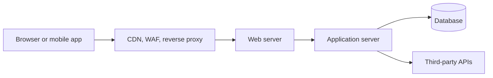
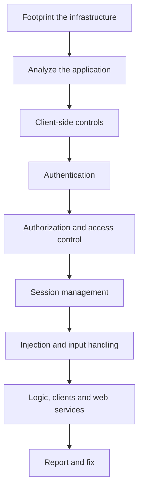
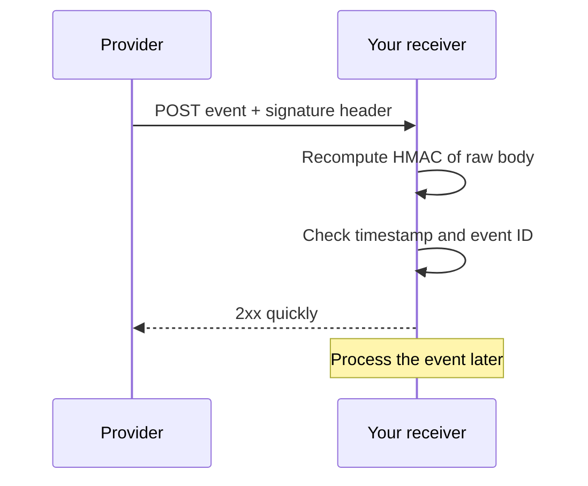

## Web Application Concepts

**Plain English.** A web application is a program that runs on servers and is used through a browser or an app. The browser sends HTTP requests, the server runs code and usually talks to a database, and a response comes back. HTTP forgets everything between requests, so the application hands out a session ID and trusts whoever presents it. Almost every attack in this module abuses one of three things: input the server trusts, a session it trusts, or a check it forgot to make.

| Tier | What lives there | Typical weakness |
|---|---|---|
| Presentation (client) | HTML, JavaScript, cookies, local storage | XSS, clickjacking, trusting client-side checks |
| Logic (application server) | business rules, authentication, authorization | injection, broken access control, logic flaws |
| Data | database, files, caches | injection, weak crypto, excessive data returned |

### HTTP pieces you must read fluently

- **Methods**: GET (read), POST (submit), PUT (replace), PATCH (modify), DELETE, HEAD (headers only), OPTIONS (what is allowed), TRACE (echo the request back, disable it), CONNECT (tunnel).
- **Status codes**: 200 OK · 301/302 redirect with `Location` · **401** not authenticated · **403** authenticated or not, but refused · 404 not found · **405** method not allowed · **429** too many requests (rate limit, may carry `Retry-After`) · **500** server error.
- **Cookies**: `Secure` = HTTPS only · `HttpOnly` = JavaScript cannot read it · `SameSite=Strict|Lax|None` = when the browser sends it on cross-site requests (`None` needs `Secure`) · `__Host-` prefix = Secure, no Domain, Path `/`.
- **Same-origin policy**: origin = **scheme + host + port**. **CORS** response headers relax it; `Access-Control-Allow-Origin: *` can never be combined with credentials.
- **Web services**: SOAP (XML envelope, described by **WSDL**), REST (resources + HTTP verbs, usually JSON, stateless), GraphQL (one endpoint, client picks fields, schema visible through **introspection**), gRPC (HTTP/2 + Protocol Buffers).
- **Tokens**: a JWT is `header.payload.signature` in Base64url; anyone can read the payload, the signature proves it genuine. OAuth 2.0 = delegated **authorization**; OpenID Connect adds **authentication** (ID token).

### Encoding schemes

| Scheme | Looks like | Why it matters |
|---|---|---|
| URL (percent) encoding | `%2F`, `%20`, `%3C` | lets special characters travel in URLs; double encoding (`%252F`) hides them from naive filters |
| HTML entities | `&lt;` `&gt;` `&quot;` | output encoding: turns markup into harmless text |
| Base64 / Base64url | `dXNlcg==` | packs binary data (JWTs, Basic auth); it is **not** encryption |
| Unicode / UTF-8 | `U+003C`, full-width and overlong forms | alternate spellings of the same character |
| Hex | `0x3c`, `\x3c` | another alternate spelling |

Rule: **canonicalize first, then validate**, and encode on output for the exact context.

### Exam traps

- Encoding ≠ encryption ≠ hashing. Base64 in a cookie hides nothing.
- **401 vs 403**: 401 asks you to log in; 403 says you are known (or not) but not allowed.
- Hidden fields and JavaScript checks are **client-side**: a proxy changes them.

## Web Application Threats

**Plain English.** OWASP publishes the Top 10 list of the most serious web application risks. The CEH v13 course page still quotes the 2021 list, so learn both editions. Each risk leaves a recognisable trace in a request, response or log.

### OWASP Top 10:2025

| # | Risk | How you recognize it | Countermeasure (Cheat Sheet) |
|---|---|---|---|
| A01 | Broken Access Control (now includes **SSRF**) | 200 OK for another user's ID or an admin URL; server fetching internal addresses | deny by default, check ownership server-side (Authorization, IDOR, SSRF) |
| A02 | Security Misconfiguration | default accounts, directory listing, stack traces, missing headers | hardening baseline, remove extras, automated checks (HTTP Headers) |
| A03 | Software Supply Chain Failures | outdated or tampered libraries, unsigned builds | SBOM, SCA, signed artifacts, patching (Vulnerable Dependency Mgmt) |
| A04 | Cryptographic Failures | HTTP login pages, MD5 password hashes, weak TLS | TLS + HSTS, Argon2id/bcrypt (Password Storage, TLS) |
| A05 | Injection (incl. XSS) | metacharacters echoed or causing errors; odd timing | parameterized APIs, output encoding, allowlists (Injection Prevention) |
| A06 | Insecure Design | the flaw is in the plan: no limit, no step check | threat modeling, abuse cases (Threat Modeling) |
| A07 | Authentication Failures | many failed logins from one IP or many accounts | MFA, throttling, breached-password check (Authentication) |
| A08 | Software or Data Integrity Failures | unsigned updates, CDN scripts without SRI, serialized objects | signatures, SRI, no untrusted deserialization (Deserialization) |
| A09 | Security Logging and Alerting Failures | the breach is found by a customer, not by you | log auth and access failures, alert on them (Logging) |
| A10 | Mishandling of Exceptional Conditions (new) | verbose errors, a failure that grants access (**fail open**) | fail closed, generic errors, central handling (Error Handling) |

2021 → 2025: A10:2021 SSRF merged into A01; A06:2021 *Vulnerable and Outdated Components* grew into A03 *Software Supply Chain Failures*; A10 is new.

### Attack classes by clue

| Attack | Clue in the request, response or log | Detection | Countermeasure |
|---|---|---|---|
| **Reflected XSS** (CWE-79) | markup in a parameter comes back unencoded in the same response | WAF/XSS rules, CSP violation reports | contextual output encoding, CSP |
| **Stored XSS** | script saved in a comment or profile runs for every visitor | content review, CSP reports | encode on output, sanitize rich text |
| **DOM-based XSS** | the server response is clean; client JavaScript writes the URL fragment into `innerHTML` | code review of sinks, DOM Invader | safe sinks (`textContent`), Trusted Types |
| **CSRF** (CWE-352) | state-changing request with the victim's cookie but a foreign `Origin`/`Referer` | missing or wrong token | synchronizer token, SameSite, Origin check |
| **SSRF** (CWE-918) | URL-valued parameter; app server calls `169.254.169.254` or internal IPs | egress logs from app servers | allowlist destinations, no redirects, segmentation |
| **Path traversal / LFI / RFI** | `../`, `%2e%2e%2f` in a file parameter | WAF, 200 responses for system files | no user input in paths, allowlist, canonicalize |
| **OS command injection** (CWE-78) | `;`, `\|`, `&&`, backticks in input; delays | web process spawning shells | call APIs, not a shell; allowlist |
| **XXE** (CWE-611) | `<!DOCTYPE` with an external `ENTITY` in an XML body | XML body inspection | disable DTDs and external entities |
| **Insecure deserialization** (CWE-502) | Base64 blob starting `rO0` (Java), PHP `O:` objects | unexpected class errors | JSON with schemas, sign data, class allowlists |
| **SSTI** (CWE-1336) | a template expression comes back computed | error messages naming the engine | never build templates from input |
| **Clickjacking** (CWE-1021) | page loads inside a foreign invisible frame | header scanners | CSP `frame-ancestors`, `X-Frame-Options` |
| **Open redirect** (CWE-601) | `?next=https://other.site` redirects anywhere | 302 to external hosts | allowlist or map destinations |
| **Session fixation** (CWE-384) | session ID unchanged before and after login | compare IDs across login | new session ID at authentication |
| **Parameter tampering / HPP** | changed price or role in hidden field; duplicate parameter names | server-side validation errors | server-side validation and authorization |
| **Unrestricted file upload** (CWE-434) | `.php` or double extension accepted, stored in web root | FIM on upload folders | allowlist, rename, store outside web root, no execute |

### Web shells

A **web shell** is a small script left on a web server that runs commands sent over HTTP. ATT&CK files it under persistence as **T1505.003**. Signs: a new `.php`, `.aspx` or `.jsp` file in the web root; the web server process (`w3wp.exe`, `httpd`, `nginx`, `php-fpm`) starting `cmd.exe`, `powershell.exe` or `/bin/sh`; POST requests to a page nobody links to; strange user agents. Defenses: file integrity monitoring, compare against a known-good copy, least privilege for the web server account, no execute rights on upload folders, patching.

### Exam traps

- **XSS runs in the browser; CSRF only sends a request.** CSRF cannot read the response.
- DOM XSS never shows up in server logs as a reflected payload when it lives in the `#fragment`.
- SSRF is inside **A01** in 2025 but still **API7** in the API list.
- A WAF blocking a pattern does not remove the flaw.

## Web Application Hacking Methodology

**Plain English.** A web application test moves from learning about the target to testing each place where the application makes a trust decision. The phases below are how the exam thinks about it. Everything is done only with written permission and a defined scope.

| Phase | What the tester learns | Tools you should recognize | What defenders see |
|---|---|---|---|
| Footprint infrastructure | server, framework, WAF, hosts, metafiles (`robots.txt`, `sitemap.xml`) | WhatWeb, Wappalyzer, wafw00f, Nmap `http-enum`, Nikto | fingerprint requests, scanner user agents |
| Analyze the application | entry points, parameters, hidden content | Burp Proxy and site map, ZAP Spider / AJAX Spider, gobuster, ffuf, dirb, feroxbuster, Arjun, HTTrack, katana | bursts of 404s, crawling patterns |
| Client-side controls | whether hidden fields and JS checks are enforced server-side | Burp Proxy, Repeater | modified values the UI never sends |
| Authentication | lockout, default credentials, password reset | Burp Intruder, Hydra, CeWL | many failed logins, lockouts |
| Authorization | IDOR, horizontal and vertical escalation | Burp Repeater and Comparer | 200 responses to other users' IDs |
| Session management | cookie flags, token randomness, fixation, CSRF | Burp Sequencer, jwt_tool | reused or predictable tokens |
| Injection | XSS, command, template, XML handling | Burp Scanner, ZAP active scan, commix, XSSer, Dalfox, sqlmap (M15) | WAF alerts, error spikes |
| Web services and APIs | endpoints, versions, schemas | Postman, Kiterunner, ZAP OpenAPI/GraphQL add-ons | calls to undocumented endpoints |

### Burp Suite and ZAP at a glance

| Tool | What it is for |
|---|---|
| Burp **Proxy** | intercept and edit traffic between browser and server |
| Burp **Repeater** | resend one request by hand and compare responses |
| Burp **Intruder** | automated customized requests; attack types **Sniper** (one list, one position at a time), **Battering ram** (same value in all positions), **Pitchfork** (parallel lists), **Cluster bomb** (every combination) |
| Burp **Sequencer** | measure randomness of session tokens |
| Burp **Collaborator** | detect out-of-band interactions (blind SSRF, blind injection) |
| ZAP **passive scan** | only reads traffic, sends nothing new: safe |
| ZAP **active scan** | sends attack requests: only with permission; blocked in Safe and Protected-out-of-scope modes |
| ZAP **baseline scan** | spider + passive scan, for CI pipelines |

**Fuzz testing** means sending large numbers of unexpected inputs and watching status codes, response length and timing. In ffuf the word `FUZZ` marks the position being replaced; in gobuster `dir` mode brute-forces paths, `dns` subdomains, `vhost` virtual hosts.

Mnemonic for the order: **"Find All Clients' Authentic Access Sessions, Inject Last"** (Footprint, Analyze, Client-side, Authentication, Authorization, Session, Injection, Logic/services).

### Exam traps

- **Spider** follows links; **forced browsing** guesses paths that are not linked.
- **Nikto** is a web **server** scanner; **WPScan** is only for WordPress; **wafw00f** only detects a WAF.
- **Repeater** is manual; **Intruder** is automated. **Sequencer** tests tokens, not passwords.
- ZAP passive scan is safe on production; active scan is not.

## Web API and Webhooks

**Plain English.** An API lets programs call the application directly, without a web page. No user interface hides IDs or admin functions, so the server must check everything. A webhook turns the usual direction around: instead of you asking an API "anything new?", the provider calls your URL when an event happens.

### OWASP API Security Top 10 (2023)

| # | Risk | How it shows up | Countermeasure |
|---|---|---|---|
| API1 | Broken Object Level Authorization (BOLA) | `/api/orders/1002` returns another user's data | per-object ownership check from the session user |
| API2 | Broken Authentication | no lockout, unsigned JWT, token in the URL | strong token validation, rate-limit logins |
| API3 | Broken Object Property Level Authorization | response shows `passwordHash`; request sets `"isAdmin": true` | response schemas, allowlist bindable fields |
| API4 | Unrestricted Resource Consumption | huge `limit=` values, no 429 ever returned | rate limits, quotas, size and depth limits |
| API5 | Broken Function Level Authorization | normal user calls `DELETE` or `/admin/` routes | role check per function, deny by default |
| API6 | Unrestricted Access to Sensitive Business Flows | bots buying all stock or mass sign-ups | detect automation, business-flow limits |
| API7 | Server-Side Request Forgery | URL field (webhook, image import) reaches internal hosts | allowlist destinations, isolate fetchers |
| API8 | Security Misconfiguration | permissive CORS, verbose errors, extra verbs | hardening, 405 for unused methods |
| API9 | Improper Inventory Management | `/v1/` or a staging host still live | API inventory, OpenAPI docs, retire old versions |
| API10 | Unsafe Consumption of APIs | trusting data from a partner API | validate third-party data like user input |

**BOLA vs BFLA**: BOLA is the wrong **object** (someone else's record); BFLA is the wrong **function** (an admin action). **API3** merges the 2019 items *excessive data exposure* and *mass assignment*.

API reconnaissance clues: `swagger.json` / `openapi.json`, WSDL files, GraphQL **introspection** (`__schema`), version prefixes. Defenses for GraphQL: disable introspection in production if not needed, limit query depth and cost, authorize each field.

### Webhooks

| Webhook risk | What defenders look for | Countermeasure |
|---|---|---|
| Forged delivery | signature missing or wrong | HMAC-SHA256 of the raw body with a shared secret (GitHub `X-Hub-Signature-256`), constant-time compare |
| Replay | old timestamp, repeated delivery ID | signed timestamp with tolerance (Stripe default 5 min), store IDs (`X-GitHub-Delivery`, `webhook-id`) |
| SSRF on the provider | users register internal URLs as endpoints | validate and allowlist destinations, block private ranges |
| Slow receiver | timeouts and retries pile up | answer 2xx fast, process async (GitHub expects a reply within 10 s) |

### Exam traps

- A webhook is **push** (provider → you); polling an API is **pull**.
- HMAC proves the sender knows the secret; HTTPS alone does not authenticate the sender.
- 401/403 on a changed ID is good; 200 is BOLA.

## Web Application Security

**Plain English.** Web defense is layered: write code that does not trust input, configure the platform tightly, put a WAF and security headers in front, and watch the logs. No layer is enough alone.

### Controls that map to the attacks

| Control | Stops or limits | Notes |
|---|---|---|
| Parameterized queries and safe APIs | injection | the only real fix for SQL and command injection |
| Contextual output encoding + CSP | XSS | CSP is defense in depth, not a replacement |
| Anti-CSRF token + `SameSite` cookies | CSRF | check `Origin` for APIs |
| `HttpOnly`, `Secure`, `__Host-` cookies | session theft | regenerate ID at login |
| HSTS (`max-age`, `includeSubDomains`, `preload`) | SSL stripping | only after HTTPS works everywhere |
| CSP `frame-ancestors` / `X-Frame-Options` | clickjacking | `frame-ancestors` is the modern one |
| Server-side authorization on every request | IDOR, BOLA, BFLA | deny by default |
| Rate limiting (429) | brute force, API4 | per user and per IP |
| File integrity monitoring | web shells, defacement | alert on new scripts in web root |

### Web application firewall

A **WAF** inspects HTTP at layer 7 and blocks requests that match attack rules. It can run as an appliance, a server module (ModSecurity) or a cloud service (Azure WAF, AWS WAF).

- **Negative model**: block known-bad patterns (signatures). **Positive model**: allow only known-good input.
- **Detection-only** mode logs; **blocking** mode drops. ModSecurity: `SecRuleEngine DetectionOnly` vs `On`.
- **OWASP CRS** uses **anomaly scoring** (rules add points, block over a threshold) and **paranoia levels** (higher = stricter, more false positives).
- **Virtual patching**: a WAF rule that blocks a known flaw until the code is fixed.
- Testers detect WAFs with **wafw00f** or Nmap `http-waf-detect`; defenders see bursts of blocked probes.

### Secure SDLC

The loop: requirements (ASVS) → design (threat model) → code (SAST, SCA) → test (DAST, IAST) → deploy (WAF, headers) → monitor (logs, alerts) → back to requirements.

- **NIST SSDF (SP 800-218)**: four groups: Prepare the Organization (**PO**), Protect the Software (**PS**), Produce Well-Secured Software (**PW**), Respond to Vulnerabilities (**RV**).
- **OWASP SAMM**: Governance, Design, Implementation, Verification, Operations. **OWASP ASVS**: verification requirements in three levels.
- **SAST** reads source (white box), **DAST** attacks the running app (black box), **IAST** instruments the running app, **SCA** checks third-party components; an **SBOM** (CycloneDX, SPDX) lists them.
- **Logging (A09)**: record login successes and failures, access-control failures and input-validation failures; never log passwords or session IDs; encode log entries to stop log injection (CWE-117); alert on patterns.

> **v13 adds AI to web application testing.** Apps that call a large language model add two risks from the OWASP Top 10 for LLM Applications: **prompt injection** (LLM01, text that overrides the app's instructions) and **improper output handling** (LLM05, model output rendered as HTML becomes XSS). Treat model output as untrusted input, give LLM tools least privilege, and require human approval for risky actions. AI assistants help testers triage and report, but every finding is verified by hand.

### Exam traps

- A WAF is **defense in depth**. The exam's "best" fix for injection is still parameterization or encoding in code.
- **SAST** needs source code; **DAST** does not.
- HSTS protects later visits; the **preload** list protects the first one.
- `X-XSS-Protection` is obsolete; CSP is the current answer.
