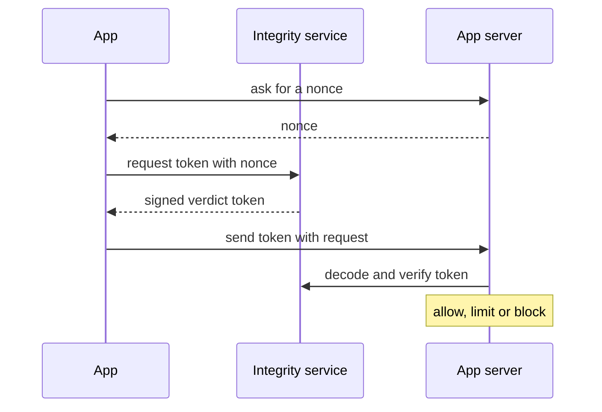
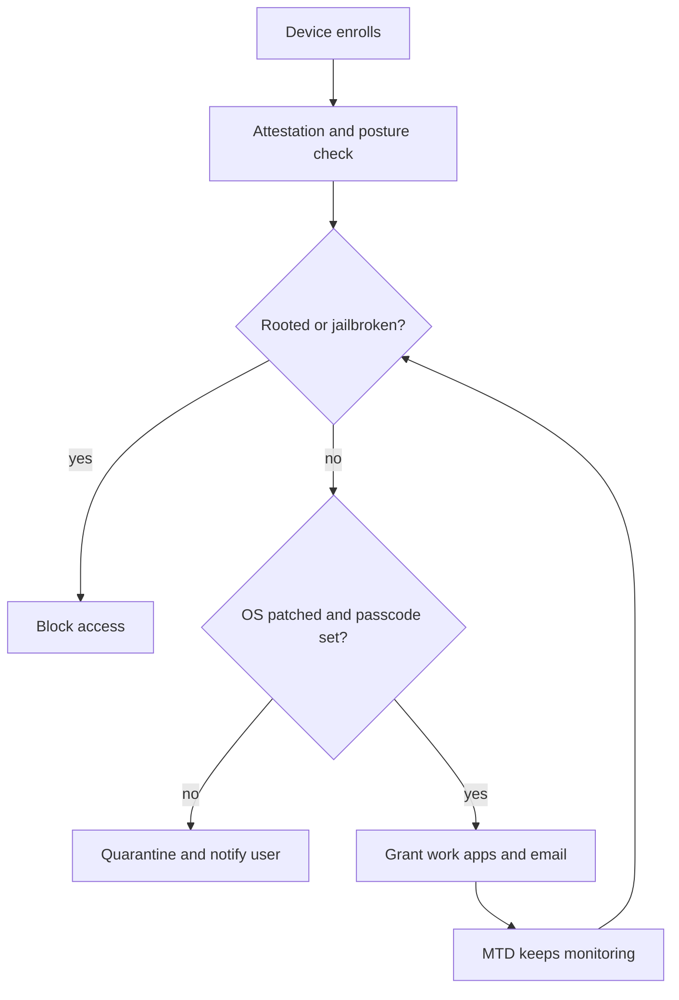

## Mobile Platform Attack Vectors

**Plain English.** A phone is a small computer that is always on, always connected, full of personal and work data, and carried everywhere. Attackers can go after the **device** (apps, OS, browser, SMS), the **network** (public Wi-Fi, rogue access points, the carrier) or the **back end** (the servers and APIs the apps talk to). Most real losses come from a few boring things: phishing by text, stolen one-time codes, apps that store or send data carelessly, and phones that are never updated.

### OWASP Mobile Top 10 (2024)

The 2024 list replaced the 2016 list. Learn the order: exam questions give you a finding and ask for the category.

| # | 2024 risk | Typical finding | Main fix |
|---|---|---|---|
| M1 | Improper Credential Usage | API key or password hardcoded in the app | keep secrets on the server, short-lived tokens |
| M2 | Inadequate Supply Chain Security | vulnerable or malicious SDK, weak build pipeline | vet and update libraries, sign builds |
| M3 | Insecure Authentication/Authorization | IDOR, role sent by the client, local-only login | enforce every check on the server |
| M4 | Insufficient Input/Output Validation | injection through intents, deep links, WebViews | validate and encode all input |
| M5 | Insecure Communication | HTTP, accepting any certificate | TLS everywhere, strict certificate checks, pinning |
| M6 | Inadequate Privacy Controls | collects or leaks more personal data than needed | data minimization, consent |
| M7 | Insufficient Binary Protections | app easy to reverse engineer or repackage | obfuscation, integrity checks, server-side enforcement |
| M8 | Security Misconfiguration | debuggable release, exported components, cleartext allowed | secure defaults, release checklist |
| M9 | Insecure Data Storage | tokens in plain files, logs, backups | Keystore / Keychain, encrypt, no secrets in logs |
| M10 | Insufficient Cryptography | weak algorithm, short key, bad key management | vetted libraries, strong algorithms |

**Mnemonic:** *"Careful Supply Always Inspects Comms, Privacy, Binaries, Config, Storage, Crypto"* (Credentials, Supply chain, Auth, Input/output, Communication, Privacy, Binary, Config, Storage, Crypto).

What changed from 2016: code tampering and reverse engineering merged into **M7**, authentication and authorization merged into **M3**, and **M1 Improper Platform Usage** and **M10 Extraneous Functionality** disappeared as separate items. Insecure Data Storage fell from M2 to **M9**.

### Attacks you must recognize

| Attack | Sign or vector | ATT&CK Mobile | Countermeasure |
|---|---|---|---|
| **Smishing** | text with a link or "call this number" | T1660 Phishing | don't click; forward spam to **7726**; report in the app |
| **Caller ID spoofing / vishing** | call appears to come from the bank | — | call back on a known number; **STIR/SHAKEN** authenticates caller ID |
| **SIM swap** (port-out fraud) | phone suddenly loses service, then SMS codes are abused | T1451 SIM Card Swap | carrier PIN / port lock, **no SMS MFA**, use FIDO |
| **OTP theft by malware** | app with SMS permissions forwards codes | T1636.004 SMS Messages | app vetting, permission review, non-SMS MFA |
| **Juice jacking** | public USB charging port or cable | T1458 Replication Through Removable Media | wall socket, own charger, charge-only cable |
| **Overlay / tapjacking** | fake login screen over a real app | T1417.002 GUI Input Capture | Android 12 blocks touches through untrusted overlays; `filterTouchesWhenObscured` |
| **Camera / mic spying** | foreground service keeps sensors alive | T1429, T1512, T1541 | status-bar indicators (Android 12+, iOS), permission review |
| **Malicious or sideloaded app** | app from outside the official store | T1474 Supply Chain Compromise | official store, Play Protect, MDM allowlist |

**App sandboxing issues:** the OS gives each app its own box; the risk appears when an app is over-permissioned, shares data through exported components or files, or the device is rooted/jailbroken so the box no longer holds.

### Exam traps

- **M1 in 2024 is Improper Credential Usage.** "Improper Platform Usage" was M1 in **2016**. Check which list the question means.
- A **hardcoded API key** is M1, not M10: the problem is the credential, not the algorithm.
- **IDOR** in a mobile API is **M3** (authorization), even though the bug is on the server.
- SMS codes are phishable and SIM-swappable. NIST SP 800-63B-4 lists PSTN (SMS/voice) out-of-band as a **restricted** authenticator; CISA says do not use SMS as a second factor.
- EC-Council's "anatomy of a mobile attack" splits the surface into **device, network, data center/cloud**. Use that framing if asked.

## Hacking Android OS

**Plain English.** Android is Linux underneath. Every app gets its own Linux user ID, so the kernel keeps apps apart, and SELinux adds a second fence. Apps must ask for permissions, every APK must be signed, and the boot chain checks that the system was not changed. **Rooting** removes these limits: anything running as root can read every app's data, hide itself and ignore policy.

### The security model

| Layer | What it does | Remember |
|---|---|---|
| **App sandbox** | unique **UID** per app, own process (kernel DAC) | apps do not share a UID by default |
| **SELinux** | mandatory access control per domain | since Android 9 each app gets its own SELinux sandbox |
| **Permissions** | normal (install time), **dangerous (runtime, since 6.0)**, special | special = e.g. draw over other apps |
| **APK signing** | v1 JAR, **v2 (7.0)**, **v3 (9, key rotation)**, v4 (11) | self-signed, no CA check |
| **Verified Boot** | hardware root of trust → bootloader → partitions (dm-verity), rollback protection | ORANGE = unlocked, YELLOW = custom key, RED = failed |
| **Keystore** | keys stay out of the app process; TEE or **StrongBox** | keys can require user authentication |
| **File-based encryption** | CE storage (after unlock) and DE storage (Direct Boot) | FBE required on new devices from Android 10 |
| **Play Protect** | scans apps, including sideloaded ones | keep it on |

### Risky settings: finding → OWASP → fix

| Finding | Why it matters | OWASP | Fix |
|---|---|---|---|
| `android:debuggable="true"` in release | debugger can attach and change the app | M8 | false in release builds |
| `android:allowBackup` left at default (true) | app data copied to backups (up to 25 MB to the cloud) | M9 | set false or exclude sensitive files |
| `android:exported="true"` without permission | any app can start the component | M8 | exported false, or require a permission |
| `usesCleartextTraffic="true"` | HTTP allowed | M5 | cleartext is off by default for API 28+; keep it off |
| trust user-added CAs | a user-installed CA can intercept TLS | M5 | default for 7.0+ trusts system CAs only; `<pin-set>` |
| secrets in `Log.d()` output | logs readable during debugging and in bug reports | M9 | strip logs in release |
| `adb tcpip 5555` left on | debugging over the network | M8 | USB debugging off; RSA prompt since 4.2.2; MDM blocks developer mode |

### Rooting

Rooting usually needs an **unlocked bootloader** (the phone then shows the ORANGE warning at boot) and breaks the chain of trust. NIST SP 800-124r2 says organizations should treat rooted or jailbroken devices as untrusted. Defenders detect it with **attestation**: the **Play Integrity API** returns verdicts such as `MEETS_BASIC_INTEGRITY`, `MEETS_DEVICE_INTEGRITY` and `MEETS_STRONG_INTEGRITY`, and an app verdict `PLAY_RECOGNIZED`. The check must be done on the **server**, not in the app.

### Exam traps

- **Runtime permissions** arrived in **Android 6.0** (API 23). Before that, all permissions were granted at install.
- Android app certificates are **self-signed**; signing proves the same developer, not a trusted identity.
- `MEETS_BASIC_INTEGRITY` alone does **not** mean a genuine, locked device; `MEETS_DEVICE_INTEGRITY` does.
- **Sideloading** is installing apps from outside Google Play; the user must allow "install unknown apps" for that source.
- Client-side root checks can be bypassed on a rooted phone. Server-side attestation is the answer.

## Hacking iOS

**Plain English.** Apple controls the whole chain: the hardware checks the boot software, the system runs only code Apple has signed, every app lives in its own sandbox and data is encrypted with keys tied to the passcode and the device. **Jailbreaking** uses vulnerabilities to switch these checks off so unapproved code can run. That also switches off the protections a company relies on.

### The security model

| Layer | What it does |
|---|---|
| **Secure boot chain** | immutable **Boot ROM** (holds the Apple Root CA public key) → iBoot → kernel; each step checks the next |
| **Secure Enclave** | separate subsystem for keys and biometrics (Face ID / Touch ID data) |
| **Code signing** | all executable code must be signed with an Apple-issued certificate; unsigned code does not run |
| **Sandbox** | random home directory per app; other data only through system services and **entitlements**; ASLR |
| **Data Protection** | per-file keys in classes A (Complete), B (Unless Open), **C (Until First User Authentication, the default)**, D (None) |
| **Keychain** | small secrets (passwords, tokens) with their own protection classes |
| **ATS** | App Transport Security: TLS 1.2+, forward secrecy (ECDHE), RSA 2048+ or ECC 256+ certificates |
| **App Attest** | proves requests come from a genuine app instance; key in the Secure Enclave |
| **Lockdown Mode** | extreme protection for people targeted by spyware; blocks most message attachments, link previews, profile installs and MDM enrollment |

### Jailbreak types (EC-Council terms)

| Type | After a reboot |
|---|---|
| **Tethered** | needs a computer to boot at all |
| **Semi-tethered** | boots alone, but jailbroken only after re-running it from a computer |
| **Semi-untethered** | boots alone; re-jailbreak with an app on the device |
| **Untethered** | stays jailbroken, nothing needed |

Mnemonic: **the more "un", the less you need.** Exploit levels are also named: **bootrom** (hardware, cannot be patched by an update), **iBoot** and **userland**.

**Why companies care:** Apple lists the effects of unauthorized modification as security holes, instability, shorter battery life and **no more updates**. A jailbroken phone can run unsigned code, read other apps' data and hide malware, so MDM and MTD flag it and block access to company data.

**Trustjacking** (EC-Council topic): abuse of an earlier "Trust This Computer" pairing, for example over Wi-Fi sync. Defense: only trust your own computers and review or reset trusted computers.

### Exam traps

- **Class C** is the default data protection class, not class A. Class A keys are dropped shortly after the device locks.
- Jailbreaking is **not** carrier unlocking.
- A **bootrom** exploit cannot be fixed by an iOS update; only new hardware fixes it.
- Lockdown Mode **prevents MDM enrollment and configuration profiles**, so it suits at-risk individuals rather than a normal managed fleet.
- ATS blocks plain HTTP by default; exceptions in the app's Info.plist are a red flag in a review.

## Mobile Device Management

**Plain English.** A company that lets phones read its email needs a way to set rules on them: a passcode, encryption, updates, which apps are allowed, and a way to erase company data if the phone is lost. **MDM** manages the whole device; **MAM** manages only the work apps; **EMM** is the umbrella that bundles both; **MTD** is the on-device threat detector that tells the EMM when something is wrong.

### Tools of the trade

| Term | Scope | Fits |
|---|---|---|
| **MDM** | whole device: passcode, encryption, OS version, Wi-Fi, camera, wipe | company-owned devices |
| **MAM** | only enterprise apps: allowlist, copy/paste limits, app-level wipe | BYOD, privacy |
| **EMM** | MDM + MAM + more, one console | most enterprises |
| **MTD** | detects malicious apps, MitM, phishing, risky configurations | adds threat signal to EMM |
| **App vetting** | tests apps before deployment (NIST SP 800-163r1) | internal and third-party apps |
| **Containerization** | separate work space on the device (app-based or OS-based) | mixed use |
| **VMI** | virtual phone hosted in the back end; data stays on the server | very sensitive data |

### Deployment models

| Model | Owner | Personal use | Typical wipe |
|---|---|---|---|
| Fully managed (strict enterprise use) | company | no | full |
| **COPE** | company | yes | full or work only |
| **CYOD** | company, from an approved list | usually | full |
| **BYOD** | employee | yes | **selective (enterprise) wipe** |

Platform names: **Android Enterprise** has the *work profile* (on personal or company-owned devices), the *fully managed device* and the *dedicated device* (kiosk); the **DPC** app applies policy. **Apple** has *supervision* for organization-owned devices (Automated Device Enrollment) and **User Enrollment** for BYOD, which manages only the organization's accounts and data.

### Policy checklist (NIST SP 800-124r2)

Require a passcode and encryption, set a minimum OS version, block rooted or jailbroken devices, disable developer mode and USB debugging, restrict sideloading, control Wi-Fi, Bluetooth and NFC, limit camera and copy/paste for work apps, push updates, and keep remote lock and wipe ready. **Remote wipe needs power and a network**, so it is never the only control.

### Exam traps

- BYOD + "must not touch personal data" → **MAM / work profile / User Enrollment + selective wipe**, never a full wipe.
- **MTD detects**, **MDM enforces**. If the question asks what spots a malicious app or rogue Wi-Fi on the phone, the answer is MTD.
- **COPE** = company owns, personal use allowed. **CYOD** = employee chooses from a company-approved list.
- MDM cannot fix a device whose OS the vendor no longer updates: replace it.

## Mobile Security Guidelines and Tools

**Plain English.** There are good free guides for every audience. Developers and testers use **OWASP MAS** (what to check and how to test it). Enterprises use **NIST** (how to run a mobile fleet). Threat analysts use **MITRE ATT&CK Mobile** (how real attackers behave). Users get simple rules from **CISA** and the FCC/FTC. The testing tools read the app, watch it run and show where it breaks those rules.

### Guidelines

| Source | What it is | Key point |
|---|---|---|
| **OWASP MASVS** | the standard: what to verify | 8 groups: STORAGE, CRYPTO, AUTH, NETWORK, PLATFORM, CODE, RESILIENCE, PRIVACY |
| **OWASP MASTG** | the testing guide: how to test | tests, tools, practice apps |
| **OWASP MASWE** | weakness list | links MASVS to MASTG tests |
| MAS profiles | how much to test | L1 Essential, L2 Advanced, **R Resilient** (user may be the attacker), P Privacy |
| **NIST SP 800-124r2** (2023) | managing mobile security in the enterprise | threats, EMM/MAM/MTD, deployment models |
| **NIST SP 800-163r1** | vetting the security of mobile apps | app vetting process |
| NIST SP 1800-21 / 1800-22 | practice guides | COPE / BYOD |
| **MITRE ATT&CK Mobile** | tactics and techniques seen in the wild | mitigations M1001 Security Updates, M1002 Attestation, M1006 Use Recent OS Version, M1011 User Guidance, M1012 Enterprise Policy, M1013 Application Developer Guidance |
| **CISA mobile guidance** | best practices for at-risk people | E2EE messaging, **FIDO** MFA, **no SMS MFA**, carrier PIN, updates, Lockdown Mode, keep Play Protect on |

### Tools (defender's use)

| Tool | What it does |
|---|---|
| **MobSF** | automated static and dynamic analysis of Android and iOS apps, web UI |
| **apktool** | decodes and rebuilds APK resources and manifest |
| **jadx** | decompiles DEX bytecode to readable Java |
| **dex2jar** | converts DEX to JAR for Java tools |
| **Androguard** | Python library to analyze APKs |
| **drozer** | tests an Android app's IPC attack surface (exported components) |
| **Frida** | dynamic instrumentation: hooks functions at run time |
| **objection** | Frida-based runtime toolkit for mobile assessments |
| **Burp Suite** | intercepting proxy to test the app's API traffic |
| **Play Protect** | Google's built-in app scanner on Android |

> **v13 AI callout.** "Jailbreak" has a second meaning now: in NIST's glossary it is a prompt attack that makes an AI model ignore its safety rules, not an iPhone modification. Read the question carefully. Mobile apps also ship AI features: OWASP M7 lists hardcoded AI models as something attackers extract by reverse engineering, and AI assistants that write mobile code can suggest `allowBackup`, cleartext or "trust all certificates" shortcuts. Check them against the MASVS.

### Exam traps

- **MASVS = what**, **MASTG = how**. ASVS is the web standard, not the mobile one.
- **drozer** = Android IPC testing; **Frida** = runtime hooking; **jadx** = decompiler; **apktool** = decode/rebuild resources.
- NIST SP **800-124** is about managing mobile devices; **800-163** is about vetting apps.
- **Attestation** (Play Integrity, App Attest) is MITRE mitigation **M1002**, and the verdict must be checked on the server.
