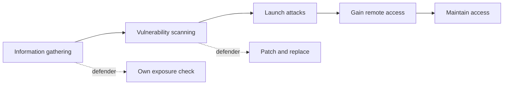
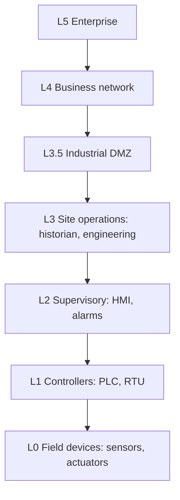
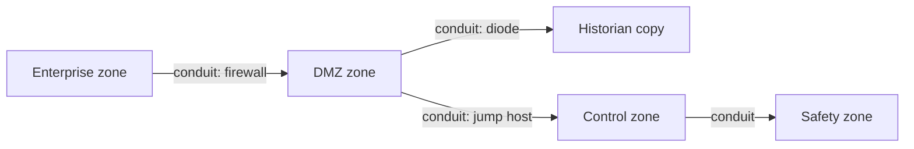

## IoT Concepts and Attacks

**Plain English.** An IoT device is a small computer with a sensor or an actuator and a network link: a camera, a smart plug, a thermostat, a medical pump. It is cheap, runs for years, has little CPU for security, and is often never updated. Many of them sit on home or office networks that nobody watches, which is why botnets like Mirai could recruit hundreds of thousands of them with nothing more than factory passwords.

### Architecture and communication

RFC 7452 describes four ways IoT devices talk:

| Pattern | Example | Security note |
|---|---|---|
| **Device-to-device** | Zigbee bulb and switch | radio link must be protected (keys, pairing) |
| **Device-to-cloud** | camera streams to the vendor cloud | cloud API and account security matter as much as the device |
| **Device-to-gateway** | Zigbee hub or phone app relays to the cloud | the gateway becomes the chokepoint to defend |
| **Back-end data sharing** | cloud shares data with third parties | privacy and API authorization |

EC-Council describes five layers, bottom to top: **edge technology** (sensors, hardware), **access gateway**, **internet**, **middleware**, **application**.

### Protocols and ports you must recognize

| Protocol | Transport / port | What it is | Typical weakness |
|---|---|---|---|
| **MQTT** | TCP **1883**, TLS **8883** | publish/subscribe through a **broker**; wildcards `+` (one level) and `#` (all levels) | anonymous broker lets anyone subscribe to `#` |
| **CoAP** | UDP **5683**, DTLS **5684** | REST-like GET/PUT for tiny devices; discovery at `/.well-known/core` | exposed UDP service can be abused for amplification |
| **Zigbee** | IEEE **802.15.4**, 2.4 GHz mesh | home and building automation | weak key handling, replay |
| **BLE** | 2.4 GHz | wearables, locks, beacons | "Just Works" pairing has **no MITM protection** |
| **LoRaWAN** | sub-GHz LPWAN via gateways | km range, low data rate | key management at join |
| **Z-Wave** | sub-GHz home mesh | home automation | legacy pairing modes |
| **6LoWPAN** | IPv6 over 802.15.4 (RFC 4944) | IP on tiny radios | same radio threats |
| **UPnP/SSDP** | UDP **1900** | device discovery, router port opening | exposes devices, opens ports without asking |
| **Telnet** | TCP **23** (and **2323**) | remote shell on cheap devices | Mirai's door |

### OWASP IoT Top 10 (2018)

| # | Risk | Recognize it by |
|---|---|---|
| I1 | Weak, guessable or hardcoded passwords | admin/admin works; password in firmware |
| I2 | Insecure network services | Telnet, UPnP or debug port open |
| I3 | Insecure ecosystem interfaces | cloud API or mobile app with no authorization |
| I4 | Lack of secure update mechanism | unsigned firmware over HTTP, no anti-rollback |
| I5 | Use of insecure or outdated components | old BusyBox, OpenSSL, kernel |
| I6 | Insufficient privacy protection | collects more personal data than needed |
| I7 | Insecure data transfer and storage | cleartext MQTT, keys stored in plain files |
| I8 | Lack of device management | no inventory, no monitoring, no decommissioning |
| I9 | Insecure default settings | features on by default, cannot be hardened |
| I10 | Lack of physical hardening | open UART/JTAG, easy to open |

**Mnemonic** (first letters): **P**asswords, **N**etwork, **E**cosystem, **U**pdates, **C**omponents, **P**rivacy, **D**ata, **M**anagement, **D**efaults, **P**hysical: *"Please Never Expose Unpatched Cameras; Protect Data, Manage Defaults Physically."*

### Threat classes: what defenders see

| Threat class | What it is | How defenders recognize it | Countermeasure |
|---|---|---|---|
| **IoT botnet / DDoS** | devices recruited to flood targets | outbound floods, scans on 23/2323 from inside, traffic to odd ports (CISA: 48101 for Mirai) | no default passwords, Telnet off, egress filtering |
| **Jamming** | radio noise so nobody can talk | devices drop offline together, high noise floor | frequency hopping, wired fallback, alerting on lost heartbeat |
| **Replay / rolling-code** | captured valid message sent again | same command seen twice, out of sequence | nonces, rolling codes with short windows, timestamps |
| **Sybil** | one node claims many identities | many "new" nodes with the same radio fingerprint | node authentication |
| **Side-channel** | secrets leak through power, timing, EM | lab-only; needs physical access | constant-time crypto, shielding |
| **MITM on the ecosystem** | traffic intercepted between app, device and cloud | certificate errors, unexpected gateways | TLS with certificate validation, pinning |
| **Firmware tampering** | modified firmware installed | hash or signature mismatch | signed updates, secure boot, anti-rollback |

**Mirai (2016).** CISA's alert: the malware scanned for Telnet on 23/TCP and 2323/TCP and tried **62 default username/password pairs**; its source code was published; an attack on KrebsOnSecurity reached about 620 Gbps. It lives only in memory, so a reboot clears it, but a device that keeps its default password is reinfected within minutes. Lesson: remove the password, not just the infection.

### Exam traps

- **1883 vs 8883**: 8883 is MQTT over TLS. **5683/5684** are CoAP over **UDP** (5684 = DTLS).
- MQTT's **broker** is the server; clients publish and subscribe. `#` is the multi-level wildcard.
- Zigbee sits on **IEEE 802.15.4**, not 802.11 or 802.15.1 (Bluetooth).
- OWASP IoT **I3 Ecosystem** is about the web, cloud, API and mobile parts *around* the device, not the device's own services (**I2**).

## IoT Hacking Methodology

**Plain English.** EC-Council describes IoT testing in five phases: **information gathering → vulnerability scanning → launch attacks → gain remote access → maintain access**. For the exam you need to recognize which tool belongs to which phase and what its output tells you. As a defender, you run the same discovery against your own devices first, so an attacker finds nothing new.

### Phase → tool → what the defender learns

| Phase | Tool | What it is for | What it tells a defender |
|---|---|---|---|
| Information gathering | **Shodan**, **Censys** | search engines of internet service banners (filters like `port:`, `product:`, `org:`) | which of *your* devices are exposed and what they reveal |
| Information gathering | **Nmap NSE** `mqtt-subscribe`, `coap-resources`, `upnp-info` | identify IoT services | anonymous brokers, open CoAP resources, UPnP descriptions |
| Vulnerability scanning | vulnerability scanners, firmware analysis | find outdated components (I5) | patch or replace list |
| Radio analysis | **HackRF One** (SDR, 1 MHz–6 GHz, half duplex), **RTL-SDR** (receive only), **GNU Radio** | capture and study radio signals | whether commands are protected against replay |
| Zigbee / 802.15.4 | **KillerBee** | Zigbee test framework | key handling on your mesh |
| Bluetooth | **Ubertooth One**, **bettercap** `ble.recon` | BLE monitoring and discovery | which devices advertise and what they expose |
| Firmware | **binwalk**, Firmware Mod Kit, **FACT**, **FirmAE** | identify, extract, compare, emulate firmware images | hardcoded passwords, keys, old libraries |
| Hardware | **JTAGulator**, **ChipWhisperer** | find debug pins (JTAG/UART); side-channel and fault-injection research | whether debug ports were left open (I10) |

**Reading output.** A Shodan result with banner `220 ... FTP` and `product: ... DVR` on a public IP is an *exposed device* finding. `nmap -p 1883 --script mqtt-subscribe` printing `$SYS/broker/...` topics means the broker accepted a connection without credentials. `binwalk` listing `Squashfs filesystem` at an offset means the firmware contains an unencrypted Linux file system that can be inspected for secrets.

### Exam traps

- **HackRF** transmits and receives (half duplex); **RTL-SDR** only receives.
- **binwalk** is for firmware images, not for network scanning. **Ubertooth** is Bluetooth, **KillerBee** is Zigbee.
- OWASP's IoT testing references: **ISTG** (testing guide), **ISVS** (verification standard), **FSTM** (firmware testing methodology), **IoTGoat** (deliberately vulnerable firmware for practice).

## IoT Attack Countermeasures

**Plain English.** Most IoT compromises come from the same few gaps: default passwords, open services, no updates, and devices sitting on the same flat network as everything else. Fix those and most attacks fail. Standards now push manufacturers to fix them before the device is sold.

### Countermeasure table

| Problem | Countermeasure | Standard or source |
|---|---|---|
| Default or shared passwords | unique per-device password or forced change at setup | ETSI EN 303 645 §5.1, UK PSTI, CISA Secure by Design |
| No updates | signed updates, defined support period, anti-rollback | ETSI §5.3, NISTIR 8259A "software update", OWASP I4 |
| Open services | disable Telnet, UPnP, debug ports; minimize attack surface | CISA Mirai alert, OWASP I2 |
| Flat network | put IoT on its own VLAN/SSID; allow only needed flows | RFC 8520 **MUD** (device declares what it needs) |
| Cleartext data | TLS/DTLS (MQTT 8883, CoAP 5684) | OWASP I7 |
| No inventory | asset management, monitoring, decommissioning | NISTIR 8259A "cybersecurity state awareness", OWASP I8 |
| Firmware tampering | secure boot, platform firmware resiliency (protect, detect, recover) | NIST SP 800-193 |

### NIST IoT guidance

- **NISTIR 8259**: six foundational activities for manufacturers, **four pre-market** (who are the customers and use cases, what do they need, how to address it, how to support it) and **two post-market** (how to communicate, what to communicate).
- **NISTIR 8259A**: the device **core baseline**, six capabilities: **device identification, device configuration, data protection, logical access to interfaces, software update, cybersecurity state awareness**.
- **NISTIR 8259B**: non-technical support (documentation, receiving questions, sharing information, education).
- **NIST SP 800-213**: how federal agencies set IoT device requirements.

**Mnemonic for 8259A:** *"I Configure Data, Lock Updates, Stay Aware"* (Identification, Configuration, Data protection, Logical access, Updates, State awareness).

### Exam traps

- **ETSI EN 303 645** is the consumer IoT baseline; its first three provisions (no universal default passwords, vulnerability reporting, keep software updated) are the ones the UK made law.
- **MUD (RFC 8520)** is a *network* control: the device points to a file listing allowed communications; the network enforces it.
- Rebooting a Mirai-infected device removes the malware but not the weakness. Change the password before reconnecting.

## OT Concepts and Attacks

**Plain English.** Operational technology runs physical things: pumps, valves, breakers, turbines, conveyor belts. A wrong command here can flood a plant, black out a city or hurt people. That is why OT ranks **safety and availability** first, why devices run for decades, and why "just patch and reboot" is rarely an option. Many OT protocols were designed for closed networks and trust anyone who can talk to them.

### Components

| Component | Role |
|---|---|
| **PLC** | rugged controller running the control logic (ladder logic) |
| **RTU** | remote field unit, often for SCADA over long distances |
| **IED** | smart device such as a protection relay |
| **HMI** | operator screen to watch and command the process |
| **Data historian** | database of process values over time |
| **Engineering workstation** | where PLC programs are written and downloaded |
| **SIS** | independent safety system that trips the process to a safe state |
| **SCADA** | supervisory control over wide areas (pipelines, grids, water) |
| **DCS** | process control inside one plant (refinery, chemical) |

### Purdue model

Level 4 should never talk straight to Levels 0–2 (NIST SP 800-82r3). IT/OT convergence (cloud analytics, remote access, IIoT sensors) pushes paths through that boundary, which is why the **industrial DMZ** exists.

### OT protocols and ports

| Protocol | Port | Where | Security note |
|---|---|---|---|
| **Modbus/TCP** | **502**/tcp (secure variant 802) | everywhere, PLCs | no authentication or encryption in the classic protocol |
| **DNP3** | **20000** | electric and water utilities | Secure Authentication exists but is not always enabled |
| **S7comm** (Siemens) | **102**/tcp (ISO-TSAP) | Siemens S7 PLCs | Stuxnet's target family |
| **EtherNet/IP** (CIP) | **44818** (explicit), **2222** (I/O) | Rockwell / Allen-Bradley | device identity readable remotely |
| **BACnet/IP** | **47808**/udp | building automation | device and object discovery |
| **IEC 60870-5-104** | **2404** | power grid telecontrol | Industroyer spoke it |
| **OPC UA** | **4840** | modern interoperability | has built-in security modes: use them |
| **Niagara Fox** | 1911 | building automation | banner reveals versions |
| **PROFINET** | 34962–34964 | Siemens field networks | real-time, little security |

### Threat classes (ATT&CK for ICS names)

| Threat class | How it shows | Detection | Countermeasure |
|---|---|---|---|
| **Internet Accessible Device** | PLC/HMI answers from the internet | own Shodan checks, external scans | remove from internet, VPN with MFA |
| **Default Credentials** | vendor password still works | login audit, failed-login alerts | change on install, password policy |
| **Unauthorized Command Message** | valid-looking write from an unknown host | protocol-aware IDS (Zeek ICSNPP), allowlists | Communication Authenticity, Network Allowlists |
| **Program Download / Modify Firmware** | logic or firmware changed outside a change window | compare logic to known-good, controller change alarms | key switch in RUN, Code Signing, Audit |
| **Manipulation of View** | HMI shows normal values while the process is not | cross-check with independent sensors | Out-of-Band Communications Channel |
| **Loss of Safety** | SIS disabled or reprogrammed | SIS program-change alarms | separate SIS network, key switch |
| **Replication Through Removable Media** | USB brings malware across the air gap | device control logs | USB control, allowlisting |

EC-Council also labels **HMI-based attacks**, **side-channel attacks**, **PLC hacking**, attacks on **RF remote controllers** of cranes and machines (replay, command injection, e-stop abuse, reprogramming) and **OT malware**.

### Case studies

| Incident | What happened | Lesson |
|---|---|---|
| **Stuxnet** (found 2010) | Windows worm spread by USB and shares, used zero-days, infected Siemens STEP 7, changed drive speeds on S7-315/417 PLCs while operators saw normal values; a rootkit hid the PLC changes (CISA ICSA-10-272-01, MITRE S0603) | air gaps leak; control removable media; verify PLC logic, don't trust the HMI alone |
| **Ukraine 2015** | spear-phishing with BlackEnergy, remote control of HMIs to open breakers, ~225,000 customers out, KillDisk wiper, serial-to-Ethernet firmware overwritten (CISA IR-ALERT-H-16-056-01) | segment IT/OT, MFA on remote access, plan manual operation |
| **Industroyer / CrashOverride** (2016) | malware that spoke IEC 101, IEC 104, IEC 61850 and OPC DA to switch a Kyiv substation; abused legitimate functions (CISA alert, MITRE S0604) | protocol-aware monitoring; attackers use the protocol as designed |
| **Triton / TRISIS / HatMan** (2017) | targeted Schneider Triconex safety controllers over TriStation; a fault tripped the plant to a safe shutdown, which exposed it (CISA MAR-17-352-01, AA22-083A) | SIS on its own network, key switch in RUN, alarm on program changes |
| **Mirai** (2016) | IoT botnet built from default Telnet passwords | the same default-credential lesson applies to OT |

### Exam traps

- **Stuxnet** = Siemens PLCs, centrifuges, USB. **Triton** = safety system (SIS). **Industroyer** = power grid protocols. **Mirai** = IoT DDoS. Match the case to the target.
- **SCADA** spans wide areas; **DCS** controls one plant.
- **Modbus 502, DNP3 20000, S7 102, BACnet 47808, EtherNet/IP 44818, IEC-104 2404, OPC UA 4840.**

## OT Hacking Methodology

**Plain English.** EC-Council uses the same five phases for OT as for IoT. In OT, even the discovery phase can do harm: a scan that a laptop shrugs off can crash an old PLC and stop a production line. Defenders therefore prefer **passive** discovery and schedule any active checks with the operators.

### Phase → technique → recognition

| Phase | ATT&CK for ICS technique | How it looks | What defenders do |
|---|---|---|---|
| Information gathering | **Internet Accessible Device** | your PLC appears in Shodan | find it first, take it off the internet |
| Information gathering | **Remote System Discovery**, **Remote System Information Discovery** | Nmap NSE `s7-info`, `modbus-discover`, `enip-info`, `bacnet-info` returning vendor, model, firmware | alert on ICS discovery from non-engineering hosts |
| Vulnerability scanning | vulnerability scanning of controllers and HMIs | version banners matched to CISA ICS advisories | patch in maintenance windows, compensating controls |
| Launch attacks | **Unauthorized Command Message**, **Modify Parameter**, **Program Download** | writes from unexpected hosts, logic changes | allowlists, change control, key switch |
| Gain remote access | **External Remote Services**, **Default Credentials**, **Valid Accounts** | VPN or remote tool logins at odd hours | MFA, jump host, session recording |
| Maintain access | **Modify Firmware**, persistence on engineering workstations | firmware hash differs from vendor image | code signing, firmware verification, backups |

### Reading NSE output

- `102/tcp open Siemens S7 PLC | s7-info: Module Type: CPU 315-2 DP` → an S7-300 PLC is reachable and identified.
- `502/tcp open modbus | modbus-discover: sid 0x64: Slave ID data: ...` → Modbus server answering device identification (note: `modbus-discover` is in NSE's **intrusive** category).
- `44818/tcp open EtherNet-IP-2 | enip-info: vendor: Rockwell Automation/Allen-Bradley` → CIP device identity.
- `iec-identify` sends **TESTFR** then **STARTDT** and a **general interrogation** to confirm IEC-104 and list information objects.

### Defender-side tools

| Tool | Purpose |
|---|---|
| **GRASSMARLIN** (NSA) | passive mapping of OT networks from captured traffic |
| **Zeek + ICSNPP** (CISA) | parsers that log ICS protocol commands (Modbus, DNP3, S7, BACnet, ENIP...) |
| **Malcolm** (CISA) | full network traffic analysis suite built on Zeek, Suricata and dashboards |
| **CSET** (CISA) | self-assessment against standards |
| **Wireshark** | dissectors: `mbtcp`, `modbus`, `dnp3`, `s7comm`, `enip`, `bacnet`, `iec60870_104`, `opcua` |

### Exam traps

- **Passive** monitoring is the safe default in OT; active scanning needs coordination.
- Name the technique, not a number: ATT&CK for ICS was renumbered in 2026.
- **Program Upload** reads the logic *from* the controller; **Program Download** writes logic *to* it.

## OT Attack Countermeasures

**Plain English.** Defend OT in layers: know every asset, keep OT off the internet, split the network into zones with tightly controlled conduits between them, lock down remote access, watch the industrial protocols, and be ready to run the plant by hand.

### Standards

- **NIST SP 800-82r3** (2023), *Guide to Operational Technology (OT) Security*: OT risk management, defense-in-depth architecture, DMZs between IT and OT, separate credentials, an OT overlay of SP 800-53 controls.
- **ISA/IEC 62443**: the industrial security series. **Zone** = group of assets that share security requirements; **conduit** = the communication path between zones. Each zone gets a target security level (**SL-T**) that is compared with the achieved one (**SL-A**), from SL 1 to SL 4. Seven **foundational requirements**: FR1 identification and authentication control, FR2 use control, FR3 system integrity, FR4 data confidentiality, FR5 restricted data flow, FR6 timely response to events, FR7 resource availability. Parts to know: **2-1** asset owner programme, **3-3** system requirements, **4-1** secure development lifecycle, **4-2** component requirements.

### Countermeasure table

| Threat | Countermeasure | Source |
|---|---|---|
| Exposed devices | remove OT from the public internet; private network + VPN with phishing-resistant MFA | CISA primary OT mitigations |
| Default passwords | change on install; unique strong passwords | CISA, ATT&CK Password Policies |
| Flat IT/OT network | segmentation, DMZ, allowlists, **unidirectional gateway / data diode** for outbound data | SP 800-82r3, IEC 62443, ATT&CK Network Segmentation |
| Rogue commands | protocol-aware filtering, Communication Authenticity (e.g. DNP3 SA, OPC UA security) | ATT&CK Filter Network Traffic |
| Logic or firmware changes | key switch in RUN, code signing, compare to known-good, backups | ATT&CK Code Signing, Audit, Data Backup |
| USB infection | removable media control, application allowlisting on engineering stations | CISA Stuxnet mitigation |
| Loss of view | independent sensors, out-of-band channels, manual operation plans | ATT&CK Out-of-Band Communications Channel |
| Unknown assets | asset inventory, passive monitoring | CISA OT asset inventory guidance |

### Exam traps

- A **data diode** allows traffic **one way only**; a firewall allows two-way traffic filtered by rules.
- **Zones** group assets; **conduits** carry the traffic between zones. Don't swap them.
- NIST SP 800-82 **r3** changed the title from "ICS" to "**OT**" security.
- Patching in OT is planned, tested and scheduled; compensating controls cover the gap.
