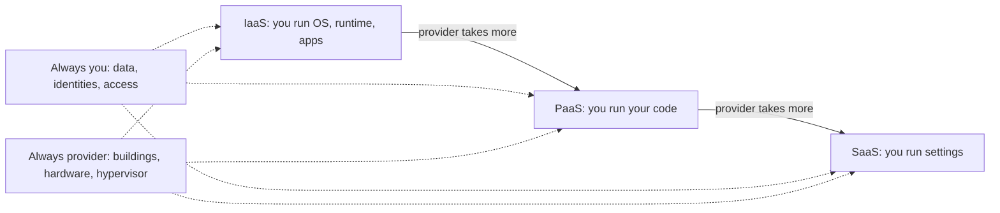
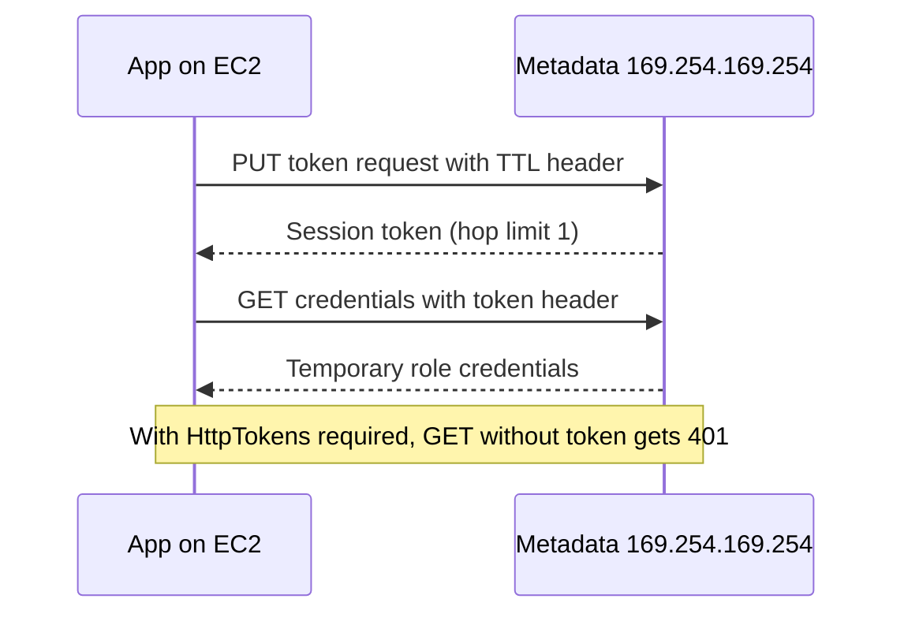
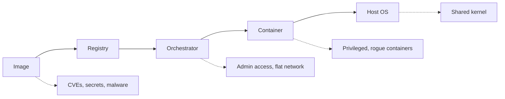

## Cloud Computing Concepts

**Plain English.** Cloud computing means renting computing (servers, storage, databases, whole applications) from a provider over the network, when you want it and paying for what you use. The security question behind every cloud topic is simple: **who is responsible for which layer?** The provider always runs the buildings and the hardware; how much else it runs depends on what you buy.

### NIST definition (SP 800-145)

Five **essential characteristics**: on-demand self-service, broad network access, resource pooling (multi-tenant), rapid elasticity, measured service. Hook: *"On Broad Roads, Rapid Meters".*

| Service model | Provider manages | You manage | Example |
|---|---|---|---|
| **IaaS** | facilities, hardware, network, hypervisor | guest OS, runtime, apps, data, identities | VMs such as EC2, Azure VMs, Compute Engine |
| **PaaS** | all of the above plus OS and runtime | your code, its settings, data, identities | App Service, Elastic Beanstalk, App Engine |
| **SaaS** | the whole application | users, data, configuration and sharing settings | Microsoft 365, Salesforce |
| **FaaS / serverless** | servers, OS, runtime, scaling | function code, dependencies, function permissions, input validation | Lambda, Azure Functions, Cloud Functions |

Four **deployment models**: **public** (open to anyone, on the provider's premises), **private** (one organization), **community** (several organizations with shared concerns, such as the same compliance rules) and **hybrid** (two or more bound together for portability, for example "cloud bursting" into a public cloud at peak). EC-Council also names **multi-cloud**: several public providers used side by side.

### Cloud actors (NIST SP 500-292)

| Actor | Role |
|---|---|
| **Consumer** | uses the service |
| **Provider** | makes the service available |
| **Auditor** | independent assessment of controls, performance and security |
| **Broker** | manages use and delivery; **intermediation** (improve one service), **aggregation** (combine services, fixed providers), **arbitrage** (combine, providers chosen dynamically) |
| **Carrier** | network and transport between provider and consumer |

### Shared responsibility

AWS calls it **security *of* the cloud** (provider) versus **security *in* the cloud** (customer). Microsoft publishes a matrix per service type. Google adds **shared fate**: secure defaults and blueprints on top of the split. In every model the customer keeps **data, accounts, access and endpoints**.

### Related models

- **Virtualization vs containers**: VMs each run their own kernel on a hypervisor; **containers share the host kernel**, so they start fast but isolate less (NIST SP 800-190).
- **Docker** builds and runs containers from **images** stored in **registries**; **Kubernetes** orchestrates containers across a cluster (API server, etcd, scheduler, controller manager on the control plane; kubelet and kube-proxy on nodes).
- **Fog computing** (NIST SP 500-325): a layer of fog nodes between end devices and the cloud, for low latency. **Edge computing**: processing on or next to the devices. **Mist**: a light fog layer at the very edge.

### Exam traps

- **Guest OS patching in IaaS is the customer's job**; in PaaS and SaaS it is the provider's.
- **Community ≠ hybrid.** Community is one infrastructure for a group; hybrid binds different infrastructures.
- **Serverless still has code risk**: vulnerable libraries and over-privileged function roles are the customer's.
- **Carrier = connectivity**, **broker = negotiates and combines**, **auditor = independent assessment**.

## Cloud Computing Threats

**Plain English.** Most cloud breaches are not clever attacks on the provider. They are customers leaving a door open: a public bucket, a leaked key, an admin account without MFA, logging switched off. Learn the recurring patterns and the one control that closes each.

### What the industry lists say

The **CSA Top Threats to Cloud Computing 2024** has 11 items, led by **misconfiguration and inadequate change control**, then **identity and access management**, **insecure interfaces and APIs**, and **inadequate cloud security strategy**; it ends with **advanced persistent threats**. OWASP's Cloud-Native Application Security Top 10 also puts **insecure cloud, container or orchestration configuration** first.

| Threat | What happens | ATT&CK | Main countermeasure |
|---|---|---|---|
| Misconfigured storage | bucket or blob readable by anyone | T1530 | account-level public-access blocks, CSPM alerts |
| Leaked or stale credentials | attacker signs in as a valid user or key | T1078.004 | MFA, roles instead of long-term keys, access reviews |
| Metadata-service abuse | SSRF makes an app fetch the VM role's credentials | T1552.005 | IMDSv2 / required headers, least-privilege roles, SSRF validation |
| Cryptojacking | victim's compute mines coins, often in unused regions | T1496, T1535 | billing and quota alerts, region guardrails |
| Log tampering | attacker stops or deletes cloud audit logs | T1562.008 | separate log account, guardrail that denies it |
| Exfiltration inside the provider | snapshot shared to attacker's account | T1537 | alert on sharing events, restrict sharing |
| Insecure APIs | static keys in apps, no rate limits | T1190 | per-user auth, least privilege, rate limiting |
| Side channels | co-tenant infers data from shared hardware | n/a | provider patching, dedicated hosts |

### Attack names EC-Council uses

- **Cloud hopping**: breach a managed service provider, then use its trusted access to reach its customers (APT10 / menuPass, ATT&CK T1199).
- **Cloudborne**: a firmware (BMC) implant on a bare-metal server that survives when the server is given to the next customer.
- **Man-in-the-cloud**: stealing a file-sync token; the attacker keeps access even after a password change until the token is revoked.
- **Wrapping attack**: moving a signed element inside a SOAP/XML message so a forged request still passes signature checks.
- **Cross-VM side channel**: timing or cache measurements across tenants on one host.

### Exam traps

- **Password reset does not revoke stolen tokens.** Revoke sessions and refresh tokens too.
- **A public bucket is a customer misconfiguration**, not a provider vulnerability.
- **DDoS hits availability**; storage leaks hit confidentiality. Read which property the scenario breaks.

## Cloud Hacking

**Plain English.** A cloud assessment looks for the same things an attacker would look for: which identities exist, what each one can reach, which resources are exposed, and whether anyone would notice. The difference is **permission**: you test only what the client owns and what the provider's rules allow.

### Before you start

- Written authorization from the client **and** the provider's testing rules: AWS lists services testable without prior approval, Microsoft publishes cloud penetration testing rules of engagement, Google requires that tests affect only your own projects. **DoS testing and anything touching other tenants are forbidden.**
- Scope by account, subscription or project, not by IP range alone.

### Assessment flow (defender's view)

| Step | Question | Tools |
|---|---|---|
| Inventory | which accounts, regions, services, public endpoints? | CSPM, ScoutSuite, Prowler |
| Identity | who can do what, stale keys, missing MFA? | IAM Access Analyzer, cloudsplaining, AzureHound |
| Configuration | storage, logging, network against CIS benchmarks | Prowler, Security Hub, Defender for Cloud |
| Workloads | VMs, metadata settings, containers, functions | Trivy, kube-bench, Inspector |
| Detection | would the SOC see it? | CloudTrail, Activity log, Cloud Audit Logs, GuardDuty |

Map what you find to the **MITRE ATT&CK Cloud matrix** (platforms: IaaS, SaaS, Office Suite, Identity Provider): valid cloud accounts for initial access, infrastructure and storage discovery (T1580, T1619), then collection, exfiltration or impact.

### Tools to recognize

| Tool | What it is |
|---|---|
| **ScoutSuite** | multi-cloud security auditing, read-only, HTML report (NCC Group) |
| **Prowler** | open-source posture and compliance checks for AWS, Azure, GCP, Kubernetes |
| **Pacu** | AWS exploitation framework for authorized tests (Rhino Security Labs) |
| **CloudGoat**, **flaws.cloud** | intentionally vulnerable AWS labs |
| **CloudFox** | situational awareness: what the current credentials can reach |
| **CloudSploit** | cloud security posture management scanner |

### Exam traps

- **Audit tools list; exploitation frameworks act.** ScoutSuite and Prowler report, Pacu tests.
- **Found a live production key?** Stop, record, report to the client contact. Do not use it beyond scope and do not publish it.

## AWS Hacking

**Plain English.** In AWS almost everything is an API call signed with a credential. So the story of most AWS incidents is: a credential leaked or was too powerful, someone called APIs with it, and the logs either caught it or were missing.

### Identity

- **Long-term access keys** start with `AKIA`; **temporary STS keys** start with `ASIA` and need a session token. Roles hand out temporary credentials; AWS best practice is roles and federation, MFA, **no root access keys**.
- `aws sts get-caller-identity` returns UserId, Account and Arn: it tells you whose key you hold and needs no permissions. Unusual callers of it are worth an alert.
- Guardrails: **SCPs** cap what member accounts can do (they grant nothing), **permissions boundaries** cap a single identity. **IAM Access Analyzer** finds resources shared outside your organization; the **policy simulator** answers "could this user do X?" without doing it.

### Storage

**S3 Block Public Access** has four settings: BlockPublicAcls, IgnorePublicAcls, BlockPublicPolicy, RestrictPublicBuckets. Turn them on at the **account** level. `aws s3api get-bucket-policy-status` returning `"IsPublic": true` means the bucket policy makes the bucket public.

### Instance metadata (IMDSv2)

A simple SSRF can usually send only GET requests without custom headers, so **requiring IMDSv2** (`HttpTokens: required`) blocks most metadata credential theft. `describe-instances` showing `"HttpTokens": "optional"` means IMDSv1 still works.

### Detection and posture

| Service | Use |
|---|---|
| **CloudTrail** | API activity log; Event history keeps 90 days of management events; enable log file integrity validation |
| **GuardDuty** | threat detection from CloudTrail, VPC Flow Logs and DNS logs |
| **Config** | configuration history and rules |
| **Security Hub** | aggregated findings, CIS AWS Foundations checks |
| **Inspector** / **Macie** | vulnerability scanning / sensitive data in S3 |

Tools: **Pacu** (exploitation framework), **cloudsplaining** (IAM least-privilege report), **S3Scanner** (misconfigured buckets).

### Exam traps

- **IsPublic** and Block Public Access settings of **false** mean *not protected*.
- **Encryption does not fix a public bucket**: S3 decrypts for any authorized reader, including anonymous ones.
- **Hop limit** is the IP TTL of the token response, not a rate limit or token lifetime.

## Microsoft Azure Hacking

**Plain English.** Azure security is mostly **Microsoft Entra ID** security: users, service principals, managed identities and the roles they hold. Storage and VMs matter too, but the paths to them go through identities.

### Key points

- **Azure IMDS**: 169.254.169.254, only from inside the VM, requires the header **`Metadata: true`** and rejects `X-Forwarded-For`. It issues tokens for the VM's **managed identity**.
- **Managed identities**: system-assigned (tied to one resource) or user-assigned (standalone, reusable). They remove stored secrets; keep their roles minimal.
- **Storage access**: account keys (full power), **SAS** tokens (user delegation SAS signed with Entra credentials is preferred; service and account SAS use the account key), anonymous blob access (disable with `allowBlobPublicAccess = false`), and Entra RBAC.
- **Consent phishing** (illicit consent grant): a user approves a malicious OAuth app, which then reads mail and files with tokens. Restrict user consent and use an admin consent workflow.

| Attack path | Tool that shows it | Defense |
|---|---|---|
| Role chains to Global Administrator | AzureHound (BloodHound), ROADtools | PIM, fewer standing admins, access reviews |
| Password spraying on Entra sign-in | sign-in logs | MFA, Conditional Access, block legacy auth |
| Anonymous or SAS-exposed blobs | MicroBurst, Defender for Cloud | disallow anonymous access, short SAS expiry |
| Over-privileged managed identity | Stormspotter, role review | least-privilege RBAC |

Defensive services: **Conditional Access** (if-then sign-in policies), **PIM** (just-in-time, time-bound, approved admin roles), **Defender for Cloud** (CSPM and workload protection), **Microsoft Sentinel** (SIEM/SOAR), **Activity log** (control-plane events), **Azure Policy** (deny or audit configurations), **Key Vault** (secrets).

### Exam traps

- `allowBlobPublicAccess: true` **permits** public containers; it does not make every blob public by itself.
- A leaked SAS stays valid until it expires or its signing key is rotated.
- `az account show` tells you the active subscription and whether you are a user or a **servicePrincipal**.

## Google Cloud Hacking

**Plain English.** Google Cloud is organized as organization → folders → projects, and permissions flow down that tree. The two big risks are the same as elsewhere: public data and powerful identities, here mostly **service accounts** and their keys.

| Topic | Remember |
|---|---|
| Public principals | **allUsers** = anyone on the internet; **allAuthenticatedUsers** = any Google account, not just yours |
| Storage defenses | **public access prevention**, **uniform bucket-level access** |
| Metadata server | `metadata.google.internal`, header **`Metadata-Flavor: Google`**, returns the VM service account's token |
| Service account keys | avoid them; use attached service accounts or **Workload Identity Federation**; block creation with **Organization Policy** |
| GKE | least-privilege node service account, **Workload Identity Federation for GKE** so pods do not inherit node rights |
| Audit logs | Admin Activity (always on), **Data Access (off by default)**, System Event, Policy Denied |
| Exfiltration control | **VPC Service Controls** perimeters |
| Posture | **Security Command Center**, IAM recommender |

Tools: **GCPBucketBrute** enumerates buckets and tests access and privilege escalation; ScoutSuite and Prowler also cover Google Cloud. `gcloud auth list` shows credentialed accounts; the one with `*` is active.

### Exam traps

- **allAuthenticatedUsers is not "our staff".** It is every Google account in the world.
- **Data Access logs are off by default**: without them you cannot see who read the data.
- The default compute service account historically had broad rights; check what your VMs and nodes run as.

## Container Hacking

**Plain English.** A container is a process with a fence around it, and all containers on a host share one kernel. Most container incidents come from a weak fence (privileged mode, root user), a bad image (known CVEs, secrets inside) or an open management door (Docker API, kubelet, dashboard).

### NIST SP 800-190 risk areas

Countermeasures follow the same five areas: scan and sign images, use trusted registries over TLS and prune stale images, least-privilege orchestrator access and network segmentation, hardened runtime configuration, and a minimal container-specific host OS.

### Ports and exposures

| Port | Service | Risk if exposed |
|---|---|---|
| 2375 | Docker API, plain TCP | unauthenticated root on the host |
| 2376 | Docker API over TLS | safe only with client certificates |
| 6443 | Kubernetes API server | cluster control if auth is weak |
| 2379-2380 | etcd | all cluster state, including Secrets |
| 10250 | kubelet API | pod listing or command execution if anonymous auth is on |
| 30000-32767 | NodePort services | unintended exposure of internal apps |

### Kubernetes controls

- **RBAC** least privilege; `kubectl auth can-i ... --as=system:serviceaccount:ns:default` should say `no` for sensitive verbs.
- **Pod Security Standards**: Privileged, Baseline, Restricted; **Pod Security Admission** modes enforce, audit, warn.
- **Secrets** are base64 and **unencrypted in etcd** by default: configure encryption at rest and protect etcd.
- **NetworkPolicies**: pods accept all traffic until a policy selects them; start from default deny.
- The "4C" model: **Cloud, Cluster, Container, Code**, each layer depending on the one outside it.

| Weakness | Tool | Countermeasure |
|---|---|---|
| vulnerable or secret-laden image | Trivy, Clair | scan in CI, rebuild often, secrets manager |
| cluster misconfiguration | kube-bench (CIS), kube-hunter | fix benchmark failures, disable anonymous kubelet |
| risky RBAC | KubiScan, `kubectl auth can-i` | remove wildcards, no rights for default service accounts |
| host misconfiguration | Docker Bench for Security | CIS Docker Benchmark |
| runtime attack (shell in container) | Falco | alert and respond |
| container escape (T1611) | `docker inspect` (`Privileged`, `User`) | no privileged, non-root, seccomp/AppArmor, gVisor or Kata |

### Exam traps

- **Containers are not VMs**: a kernel exploit crosses every container on the host.
- `"User": ""` in `docker inspect` means the image default, usually **root**.
- **kube-bench checks CIS configuration; kube-hunter probes like an attacker; Falco watches runtime.**

## Cloud Security

**Plain English.** Cloud defense is mostly hygiene done at scale: strong identities, no public data by default, logs that attackers cannot switch off, and guardrails that stop mistakes before they happen. Frameworks and benchmarks tell you what "good" looks like; posture tools check it continuously.

### Frameworks and benchmarks

- **CSA Cloud Controls Matrix (CCM)**: 197 control objectives in 17 domains, with who owns each control; the **CAIQ** questionnaire and the **STAR** registry (level 1 self-assessment, level 2 third-party audit).
- **CIS Benchmarks**: free hardening guides for AWS, Azure, Google Cloud, Kubernetes and Docker, automated by Security Hub, Defender for Cloud, Prowler, kube-bench and Docker Bench.
- **MITRE ATT&CK Cloud matrix** for detection coverage; **NCSC cloud security principles** and **CISA SCuBA** baselines for SaaS.

### Product families

| Family | Protects | Examples |
|---|---|---|
| **CSPM** | configuration across accounts | Defender CSPM, Security Hub, Security Command Center, Prowler |
| **CWPP** | running workloads (VMs, containers, functions) | Defender for Cloud workload plans, Falco |
| **CASB** | users' access to cloud apps, DLP, shadow IT | CASB products between users and SaaS |
| **IaC scanning** | templates before deployment | Checkov, Trivy |

### Countermeasures checklist

1. **MFA** for every user, phishing-resistant for admins; block legacy authentication.
2. **Least privilege**: roles, managed identities and workload identity instead of long-term keys; just-in-time admin (PIM).
3. **Block public storage** at account or organization level.
4. **Central, protected logging**: CloudTrail with integrity validation in a separate account, Activity log, Cloud Audit Logs including Data Access for sensitive data.
5. **Enforce IMDSv2** and metadata protections; fix SSRF.
6. **Encrypt** with KMS or Key Vault; keep secrets in a vault with rotation, never in code or images.
7. **Guardrails**: AWS SCPs, Azure Policy, Google Organization Policy, VPC Service Controls.
8. **Scan** images and IaC in CI, run CIS checks continuously, detect at runtime.

### Exam traps

- **SCPs never grant permissions**; they only limit.
- **CSPM finds misconfigurations; CASB controls user access to cloud apps.**
- **Base64 is not encryption**, whether in Kubernetes Secrets or in code.
