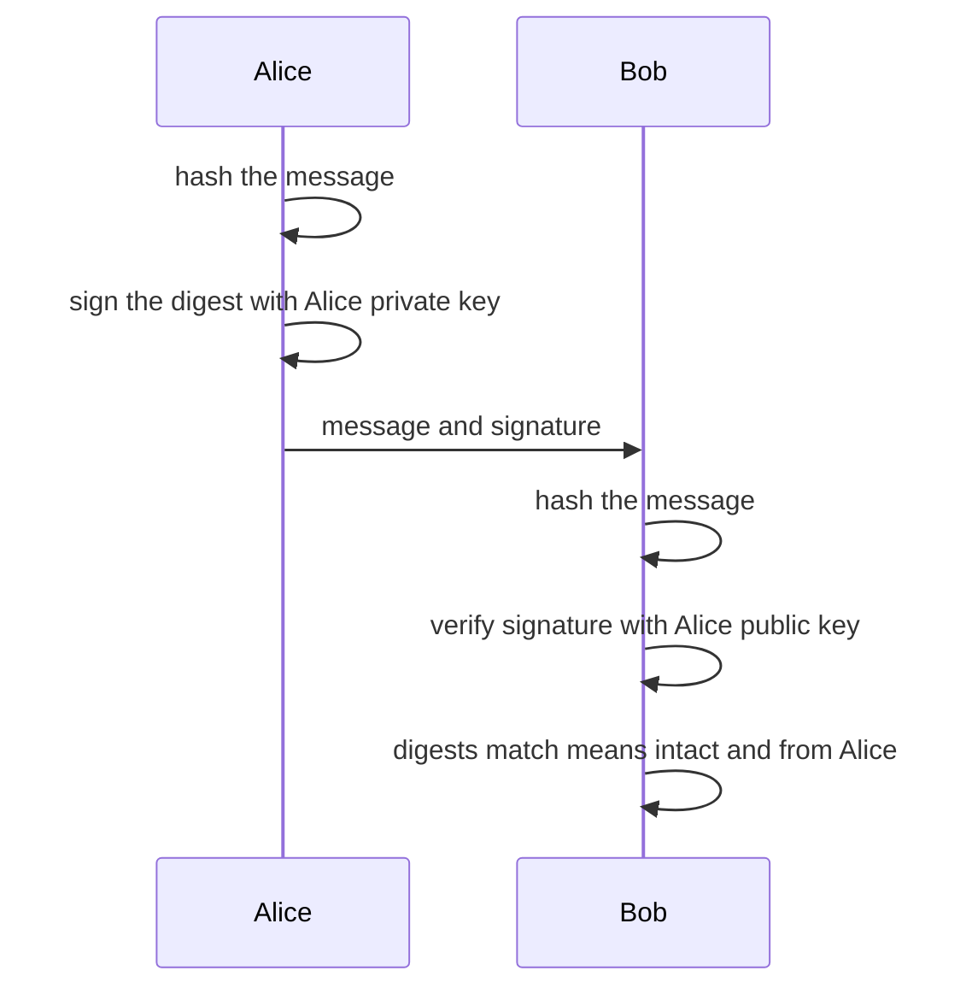
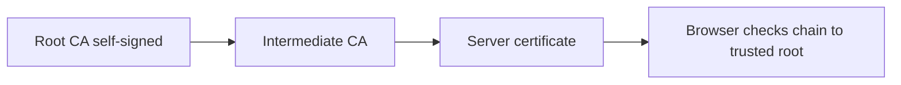
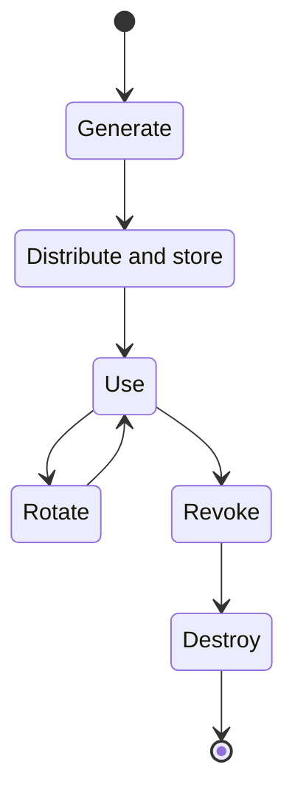

## Cryptography Concepts and Encryption Algorithms

**Plain English.** Cryptography turns readable data (plaintext) into unreadable data (ciphertext) with a key, so only people with the right key can read it. Hashes and signatures go further: they prove data was not changed and who produced it. Security depends on the **key**, not on keeping the algorithm secret (Kerckhoffs' principle).

### What each tool gives you

| Goal | Tool | Example |
|---|---|---|
| Confidentiality | encryption | AES, ChaCha20, RSA-OAEP |
| Integrity | hash | SHA-256, SHA-3 |
| Integrity + origin (shared key) | MAC | HMAC-SHA-256 |
| Integrity + origin + **non-repudiation** | digital signature | RSA, ECDSA, EdDSA, ML-DSA |

### Symmetric vs asymmetric

| | Symmetric | Asymmetric (public key) |
|---|---|---|
| Keys | one shared secret | key pair: public + private |
| Speed | fast, for bulk data | slow, for small data |
| Problem | key distribution: n people need **n(n−1)/2** keys | slower, bigger keys |
| Examples | AES, 3DES, Blowfish, Twofish, RC4, ChaCha20 | RSA, Diffie-Hellman, ECC, ElGamal, DSA |

Real systems use **hybrid encryption**: a random symmetric session key encrypts the data, and the recipient's public key encrypts that session key.

Remember who uses which key: **encrypt with the recipient's public key, sign with your own private key.**

### Symmetric algorithms

| Algorithm | Type | Block | Key | Status |
|---|---|---|---|---|
| **DES** | block | 64 | 56 effective | broken by brute force; FIPS 46-3 withdrawn 2005 |
| **3DES (TDEA)** | block | 64 | 3 keys (112-bit strength) | applying protection disallowed after 31 Dec 2023; decrypt legacy only |
| **AES** (Rijndael) | block | **128** | 128 / 192 / 256 (10 / 12 / 14 rounds) | current standard, FIPS 197 |
| Blowfish | block | 64 | 32–448 | legacy (64-bit block) |
| Twofish | block | 128 | up to 256 | AES finalist |
| **RC4** | stream | none | variable | prohibited in TLS (RFC 7465) |
| **ChaCha20** | stream | none | 256 | with Poly1305 in TLS 1.3 |

Why three DES passes and not two? **Meet-in-the-middle**: double encryption with two k-bit keys only costs about 2^(k+1) work to break, not 2^(2k).

### Modes of operation

| Mode | Idea | Watch out |
|---|---|---|
| **ECB** | each block encrypted alone | same plaintext block → same ciphertext block (pattern leak) |
| **CBC** | XOR with previous ciphertext block, needs an IV | padding oracle attacks |
| **CTR** | encrypts a counter to make a keystream | never reuse a counter/nonce |
| **GCM** | CTR + authentication tag (AEAD) | nonce reuse is catastrophic |

### Asymmetric algorithms

- **RSA**: security rests on factoring large numbers. Minimum 2048-bit modulus today.
- **Diffie-Hellman (DH)**: **key agreement** (both sides compute the same secret) based on discrete logarithms. It does not authenticate anyone, so plain DH is open to man-in-the-middle.
- **ECC**: same math family on elliptic curves; much smaller keys for the same strength.
- **DSA**: FIPS 186-5 (2023) no longer approves it for new signatures; ECDSA and **EdDSA** remain alongside RSA.

Security strength (NIST SP 800-57):

| Bits of security | Symmetric | RSA / DH | ECC |
|---|---|---|---|
| 112 | 3TDEA | 2048 | 224 |
| 128 | AES-128 | 3072 | 256 |
| 192 | AES-192 | 7680 | 384 |
| 256 | AES-256 | 15360 | 512 |

### Hash functions

A hash maps any input to a fixed-size digest. It must resist **preimage** (find an input for a digest), **second preimage** (find another input with the same digest as a given one) and **collision** (find any two inputs with the same digest).

| Hash | Digest bits | Status |
|---|---|---|
| MD5 | 128 | collisions are easy, integrity checks only against accidents |
| SHA-1 | 160 | practical collision 2017 (SHAttered); NIST retires it by end of 2030 |
| SHA-2 (SHA-224/256/384/512) | 224–512 | current, FIPS 180-4 |
| SHA-3 (Keccak), SHAKE | 224–512, variable | current, FIPS 202 |

**HMAC** mixes a secret key into the hash: integrity plus proof that someone with the key sent it. Both sides share the key, so HMAC **cannot** give non-repudiation.

### Classical ciphers and the one-time pad

**Substitution** replaces symbols (Caesar shifts letters); **transposition** reorders them. A **one-time pad** is unbreakable only if the key is truly random, as long as the message and never reused.

### Quantum and post-quantum

- **Shor's algorithm** would break RSA, DH and ECC on a large quantum computer.
- **Grover's algorithm** speeds up key search, so prefer AES-256 for long-lived secrets.
- NIST post-quantum standards (August 2024): **FIPS 203 ML-KEM** (key encapsulation, from Kyber), **FIPS 204 ML-DSA** (signatures, from Dilithium), **FIPS 205 SLH-DSA** (hash-based signatures, from SPHINCS+). **HQC** was picked in 2025 as a backup KEM.
- **Quantum key distribution (QKD)** uses physics to agree a key, but it does not authenticate the endpoints. The UK NCSC and France's ANSSI prefer post-quantum algorithms.
- **Lightweight cryptography** for IoT: NIST chose **Ascon** (SP 800-232).

EC-Council calls key escrow to the authorities **GAK (Government Access to Keys)**.

### Exam traps

- **Hashing is not encryption**: there is no key and no way back.
- **AES block size is always 128 bits**; the 192 and 256 are key sizes.
- **DH exchanges keys, it does not encrypt data** and does not authenticate.
- **3DES is not "168-bit secure"**: meet-in-the-middle leaves about 112 bits.

## Applications of Cryptography

**Plain English.** Public key cryptography only helps if you know a public key really belongs to the right person or website. PKI solves that with certificates signed by trusted authorities. On top of it run HTTPS, secure e-mail, code signing, VPNs and disk encryption.

### PKI building blocks

| Component | Job |
|---|---|
| **Certification authority (CA)** | issues and signs certificates |
| **Registration authority (RA)** | checks the requester's identity for the CA |
| **Certificate (X.509 v3)** | binds a subject to a public key; never holds the private key |
| **CRL** | signed list of revoked certificates, published periodically |
| **OCSP** | real-time "is this one certificate still good?" query |
| **Certificate Transparency** | public logs of every issued certificate, to spot misissuance |

Key X.509 fields: version, serial number, signature algorithm, **issuer**, **validity**, **subject**, **subject public key info**, and extensions such as **subjectAltName** (the host names), keyUsage and basicConstraints (CA or not).

A **self-signed certificate** has issuer = subject. Fine for a lab, but browsers warn because no trusted CA vouches for it:

`openssl req -x509 -newkey rsa:2048 -keyout key.pem -out cert.pem -days 365 -nodes`

A **CSR** (PKCS #10) carries your public key and subject name to the CA; the private key stays with you. **ACME** (Let's Encrypt, certbot) automates domain-validated certificates.

### TLS 1.3 in one table

| Change in TLS 1.3 | Why it matters |
|---|---|
| key exchange only (EC)DHE or PSK | **forward secrecy** by default; static RSA key transport gone |
| AEAD ciphers only (AES-GCM, ChaCha20-Poly1305) | no CBC padding oracles, no RC4 |
| 1-RTT handshake, certificate encrypted | faster, less metadata exposed |
| optional 0-RTT early data | can be **replayed**: only for safe requests |
| downgrade sentinel in ServerHello.random | detects forced fallback to TLS 1.2 or lower |

SSL 3.0 and TLS 1.0/1.1 are deprecated (RFC 7568, RFC 8996). **HSTS** stops browsers from falling back to plain HTTP (SSL stripping).

### E-mail encryption

| | S/MIME | PGP / OpenPGP (GnuPG) |
|---|---|---|
| Trust model | **hierarchical**: X.509 certificates from CAs | **web of trust**: users sign each other's keys |
| Typical use | corporate mail clients | individuals, open source signing |

Both are hybrid: a random session key encrypts the message; the recipient's public key encrypts the session key; the sender's private key signs.

### Disk and file encryption

| Tool | Platform | Note |
|---|---|---|
| **BitLocker** | Windows | TPM-backed, XTS-AES; `manage-bde -status` |
| **FileVault** | macOS | full volume encryption |
| **LUKS / cryptsetup** | Linux | `cryptsetup luksFormat` |
| **VeraCrypt** | cross-platform | containers, **hidden volumes** for plausible deniability |
| AxCrypt, `openssl enc`, `gpg -c` | files | per-file encryption |

Full-disk encryption protects a **powered-off or lost** device. Once the system is running and unlocked, the data is readable by anyone using it.

Hash tools: `sha256sum file`, PowerShell `Get-FileHash file` (SHA256 by default), `certutil -hashfile file SHA256`, `openssl dgst -sha256 file`, NirSoft HashMyFiles.

### Blockchain

A blockchain is a distributed ledger where each block stores the **hash of the previous block**, so changing old data breaks every later link. Nodes agree through a consensus model (**proof of work** or **proof of stake**). **Smart contracts** are programs stored on the chain; their bugs are permanent and public.

> **v13 AI callout.** The v13 labs include "cryptography using AI": asking an assistant to write `openssl` or `gpg` commands or explain a cipher. Check every flag against the official docs (assistants suggest ECB, MD5 or `-k` passwords without key derivation), and never paste real keys or client data into a public AI service.

### Exam traps

- **The CA signs the certificate with the CA's private key**; the browser checks it with the CA's public key.
- **S/MIME = CAs, PGP = web of trust.**
- **Disk encryption does not protect a running, logged-in machine.**
- **A certificate never contains the private key.**

## Cryptanalysis Methods and Cryptography Attacks

**Plain English.** Cryptanalysis is breaking crypto without being given the key. Most real breaks do not beat the math: they exploit short keys, old algorithms, bad randomness, leaky implementations, or people.

### Attack models (what the attacker has)

| Model | Attacker has | Example |
|---|---|---|
| **Ciphertext-only** | ciphertext only | frequency analysis on a substitution cipher |
| **Known-plaintext** | some plaintext and its ciphertext | a known file header |
| **Chosen-plaintext** | can encrypt inputs of their choice | an encryption oracle; **differential** cryptanalysis |
| **Adaptive chosen-plaintext** | chooses each input after seeing earlier results | |
| **Chosen-ciphertext** | can get chosen ciphertexts decrypted | padding oracle, Bleichenbacher (ROBOT) |

**Linear cryptanalysis** uses known plaintext and linear approximations; **differential cryptanalysis** uses chosen plaintext and differences between inputs. EC-Council also lists **integral** cryptanalysis.

### Attacks → tool → countermeasure

| Attack | How it works | Tool / example | Countermeasure |
|---|---|---|---|
| **Brute force** | try every key or password | hashcat `-a 3` | long keys, long passwords, slow hashes |
| **Dictionary** | try likely words | hashcat `-a 0`, John the Ripper | salted slow hashes, strong passwords |
| **Rainbow table** | precomputed hash chains | lookup tables | **unique salt** per password |
| **Birthday** | collision after ~2^(n/2) tries | Sweet32 on 64-bit blocks | longer digests, 128-bit blocks |
| **Meet-in-the-middle** | attack double encryption from both ends | why 2DES was skipped | 3 passes or AES |
| **Side channel** | timing, power, EM, sound leak key bits | power analysis | constant-time code, blinding |
| **Cold boot / DMA** | read keys from RAM | memory dump | TPM + PIN, shut down, DMA protection |
| **Padding oracle** | error messages reveal valid padding | POODLE (SSL 3.0) | AEAD, TLS 1.3 |
| **Downgrade** | force weak version or export crypto | FREAK, Logjam, DROWN | disable old protocols, TLS 1.3 sentinel |
| **Implementation bug** | leaks memory or keys | Heartbleed; Nmap `ssl-heartbleed` | patch, revoke and reissue keys |
| **Man-in-the-middle** | sits inside an unauthenticated key exchange | rogue root CA, ARP spoofing | authenticated DH, certificate checks |
| **Replay** | re-sends a valid captured message | 0-RTT abuse | nonces, timestamps, sequence numbers |
| **Rubber-hose** | coerces or bribes a person for the key | none needed | policy, split knowledge, hidden volumes |

**Heartbleed** (CVE-2014-0160) is an OpenSSL heartbeat over-read that could leak private keys. **DUHK** abused a hard-coded seed key in an old random number generator. **ROBOT** revived a Bleichenbacher oracle on RSA key exchange.

### Blockchain attacks

- **51 % (majority) attack**: whoever controls most mining power or stake can rewrite recent blocks and **double-spend**.
- **Sybil / eclipse** (EC-Council list): many fake identities, or isolating a node so it only sees the attacker's peers.
- **Smart contract reentrancy**: a contract calls out before updating its balance, and the callee calls back in to withdraw again.

### Quantum computing attacks

**Harvest now, decrypt later**: record encrypted traffic today and decrypt it once a large quantum computer exists (Shor). Data that must stay secret for years is already at risk.

### Tools

| Tool | Use |
|---|---|
| **hashcat** | GPU password cracking (`-m 0` MD5, `-m 1000` NTLM, `-m 3200` bcrypt) |
| **John the Ripper** | CPU password cracking, many formats |
| **CrypTool** | learning and analysing classical and modern ciphers |
| **RsaCtfTool** | recovering keys from weak RSA parameters |
| **testssl.sh, sslscan, Nmap `ssl-enum-ciphers`** | auditing TLS versions and cipher suites |

### Exam traps

- **Chosen-plaintext vs known-plaintext**: "can choose" beats "happens to have".
- **Salts stop rainbow tables**, not online guessing.
- **Birthday = collisions**, brute force = keys or preimages.
- **Side-channel attacks target the implementation**, not the algorithm.

## Cryptography Attack Countermeasures

**Plain English.** Most crypto failures are configuration and handling mistakes. Use current algorithms at the right sizes, protect and rotate keys, store passwords with slow salted hashes, lock TLS down, and start planning for quantum-safe algorithms now.

| Weakness | Fix |
|---|---|
| DES, 3DES, RC4, MD5, SHA-1 | AES-GCM, ChaCha20-Poly1305, SHA-256 or SHA-3 |
| RSA 1024 | RSA ≥ 2048 (3072 for 128-bit strength) or ECC P-256+ |
| ECB mode | GCM or another AEAD mode |
| plain or fast password hashes | **Argon2id**, scrypt, bcrypt, or PBKDF2 with a high iteration count, unique salt |
| hard-coded keys | key vault, HSM or TPM; per-purpose keys; rotation |
| predictable IVs, reused nonces | CSPRNG (NIST SP 800-90A DRBG), unique nonce per key |
| SSL 3.0, TLS 1.0/1.1 | TLS 1.2 and 1.3 only, AEAD suites, ECDHE, HSTS |
| stolen laptop | full-disk encryption with TPM + PIN; shut down rather than sleep |
| leaky implementations | constant-time libraries, patch quickly |

### Key management lifecycle

NIST SP 800-57 limits how long each key may be used (the **cryptoperiod**). Store private keys in an HSM or TPM with a passphrase, and never commit keys to code.

### Post-quantum readiness

1. **Inventory** where you use RSA, DH and ECC.
2. Build **crypto agility** (algorithms swappable by configuration).
3. Protect long-lived secrets first (harvest now, decrypt later), with **hybrid** key exchange (classical + ML-KEM) where supported.
4. Timelines: NIST's draft IR 8547 deprecates 112-bit RSA/ECC after 2030 and disallows quantum-vulnerable public key algorithms after 2035; the UK NCSC sets 2028, 2031 and 2035 milestones.

Check your work with **testssl.sh**, **SSL Labs** or **Nmap `ssl-enum-ciphers`** (A–F grades), and watch Certificate Transparency logs for certificates you did not request.

### Exam traps

- **Salt is not secret** and must be unique per password; a pepper is a secret added on top.
- **A longer RSA key does not stop Shor**; only post-quantum algorithms do.
- **Encrypting does not prove integrity** unless you use an AEAD mode or a MAC.
- **After Heartbleed-type leaks, patch, then revoke and reissue certificates.**
